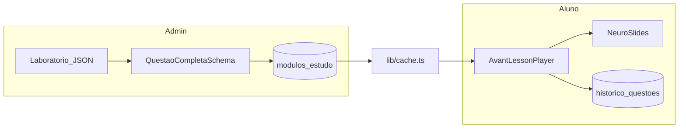

# AVANT — Guia de onboarding (IA e devs)

Leitura estimada: **~5 minutos**. Este arquivo é a referência canônica para não quebrar padrões do projeto. Para aprofundar, use o mapa em [Referências](#referências).

## Comandos rápidos

```bash
npm run dev              # servidor local
npm run validate:env     # valida .env (roda no build)
npm test                 # Jest
npm run build            # validate:env + next build
```

## Fontes de verdade (código)

| Área | Arquivo |
|------|---------|
| Validação de questões | [`lib/validations.ts`](lib/validations.ts) · write spec [`lib/questaoSpec/validateQuestaoForWrite.ts`](lib/questaoSpec/validateQuestaoForWrite.ts) |
| Cache de dados | [`lib/cache.ts`](lib/cache.ts) |
| Slides, layouts, subtópicos | [`docs/AGENT_AVANT_TEMPLATES_E_LAYOUT.md`](docs/AGENT_AVANT_TEMPLATES_E_LAYOUT.md) |
| O que é questão premium (L1/L2/L3) | [`docs/PREMIUM_QUESTAO.md`](docs/PREMIUM_QUESTAO.md) |
| **Decisão handcraft único** | [`docs/DECISAO_TRILHO_A_UNICO.md`](docs/DECISAO_TRILHO_A_UNICO.md) |
| Pacote premium (checklist + legado) | [`docs/PACOTE_PREMIUM_CHECKLIST.md`](docs/PACOTE_PREMIUM_CHECKLIST.md) |
| Golden no catálogo inteiro (programa) | [`docs/GOLDEN_ROLLOUT_CATALOGO.md`](docs/GOLDEN_ROLLOUT_CATALOGO.md) |
| **Taxonomia** (`Classify: <bucket>`) | [`docs/TAXONOMIA_MODEL.md`](docs/TAXONOMIA_MODEL.md) · [`docs/TAXONOMIA_CONVERSA.md`](docs/TAXONOMIA_CONVERSA.md) |
| **Handcraft golden-v1** (runbook operacional) | [`docs/GOLDEN_HANDCRAFT_MODEL.md`](docs/GOLDEN_HANDCRAFT_MODEL.md) |
| **Nova conversa handcraft** (`Handcraft: <subtópico>`) | [`docs/HANDCRAFT_CONVERSA.md`](docs/HANDCRAFT_CONVERSA.md) |
| **Qualidade vendável** (L1–L6, modelo híbrido) | [`docs/QUALITY_LAYERS_MODEL.md`](docs/QUALITY_LAYERS_MODEL.md) · ADR [`docs/DECISAO_QUALITY_HIBRIDA.md`](docs/DECISAO_QUALITY_HIBRIDA.md) |
| **Nova conversa vendável** (`Qualidade vendável: <subtópico>`) | [`docs/QUALITY_VENDAVEL_CONVERSA.md`](docs/QUALITY_VENDAVEL_CONVERSA.md) |
| **Pipeline completo** (`Pipeline completo: <subtópico>`) | [`docs/PIPELINE_COMPLETO_CONVERSA.md`](docs/PIPELINE_COMPLETO_CONVERSA.md) · [`docs/PROGRAMA_CATALOGO_41.md`](docs/PROGRAMA_CATALOGO_41.md) |
| **Mapeamento L3** (`Mapeamento L3: <subtópico>`) | [`docs/L3_MAPEAMENTO_CONVERSA.md`](docs/L3_MAPEAMENTO_CONVERSA.md) |
| Monitoramento contínuo pós-venda | [`docs/CONTINUOUS_QUALITY_RUNBOOK.md`](docs/CONTINUOUS_QUALITY_RUNBOOK.md) |
| Progresso handcraft | [`data/catalog-migration/handcraft-registry.json`](data/catalog-migration/handcraft-registry.json) |
| Fonte normativa (handcraft × guideline × legado) | [`docs/FONTE_NORMATIVA_AVANT.md`](docs/FONTE_NORMATIVA_AVANT.md) |
| Padrão de conteúdo golden (v1) | [`docs/GOLDEN_CONTENT_STANDARD.md`](docs/GOLDEN_CONTENT_STANDARD.md) |

## Índice

1. [Visão geral do produto e stack](#1-visão-geral-do-produto-e-stack)
2. [Padrões arquiteturais obrigatórios](#2-padrões-arquiteturais-obrigatórios)
3. [Design system](#3-design-system)
4. [Estrutura de pastas](#4-estrutura-de-pastas)
5. [Regras de cache](#5-regras-de-cache)
6. [Regras de logging](#6-regras-de-logging)
7. [Validação (Zod)](#7-validação-zod)
8. [Sistema NeuroSlides](#8-sistema-neuroslides)
9. [Subtópicos válidos](#9-subtópicos-válidos)
10. [O que NUNCA fazer](#10-o-que-nunca-fazer)
11. [Referências](#referências)

---

## 1. Visão geral do produto e stack

### Produto

**AVANT** é uma plataforma de **estudo reverso** para **Técnicos de Enfermagem**: questões de concursos (EBSERH, prefeituras, bancas diversas) viram uma jornada guiada — enunciado → alternativas → **NeuroSlides** (4 telas didáticas) → registro de desempenho.

Funcionalidades principais:

- **Aluno:** vitrine `/estudar`, player `AvantLessonPlayer`, cadernos, plano diário, analytics, material NeuroSlides, freemium/Pro.
- **Admin:** Laboratório (JSON de questões), concursos, matrículas, convites, landings, e-mails.
- **Monetização:** Stripe (concursos e assinatura Pro), convites com resgate por token.

### Stack técnica (verificada no repo)

| Camada | Tecnologia |
|--------|------------|
| Framework | **Next.js 16** App Router, **React 19** |
| Linguagem | TypeScript (strict), alias `@/*` → raiz |
| Estilo | **Tailwind CSS 4**, Radix/shadcn, Framer Motion |
| Dados / auth | **Supabase** (PostgreSQL, RLS, SSR cookies) |
| Pagamentos | Stripe |
| Validação | **Zod 4** |
| E-mail | Resend + React Email |
| IA (onde usado) | Google Gemini |
| Visual engine (legado/auxiliar) | `@xyflow/react` |
| Testes | Jest (`__tests__/`), Playwright (`e2e/`) |

### Auth na borda

Next.js 16 usa [`proxy.ts`](proxy.ts) (substitui `middleware.ts`): `getUser()` **uma vez** por request em rotas protegidas, renovando sessão **antes** dos RSC e evitando corrida de refresh token.



---

## 2. Padrões arquiteturais obrigatórios

### Regras resumidas

| Padrão | Regra |
|--------|--------|
| Server Components | Padrão: `async` RSC. `'use client'` só com hooks, eventos ou APIs do browser. |
| Leitura catálogo/questão/histórico em RSC | **Sempre** [`lib/cache.ts`](lib/cache.ts) — nunca Supabase direto. |
| Sessão em RSC | `getServerSession()` — leitura de cookies, **sem** refresh no Node. |
| Browser Supabase | **Único** singleton em [`lib/supabase/client.ts`](lib/supabase/client.ts). |
| Admin / bypass RLS | `createServerSupabase()` (service role) **só** server-side. |
| APIs chamadas do client | `fetchWithAuth` → `Authorization: Bearer`. |
| APIs (Route Handlers) | Validar body com Zod; auth via sessão ou JWT. |
| Admin API | `requireAdminApi()` em [`lib/admin/requireAdmin.ts`](lib/admin/requireAdmin.ts). |
| Env | Novas variáveis em [`lib/env.ts`](lib/env.ts) + `npm run validate:env`. |
| Segurança | **RLS** no Supabase é fonte de verdade; nunca confiar só no client. |

### RSC + cache + sessão

```typescript
// app/(dashboard)/estudar/[slug]/page.tsx — padrão
import { getQuestaoBySlugCached, getHistoricoQuestoesCached } from '@/lib/cache';
import { getServerSession } from '@/lib/supabase/server-auth';

export default async function Page({ params }: { params: Promise<{ slug: string }> }) {
  const { slug } = await params;
  const session = await getServerSession();
  const [questao, historico] = await Promise.all([
    getQuestaoBySlugCached(slug),
    getHistoricoQuestoesCached(session?.user?.id),
  ]);
  // renderizar player ou notFound() se !questao
}
```

### Cliente Supabase no browser

```typescript
// lib/supabase/client.ts — NÃO duplicar este padrão em outro arquivo
import { createBrowserClient } from '@supabase/ssr';
export const supabase = createBrowserClient(url, anonKey);
// Refresh de token centralizado aqui (Web Locks entre abas).
```

### Chamada autenticada a `/api` no client

```typescript
import { fetchWithAuth } from '@/lib/api/fetch-with-auth';

const res = await fetchWithAuth('/api/aluno/registrar-tentativa', {
  method: 'POST',
  headers: { 'Content-Type': 'application/json' },
  body: JSON.stringify(payload),
});
```

### Validação em Route Handler

```typescript
import { QuestaoCompletaSchema } from '@/lib/validations';
import { logger } from '@/lib/logger';

export async function POST(req: Request) {
  const body = await req.json();
  const parsed = QuestaoCompletaSchema.safeParse(body);
  if (!parsed.success) {
    logger.warn('Payload inválido', { issues: parsed.error.issues.length });
    return Response.json({ error: parsed.error.flatten() }, { status: 400 });
  }
  // usar parsed.data
}
```

### Service role (servidor apenas)

```typescript
import { createServerSupabase } from '@/lib/supabase/server';

const supabase = await createServerSupabase(); // exige SUPABASE_SERVICE_ROLE_KEY
```

---

## 3. Design system

O AVANT opera com **duas skins** (mesmos tokens semânticos, valores diferentes):

| Skin | Onde | Estética |
|------|------|----------|
| **Editorial v2.1** | Login, dashboard, vitrine, player (enunciado), modais | Slate `#f1f5f9`, verde `#8fe020`, cards brancos com sombra |
| **Cyber Clinical** | NeuroSlides/reverso fullscreen, landing, admin | Escuro `#010409`, cyan neon `#00f2ff`, glassmorphism |

Ativação editorial: `useEditorialTheme()` → `html[data-theme='editorial']` em [`app/globals.css`](app/globals.css).  
Escopo e screenshots: [`docs/auditoria-visual-v2/plataformas/D2-avant-editorial-v2.md`](docs/auditoria-visual-v2/plataformas/D2-avant-editorial-v2.md).  
Direção visual v3 (Clinical Study): [`docs/auditoria-visual-v2/tokens/AVANT-VISUAL-DIRECTION-v3.md`](docs/auditoria-visual-v2/tokens/AVANT-VISUAL-DIRECTION-v3.md).  
Polish de UI no app: skill [`.cursor/skills/avant-ui-visual/SKILL.md`](.cursor/skills/avant-ui-visual/SKILL.md).

### Fundo global (Cyber — `:root`)

- Cor base: `#010409` (`--color-surface-0`)
- Listras diagonais fixas em `html`/`body` — `main` e `section` devem ser **transparentes** para o padrão aparecer
- Definição: [`app/globals.css`](app/globals.css)

### Tokens semânticos (`:root`)

| Token | Uso |
|-------|-----|
| `--color-surface-0` … `3` | Camadas de fundo `#010409` → `#111827` |
| `--color-border-subtle/default/strong` | Bordas `rgba(255,255,255,0.05–0.18)` |
| `--color-brand` `#00f2ff` | Foco primário (cyan neon) |
| `--color-success` `#00ff88` | Acerto / positivo |
| `--color-danger` `#ff0055` | Erro / alerta (danger_zone) |
| `--color-warning` `#ffb800` | Avisos |
| `--color-text-primary/secondary/tertiary` | Hierarquia de texto |

### Classes utilitárias (usar em vez de inventar)

| Classe | Efeito |
|--------|--------|
| `.glass-panel` | `bg-slate-900/80 backdrop-blur-2xl border-white/10 rounded-[2.5rem]` |
| `.btn-option` | Botão de alternativa com hover cyan glow |
| `.text-neon-gradient` | Título com gradiente white → cyan → blue |
| `.card-success-static` | Card de acerto (verde neon + blur) |
| `.card-error-static` | Card de erro (rose neon + blur) |
| `.bg-glow-main` | Glow radial de fundo (decorativo) |
| `.dashboard-surface` | Tokens shadcn para área logada escura |
| `.pb-safe` / `.pt-safe` | Safe area iOS (notch/home indicator) |

### Classes utilitárias (Editorial v2 — `data-theme='editorial'`)

| Classe | Efeito |
|--------|--------|
| `.card-elevated` / `.card-elevated-lg` | Card branco, borda `slate-200`, sombra sutil |
| `.btn-editorial-primary` | CTA verde `#8fe020`, label escuro |
| `.btn-editorial-outline` | Secundário branco/slate |
| `.btn-option-editorial` | Alternativa no player (hover verde suave) |
| `.card-success-editorial` | Feedback de acerto no fluxo editorial |

### Padrão Tailwind recorrente (slides/player)

```
bg-slate-900/80 backdrop-blur-xl border border-white/10
```

**Não** usar paleta genérica (`bg-blue-500`) fora dos tokens existentes. Temas por slide: [`components/slides/core/themeGenerator.ts`](components/slides/core/themeGenerator.ts) — ver [`docs/SISTEMA_TEMAS_UNICOS.md`](docs/SISTEMA_TEMAS_UNICOS.md).

---

## 4. Estrutura de pastas

```
app/                    # App Router
  (dashboard)/          # Área logada: estudar, cadernos, analytics, material…
  (admin)/              # Admin: laboratorio, concursos, convites, landings…
  api/                  # Route Handlers (pagamentos, validate-question, cache…)
  login, register, lp/, blog/, convite/…
components/
  slides/               # NeuroSlides: core/, variants/
  lesson/               # AvantLessonPlayer, zoom
  dashboard/, admin/, ui/, landing/, …
lib/
  validations.ts        # Zod — questões e APIs
  cache.ts              # unstable_cache
  supabase/             # client, server, server-auth
  stripe/, invite/, concursos/, env.ts, logger.ts, …
types/                  # database.ts, flow.ts, …
docs/                   # Documentação técnica
examples/               # JSON golden (Laboratório / agente)
__tests__/              # Jest
e2e/                    # Playwright
supabase/               # schema.sql, migrations/
.cursor/rules/          # Regras Cursor (engenharia + JSON)
proxy.ts                # Auth na borda (Next 16)
```

### Rotas-chave

| URL | Propósito |
|-----|-----------|
| `/estudar`, `/estudar/[slug]` | Vitrine e player de questão |
| `/admin/laboratorio` | Editor/import JSON de questões |
| `/api/validate-question` | Validação Zod (admin) |
| `/api/cache/revalidate` | Invalidação por tag (webhook) |
| `/api/pagamentos/webhook` | Stripe concursos |
| `/convite/[token]` | Resgate de convite |
| `/analytics` | Meu desempenho |

> **Nota:** O [`README.md`](README.md) ainda menciona `(auth)` e `/study` — no código atual auth está em rotas soltas e estudo em `(dashboard)/estudar`.

---

## 5. Regras de cache

Implementação: [`lib/cache.ts`](lib/cache.ts). Docs complementares: [`docs/SISTEMA_CACHE.md`](docs/SISTEMA_CACHE.md), [`docs/CACHE_QUICK_START.md`](docs/CACHE_QUICK_START.md).

> **Obsoleto:** `getFluxogramaByAssuntoCached` / `getFluxogramasCached` aparecem em docs antigos e **não existem** no código. Não usar.

### `CACHE_CONFIG`

| Perfil | `revalidate` | Tags base | Uso |
|--------|--------------|-----------|-----|
| `STATIC` | 900 s (15 min) | `static` | Dados raramente alterados |
| `SEMI_STATIC` | 300 s (5 min) | `semi-static` | Módulos, listas de questões |
| `DYNAMIC` | 60 s (1 min) | `dynamic` | Agregações frequentes |
| `USER` | 120 s (2 min) | `user` | Histórico, catálogo por usuário |

### Funções exportadas (lista atual)

| Função | Cache | Notas |
|--------|-------|-------|
| `getModulosEstudoCached` | 5 min | Catálogo global; limite vitrine **10.000** (`SCALE_LIMITS.VITRINE_MODULOS`) — ver `docs/SUPABASE_MAX_ROWS.md` |
| `getModulosEstudoForUserCached(userId)` | 2 min | Entitlements + matrículas |
| `getModulosEstudoVitrineForUserCached(userId)` | 2 min | Pacote do edital matriculado ou união completa |
| `getQuestaoBySlugCached(slug)` | **10 min** | Cliente anon lazy (sem cookies) |
| `getQuestoesByAssuntoCached(tituloAula)` | 5 min | `cache()` React + `unstable_cache` |
| `getQuestoesByBancaCached(banca, moduloNome)` | 5 min | Idem |
| `getHistoricoQuestoesCached(userId?)` | 2 min | Sem `userId` → `[]` (segurança) |
| `getAdminConcursosList` | 5 min | Builder admin |
| `getAuthUserWelcomeContactCached(userId)` | 2 min | E-mail transacional (server only) |

### Invalidação

```typescript
import { revalidateCache, invalidateModulosCache, CACHE_REVALIDATE_IMMEDIATE } from '@/lib/cache';
import { revalidateTag } from 'next/cache';

// Helpers
await invalidateModulosCache();
await invalidateQuestoesCache();
await invalidateHistoricoCache();
await invalidateUserModulosCache(userId);

// Manual por tags
await revalidateCache(['questao', `questao-${slug}`]);

// Next.js 16+: perfil imediato documentado
revalidateTag('modulos-estudo', CACHE_REVALIDATE_IMMEDIATE); // { expire: 0 }
```

Webhook: `POST /api/cache/revalidate` (tags vindas do Supabase via `pg_net`).

### Regras críticas

1. **Dentro de `unstable_cache`:** usar `getSupabaseAnon()` (sem cookies) ou `createServerSupabase()` para dados por usuário/admin — nunca misturar cookies de request.
2. **Falha de rede:** lançar `DataServiceUnavailableError` — **não** cachear `[]` falso (exceto `getQuestaoBySlugCached` que retorna `null` em erro).
3. **Não reduzir** `SCALE_LIMITS.VITRINE_MODULOS` para ~100 — esconde assuntos na vitrine. Vitrine UI: `GET /api/vitrine` (paginada).
4. **`userId` no histórico:** sempre obter fora do cache (sessão) e passar como argumento da key.

---

## 6. Regras de logging

Implementação: [`lib/logger.ts`](lib/logger.ts).

### API

```typescript
import { logger } from '@/lib/logger';

logger.debug('Detalhe', { slug });           // só development
logger.info('Operação ok', { count: 3 });    // só development
logger.warn('Situação anômala', { userId }); // sempre
logger.error('Falha ao buscar questão', error, { slug }); // sempre
```

| Nível | Produção | Formato |
|-------|----------|---------|
| `debug` / `info` | Suprimidos | `[ISO] [LEVEL] message {json}` |
| `warn` / `error` | Sempre emitidos | Inclui stack se `Error` |

### Uso em API route

```typescript
import { logger } from '@/lib/logger';

try {
  // ...
} catch (err) {
  logger.error('Webhook Stripe falhou', err, { eventId });
  return Response.json({ error: 'internal' }, { status: 500 });
}
```

Métricas opcionais de cache: [`lib/metrics.ts`](lib/metrics.ts) (`recordCacheHit` / `recordCacheMiss`) — endpoint `/api/metrics`.

---

## 7. Validação (Zod)

Fonte: [`lib/validations.ts`](lib/validations.ts). Docs: [`docs/VALIDACAO_ZOD.md`](docs/VALIDACAO_ZOD.md), [`docs/JSON_FORMAT_SEMANTICO.md`](docs/JSON_FORMAT_SEMANTICO.md).

### Fluxo da questão completa

```
JSON bruto
  → normalizeQuestaoSlideArrays()   // lib/reverseStudySlidesNormalize.ts
  → QuestaoCompletaObjectSchema
```

Export principal: **`QuestaoCompletaSchema`** (com preprocess). Usado no Laboratório, `POST /api/admin/questions`, `/api/validate-question`.

### Campos obrigatórios (`QuestaoCompleta`)

| Campo | Regra |
|-------|--------|
| `meta.banca` | string, obrigatório |
| `meta.topico` | string, obrigatório |
| `question_data.instruction` | string, obrigatório |
| `question_data.options` | 1–10 itens, `id` únicos |
| `reverse_study_slides` ou `study_slides` | opcional no schema, **4 tipos** no pacote padrão |

### `LIMITS` (resumo)

| Campo | Máx. |
|-------|------|
| `instruction` | 2000 |
| `text_fragment` | 5000 |
| `content` (slides) | 1000 |
| `footer_rule` | 500 |
| `label` / `detail` / `step` | 200 / 500 / 500 |
| `header_line` | 500 |
| `chip_label` / `slide_title` | 80 / 120 |
| Itens `concept_map` | 20 |
| Passos `logic_flow` | 15 |
| Itens `danger_zone` | 10 |
| `golden_rule.rows` | 12 |

### HTML e ícones

- **`text_fragment`:** tags permitidas — `p`, `strong`, `em`, `u`, `br`, `span`, `div`, `ul`, `ol`, `li`; scripts e `on*` removidos.
- **`icon` em items:** deve existir em **Lucide React** (`lucideIconValidator`).

### Cabeçalho da questão no player

[`lib/questionHeader.ts`](lib/questionHeader.ts): linha 1 CPCON (`BANCA – TÉCNICO (Órgão) ANO`), linha 2 `Tópico - Subtópico`. Opcional `meta.header_line` (literal, máx. 500) substitui montagem automática. Ver regra em `.cursor/rules/avant-agent-json.mdc`.

### Bloqueio TecConcursos

Qualquer string com `tecconcursos`, `Tec Concursos` ou rodapé típico copiado → rejeitado (`payloadContainsTecconcursosReference`).

### Outros schemas no mesmo arquivo

Convites (`InviteLinkCreateSchema`, `InviteRedeemSchema`), concursos (`ConcursoCreateSchema`, matrículas), LP (`LpPageAdminCreateSchema`), pagamentos (`CriarSessaoPagamentoSchema`), e-mail admin — sempre reutilizar exports existentes.

### Pós-Zod no Laboratório

[`app/(admin)/admin/laboratorio/page.tsx`](app/(admin)/admin/laboratorio/page.tsx) aplica validações manuais extras após `safeParse` (UX do editor visual).

---

## 8. Sistema NeuroSlides

Pacote padrão de estudo reverso: **exatamente 4 slides**, um de cada tipo principal.

| `type` | Função |
|--------|--------|
| `concept_map` | Múltiplos conceitos (ícone + label + detail) |
| `golden_rule` | Regra essencial ou tabela de referência |
| `logic_flow` | Sequência de decisões (`steps`) |
| `danger_zone` | Pegadinhas e erros comuns |

**Extras no schema** (não usar no pacote padrão de 4): `syllable_scanner`, `versus_arena`.

### Formato plano (obrigatório em conteúdo novo)

Campos (`items`, `steps`, `content`, `rows`) ficam **no mesmo nível** que `type`. **Não** aninhar:

```json
// ERRADO (legado)
{ "type": "concept_map", "concept_map": { "items": [...] } }

// CERTO
{ "type": "concept_map", "items": [...] }
```

Normalização de legado: [`lib/reverseStudySlidesNormalize.ts`](lib/reverseStudySlidesNormalize.ts).

### Prioridade de design (automático)

1. `template` ou `theme_id` explícito no slide  
2. `layout_variant` explícito  
3. `meta.subtopico` → `SUBTOPIC_DESIGN_MAP` ([`themeGenerator.ts`](components/slides/core/themeGenerator.ts))  
4. `slide.subject` → `SUBJECT_THEME_MAP`  
5. Hash da questão (fallback consistente)

**Recomendado:** preencher só `meta.subtopico` com nome exato da [§9](#9-subtópicos-válidos) — omitir `template` e `layout_variant`.

### `layout_variant` por tipo

| Tipo | Variantes |
|------|-----------|
| **concept_map** | `morphological` (3+ itens), `grid`, `molecular`, `bridge`, `stack` (≤2 itens) |
| **golden_rule** | `center`, `compact`, `minimal`, `banner`, `reference_table` (auto com `rows`) |
| **logic_flow** | `vertical`, `horizontal`, `cards` |
| **danger_zone** | `list`, `compare` (auto com `correct`), `cards`, `compact` |

Layouts automáticos importantes:

- **`logic_flow` + `reveal_mode: "tap"`** — conteúdo novo; aluno avança passo a passo. Omitir = `auto` (legado).
- **`golden_rule` + `rows[]`** → layout `reference_table`. `content` opcional como título.
- **`danger_zone` + `items[].correct`** → layout `compare` (pegadinha × correto). `bullet_style: "x_icon"` opcional.

### Templates de cor (`t01`–`t15`)

| ID | Cor | Sugestão |
|----|-----|----------|
| t01 | indigo | Fundamentos |
| t02 | emerald | Procedimentos, AB |
| t03 | rose | Anatomia, Urgências |
| t04 | amber | Legislação, História |
| t05 | violet | SAE, Saúde Mental |
| t06 | cyan | Fisiologia, Respiratório |
| t07 | fuchsia | Centro Cirúrgico |
| t08 | sky | Adolescente, Ética |
| t09 | lime | Epidemiologia, Imunização |
| t10 | teal | CME, Biossegurança |
| t11 | orange | Curativos, Feridas |
| t12 | blue | Cálculos |
| t13 | purple | Farmacologia, ISTs |
| t14 | pink | Saúde da Mulher |
| t15 | indigo | Variação t01 |

Também aceita nome: `"template": "rose"`, `"violet"`, etc.

### Schema TypeScript (resumo)

```typescript
interface QuestaoCompleta {
  id?: string;
  meta: {
    banca: string;
    topico: string;
    ano?: string;
    orgao?: string;
    prova?: string;
    subtopico?: string;
    header_line?: string;   // override linha 1 do cabeçalho
    cargo_header?: string;  // ex.: "TÉCNICO"
  };
  question_data: {
    instruction: string;
    text_fragment?: string;
    options: { id: string; text: string; is_correct: boolean }[];
  };
  reverse_study_slides?: ReverseStudySlide[];
  study_slides?: ReverseStudySlide[]; // alias
}

type ReverseStudySlide =
  | {
      type: 'concept_map';
      subject?: string;
      meta?: { topico?: string; subtopico?: string };
      chip_label?: string;
      slide_title?: string;
      items: { label: string; detail?: string; icon?: string; correct?: string }[];
      footer_rule?: string;
    }
  | {
      type: 'golden_rule';
      content?: string;
      rows?: { label: string; value: string }[];
      footer_rule?: string;
      meta?: { topico?: string; subtopico?: string };
    }
  | {
      type: 'logic_flow';
      steps: string[]; // array de strings, não objetos
      reveal_mode?: 'auto' | 'tap';
      footer_rule?: string;
    }
  | {
      type: 'danger_zone';
      content: string;
      items?: { label: string; detail?: string; correct?: string }[];
      bullet_style?: 'numbered' | 'x_icon';
      footer_rule?: string;
    };
```

### Player e componentes

- Player: [`components/lesson/AvantLessonPlayer.tsx`](components/lesson/AvantLessonPlayer.tsx)
- Motor: [`components/slides/core/NeuroSlide.tsx`](components/slides/core/NeuroSlide.tsx) + `variants/`
- Exemplo golden: [`examples/questao-premium-urgencias-rcp.json`](examples/questao-premium-urgencias-rcp.json)

### `meta` da questão (agente)

- Linha 1 CPCON quando possível: `BANCA – TÉCNICO (Órgão) ANO`
- Linha 2: `Tópico - Subtópico`
- **Não** repetir banca/ano/cargo no `question_data.instruction`
- `instruction`: itens **I -**, **II -**, **III -** em linhas separadas; alternativas só em `options`

---

## 9. Subtópicos válidos

Use estes nomes **exatos** em `meta.subtopico` (e repetir em cada slide). O Zod aceita qualquer string, mas o design automático depende do mapa em `themeGenerator.ts`.

### 6.1 Fundamentos e Bases (4)

1. História da Enfermagem  
2. Noções de Anatomia  
3. Noções de Fisiologia  
4. Processo de Enfermagem  

### 6.2 Farmacologia e Medicamentos (4)

5. Farmacodinâmica e Farmacocinética  
6. Cálculo de Administração de Medicamentos e Infusões  
7. Vias de Administração  
8. Cuidados na Administração de Medicamentos  

### 6.3 Procedimentos de Enfermagem (9)

9. Verificação de Sinais Vitais  
10. Instalação e Manejo de Sondas  
11. Oxigenoterapia e Cuidados Respiratórios  
12. Curativos e Manejo de Feridas  
13. Punção Venosa e Cuidados com Cateteres  
14. Coleta de Exames Laboratoriais  
15. Mobilização e Posicionamento do Paciente  
16. Procedimentos Diversos  
17. Feridas e Queimaduras  

### 6.4 Biossegurança e Controle de Infecção (5)

18. Processamento de Artigos e Produtos de Saúde  
19. Enfermagem em Central de Material e Esterilização (CME)  
20. Medidas de Prevenção e Precaução de Contato  
21. Infecções no Contexto da Biossegurança  
22. Segurança do Paciente  

### 6.5 Saúde Pública e Epidemiologia (4)

23. Epidemiologia e Vigilância Epidemiológica  
24. Promoção à Saúde e Prevenção de Agravos  
25. Imunização  
26. Atenção Básica / Saúde da Família  

### 6.6 Doenças Transmissíveis (7)

27. Infecções Sexualmente Transmissíveis (ISTs)  
28. Doenças Virais de Interesse Epidemiológico (Covid, Influenza, Sarampo, Polio etc.)  
29. Doenças Bacterianas e Fúngicas (Tuberculose, Tétano, Candidíase etc.)  
30. Doenças Parasitárias e Zoonoses  
31. Outras Doenças e Questões Mescladas sobre Doenças Transmissíveis  
32. Questões Mescladas e Outras Doenças Agudas  
33. Doenças Respiratórias Crônicas (Asma, DPOC)  

### 6.7 Especialidades Cirúrgicas e Críticas (3)

34. Assistência Perioperatória (Inclui SRPA)  
35. Enfermagem em Centro Cirúrgico  
36. Urgências e Emergências  

### 6.8 Saúde Mental, do Trabalho e Ciclos de Vida (5)

37. Enfermagem do Trabalho  
38. Saúde Mental  
39. Saúde da Criança  
40. Saúde do Adolescente  
41. Saúde da Mulher  

**Total: 41 subtópicos canônicos.**

O `SUBTOPIC_DESIGN_MAP` também aceita **aliases** normalizados (ex.: `sae`, `urgência`, `pediatria`) para slides legados — em conteúdo novo, prefira sempre o nome canônico acima.

---

## 10. O que NUNCA fazer

### Código e infra

- ✗ `console.log` / `console.error` solto em produção → use `logger` de [`lib/logger.ts`](lib/logger.ts)
- ✗ Query Supabase direta em **Server Components** para catálogo/questão/histórico → use [`lib/cache.ts`](lib/cache.ts)
- ✗ Segundo `createBrowserClient` na aplicação → só [`lib/supabase/client.ts`](lib/supabase/client.ts)
- ✗ `getUser()` / refresh de token no Node em RSC além do [`proxy.ts`](proxy.ts) → use `getServerSession()` (read-only)
- ✗ Nova variável de ambiente sem Zod em [`lib/env.ts`](lib/env.ts) e sem passar em `validate:env`
- ✗ `SUPABASE_SERVICE_ROLE_KEY` ou secrets no client bundle
- ✗ Segurança só no front; ignorar **RLS** e políticas Supabase
- ✗ Referenciar `getFluxograma*Cached` — funções **não implementadas**

### JSON de questões / NeuroSlides

- ✗ Slides aninhados (`concept_map: { items }`) em conteúdo novo
- ✗ `logic_flow.steps` como objetos — sempre **array de strings**
- ✗ Ícones Lucide inventados (validar contra exports reais)
- ✗ Repetir banca, ano, órgão no `instruction` se já estão em `meta`
- ✗ Enviar `template` / `layout_variant` sem necessidade quando `subtopico` está no mapa
- ✗ Conteúdo com referência a TecConcursos (domínio, marca ou rodapé copiado)
- ✗ Menos ou mais de 4 slides no pacote padrão (sem motivo explícito)
- ✗ `danger_zone` sem `content`; `golden_rule` sem `content` nem `rows`
- ✗ **Reciclar conteúdo entre alternativas/questões** — cada `danger_zone.items[].correct` deve explicar a alternativa daquele card; dois itens não podem repetir a mesma justificativa (gate `detectDuplicateDangerJustifications` em `lib/catalogMigration/slideContract.ts`)
- ✗ **Vazar tema de outro ramo** — vocabulário como `bundle`/`IPCS`/`CVC`/`barreira estéril máxima` só se o enunciado ancorar o tema (`detectSlideTopicDrift`)
- ✗ **EXCETO com frase-coringa** — no comando EXCETO/INCORRETA, cada distrator explica por que é conduta correta; só o card do gabarito aponta a exceção (nunca usar o texto do gabarito como base para todas as letras)

### Workflow (agentes e devs)

- ✗ Commit, push ou PR sem pedido explícito do usuário
- ✗ Refatorar arquivos fora do escopo da tarefa
- ✗ Inventar stack alternativa (manter Next 16, Supabase, Zod, Tailwind 4)
- ✗ Criar testes em massa onde o projeto não testa fluxo equivalente

---

## Referências

### Documentação `docs/`

| Arquivo | Quando ler |
|---------|------------|
| [`AGENT_AVANT_TEMPLATES_E_LAYOUT.md`](docs/AGENT_AVANT_TEMPLATES_E_LAYOUT.md) | Slides, subtópicos, layouts, exemplos JSON |
| [`PROMPT_VARIANTES_NEUROSLIDES.md`](docs/PROMPT_VARIANTES_NEUROSLIDES.md) | System prompt (enxuto + completo) para brief de variantes NeuroSlides 4/4 |
| [`VARIANT_MOLDS.md`](docs/VARIANT_MOLDS.md) | Pipeline de engenharia de moldes bespoke |
| [`PREMIUM_QUESTAO.md`](docs/PREMIUM_QUESTAO.md) | Definição canônica — L1 estrutural, L2 conteúdo, L3 experiência |
| [`PACOTE_PREMIUM_CHECKLIST.md`](docs/PACOTE_PREMIUM_CHECKLIST.md) | **Runbook** procedural (Fases 0–6) + matriz por subtópico |
| [`FONTE_NORMATIVA_AVANT.md`](docs/FONTE_NORMATIVA_AVANT.md) | Handcraft × guideline × legado builder |
| [`DECISAO_TRILHO_A_UNICO.md`](docs/DECISAO_TRILHO_A_UNICO.md) | ADR — handcraft único |
| [`DECISAO_QUALITY_HIBRIDA.md`](docs/DECISAO_QUALITY_HIBRIDA.md) | ADR — ship = venda; health contínuo pós-venda |
| [`QUALITY_LAYERS_MODEL.md`](docs/QUALITY_LAYERS_MODEL.md) | Camadas L1–L6, `production_ready` vs `applied` |
| [`QUALITY_VENDAVEL_CONVERSA.md`](docs/QUALITY_VENDAVEL_CONVERSA.md) | Prompt `Qualidade vendável: <subtópico>` |
| [`CONTINUOUS_QUALITY_RUNBOOK.md`](docs/CONTINUOUS_QUALITY_RUNBOOK.md) | Ops diária — `audit:subtopico-health` |
| [`RUNBOOK_ERROR_REPORT_TRIAGE.md`](docs/RUNBOOK_ERROR_REPORT_TRIAGE.md) | Triagem P0/P1 e repair pós-publicação |
| [`AVANT_AGENT_SOURCES.md`](docs/AVANT_AGENT_SOURCES.md) | Índice para agente de questões |
| [`AVANT_AGENT_PROMPT_EXPORT.md`](docs/AVANT_AGENT_PROMPT_EXPORT.md) | System prompt exportável (agente externo) |
| [`JSON_FORMAT_SEMANTICO.md`](docs/JSON_FORMAT_SEMANTICO.md) | Formato enxuto vs legado |
| [`VALIDACAO_ZOD.md`](docs/VALIDACAO_ZOD.md) | Validação detalhada |
| [`SISTEMA_CACHE.md`](docs/SISTEMA_CACHE.md) | Cache aprofundado (cuidado com APIs obsoletas) |
| [`SISTEMA_TEMAS_UNICOS.md`](docs/SISTEMA_TEMAS_UNICOS.md) | Temas por slide |
| [`DEPLOY.md`](docs/DEPLOY.md) / [`DEPLOY_CHECKLIST.md`](DEPLOY_CHECKLIST.md) | Deploy |
| [`TESTES_QUICK_START.md`](docs/TESTES_QUICK_START.md) | Jest e Playwright |
| [`ZOOM_MOBILE_POLICY.md`](docs/ZOOM_MOBILE_POLICY.md) | Pinch vs toolbar A+/A− no mobile (Modelos A/B/E) |
| [`auditoria-visual-v2/plataformas/D2-avant-editorial-v2.md`](docs/auditoria-visual-v2/plataformas/D2-avant-editorial-v2.md) | Rebrand editorial — escopo, telhas T1–T11, WCAG |
| [`auditoria-visual-v2/tokens/AVANT-VISUAL-DIRECTION-v3.md`](docs/auditoria-visual-v2/tokens/AVANT-VISUAL-DIRECTION-v3.md) | Direção visual v3 — Clinical Study, paleta híbrida, mapeamento skills |
| [`auditoria-visual-v2/LANDING-AVANT-v3.md`](docs/auditoria-visual-v2/LANDING-AVANT-v3.md) | Brief landing `/` — síntese Estudei, seções, tokens, Fase 8 |

### Skills Cursor (projeto)

| Skill | Quando usar |
|-------|-------------|
| [`.cursor/skills/avant-ui-visual/SKILL.md`](.cursor/skills/avant-ui-visual/SKILL.md) | Melhorar visual de componentes/telas (vitrine, player, dashboard); tokens editorial + cyber |
| [`.cursor/skills/avant-json-template/SKILL.md`](.cursor/skills/avant-json-template/SKILL.md) | Gerar/editar JSON de questões e NeuroSlides |
| [`.cursor/skills/ebook-enfermagem-premium/SKILL.md`](.cursor/skills/ebook-enfermagem-premium/SKILL.md) | Ebooks HTML offline (fora do app Next) |

### Regras Cursor (não duplicar aqui)

- [`.cursor/rules/avant-engineering.mdc`](.cursor/rules/avant-engineering.mdc) — stack, RLS, entrega focada
- [`.cursor/rules/avant-premium-pacote.mdc`](.cursor/rules/avant-premium-pacote.mdc) — pacote premium (estrutura + rollout por subtópico)
- [`.cursor/rules/handcraft-golden-v1.mdc`](.cursor/rules/handcraft-golden-v1.mdc) — trigger `Handcraft: <subtópico>`
- [`.cursor/rules/quality-vendavel.mdc`](.cursor/rules/quality-vendavel.mdc) — trigger `Qualidade vendável: <subtópico>`
- [`.cursor/rules/pipeline-completo.mdc`](.cursor/rules/pipeline-completo.mdc) — trigger `Pipeline completo: <subtópico>`
- [`.cursor/rules/l3-mapeamento.mdc`](.cursor/rules/l3-mapeamento.mdc) — trigger `Mapeamento L3: <subtópico>`
- [`docs/cursor/l3-mapeamento.mdc`](docs/cursor/l3-mapeamento.mdc) — cópia versionada do mapeamento L3
- [`docs/cursor/avant-agent-json.mdc`](docs/cursor/avant-agent-json.mdc) — cópia versionada da rule de JSON (copiar para `.cursor/rules/` se faltar no clone)
- [`docs/cursor/quality-vendavel.mdc`](docs/cursor/quality-vendavel.mdc) — cópia versionada da rule vendável
- [`docs/cursor/pipeline-completo.mdc`](docs/cursor/pipeline-completo.mdc) — cópia versionada pipeline completo

### Outros

- [`cursorrules`](cursorrules) — prompt longo legado (parcialmente desatualizado; preferir este `CLAUDE.md`)
- [`RELATORIO_PROJETO_AVANT.md`](RELATORIO_PROJETO_AVANT.md) — relatório arquitetural extenso
- [`INSTALL.md`](INSTALL.md) — instalação passo a passo
