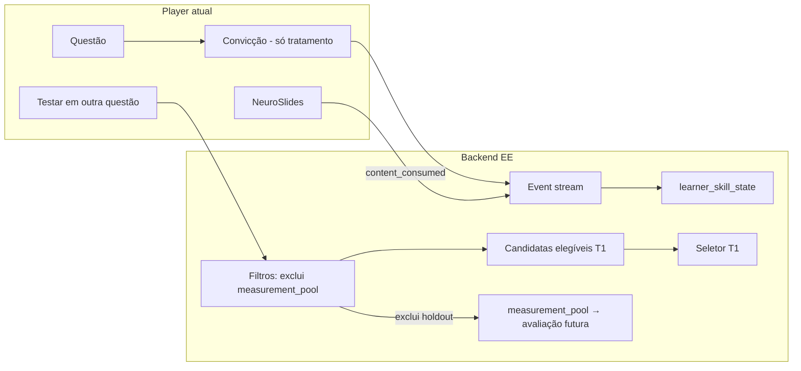
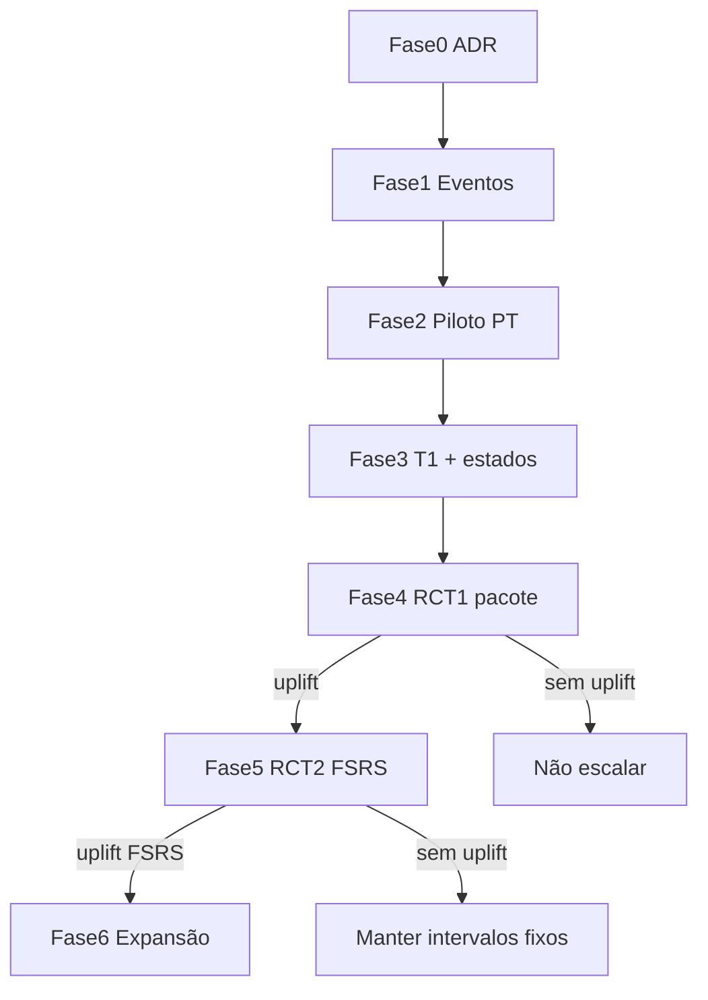

# Decisão — AVANT Evidence Engine (V1 estreita)

**Data:** 2026-07-24  
**Status:** proposta — aguarda aprovação humana (Fase 0, somente ADR)  
**Escopo:** instrumentação, piloto PT, transferência imediata, measurement_pool e estados auditáveis.  
**Não inclui nesta fase:** FSRS completo em produção, contextual bandit, LLM em runtime, controle total da Vitrine, anotação do catálogo inteiro.

Complementa:
- [`DECISAO_TRILHO_A_UNICO.md`](DECISAO_TRILHO_A_UNICO.md) — produção = handcraft golden-v1
- [`DECISAO_QUALITY_HIBRIDA.md`](DECISAO_QUALITY_HIBRIDA.md) — ship = venda; health contínuo
- [`lib/recommendations.ts`](../lib/recommendations.ts) — recomendação híbrida atual (prior declarado + desempenho + spaced)

---

## 1. Contexto e problemas do modelo atual

O AVANT já distingue enunciado → alternativas → NeuroSlides → registro de tentativa. Porém o sinal pedagógico disponível hoje é pobre:

| Fonte atual | O que registra | Limitação |
|-------------|----------------|-----------|
| [`historico_questoes`](../supabase/migrations-legacy/create_historico_questoes.sql) | `modulo_slug`, `topico`, `subtopico`, `banca`, `acertou`, `created_at` | Sem alternativa escolhida, convicção, tempo, contexto da tentativa nem `attempt_id`; replay **atualiza** a linha existente (não é append-only) |
| [`registrar-tentativa`](../app/api/registrar-tentativa/route.ts) | Acerto / gabarito | Não distingue diagnóstico, pós-explicação, transferência ou revisão; não persiste `opcao_id` no histórico |
| [`recommendations.ts`](../lib/recommendations.ts) | Prior declarado + desempenho + `spaced_repetition` | Não opera por microcompetência; não é FSRS |
| Quiz intra-slide (removido) | Existiu em `lib/slides/transferQuiz.ts` até `21e042e8` | Mediu toque/resposta **dentro** do slide; **não** prova transferência em questão inédita; hoje **não há** quiz de transferência no player |
| [`MarcarEstudoConcluidoButton`](../components/lesson/MarcarEstudoConcluidoButton.tsx) | CTA “Marcar estudado” | Fecha sessão sem evidência de aquisição/transferência |

Consequências:

1. Consumo de slides pode ser confundido com domínio.
2. Acerto imediato após explicação pode ser confundido com retenção.
3. Autopercepção do onboarding/questionário pesa demais enquanto há poucos dados observados.
4. Sem holdout e sem grupo controle, qualquer “melhoria” pode ser prática geral, regressão à média ou diferença de dificuldade — não causalidade do motor.

---

## 2. Decisão arquitetural

Adotar o **AVANT Evidence Engine V1** como sistema de evidência pedagógica estreito, mensurável e reversível, integrado ao player atual com **somente duas novas primitivas de UI**:

1. Componente de convicção antes de confirmar a resposta (`Chutei` / `Entre duas` / `Tenho certeza`).
2. CTA condicional pós-NeuroSlides **“Testar em outra questão”** (transferência T1), onde o conteúdo estiver `evidence_ready`.

Essas primitivas são habilitadas por `context` e braço experimental, **nunca globalmente**. A sessão `measurement_holdout` é **superfície experimental separada**, idêntica nos dois braços, e reutiliza o modo avaliativo existente do simulado — portanto, não adiciona uma terceira primitiva (ver §18).

Todo o restante (diagnóstico, estado por competência, seleção de transferência, holdout, experimento) ocorre no backend, sob feature flag e piloto por skill/subtópico.

**Pergunta científica do primeiro RCT (Fase 4):**

> Convicção + transferência T1 + Evidence Engine V1 aumentam o acerto em questões inéditas após 14 dias quando comparados ao AVANT atual?

**Separação científica congelada:**

| Fase | O que comprova |
|------|----------------|
| Fase 1 | Confiabilidade dos eventos |
| RCT-1 (Fase 4) | Valor do **pacote** convicção + T1 + EE V1 vs. legado |
| RCT-2 (Fase 5) | Valor **incremental** do FSRS vs. intervalos fixos (ambos com EE) |
| Fase 6 | Expansão só após evidência positiva nas fases anteriores |

Este ADR **não** é especificação de implementação. Spec operacional da Fase 1 só após aprovação humana deste documento.

---

## 3. Relação com o código existente

| Componente atual | Papel no EE V1 |
|------------------|----------------|
| `recommendations.ts` | No RCT-1, **ambos** os braços mantêm Vitrine livre + `recommendations.ts` / fluxo adaptativo **legado**. O seletor EE V1 entra **somente** no tratamento, e só em sessões adaptativas elegíveis. O híbrido **não** é o braço experimental; o estimando é o **pacote completo** (§18). EE **não** substitui a Vitrine livre. |
| Simulado diagnóstico (`lib/simulado/*`) | Continua gerando evidência observada forte; passa a emitir eventos com `context = diagnostic` e convicção **somente** no braço de tratamento / coorte de instrumentação. |
| Quiz intra-slide (legado removido) | `lib/slides/transferQuiz.ts` foi removido em `21e042e8` (sem sucessor no player). T1 do EE = questão inédita pós-slides — nome e métricas **distintos** de qualquer quiz intra-slide histórico. |
| Pós-NeuroSlides (`MarcarEstudoConcluidoButton`) | Sob flag de tratamento: CTA vira “Testar em outra questão”. No controle: fluxo legado (“Marcar estudado”). |
| `meta.subtopico` / `family` / `pedagogical_branch` | Continuam no schema ([`lib/validations.ts`](../lib/validations.ts)); **não** são `skill_id`. |
| Vitrine / entitlements / cache | Contratos atuais preservados **exceto** o filtro experimental do `measurement_pool` (§14, §28). Seleção adaptativa EE só no tratamento, em sessões explícitas (“Plano do dia”, “Continuar diagnóstico”, revisão programada). Para participantes em experimento: itens do pool ficam **inelegíveis em toda superfície** até a janela de medição — ver §14–§16. |



> **Nota:** `learner_skill_state` (SK) é projeção derivada — **não** ativada no produto na Fase 1; o diagrama descreve o alvo pós-instrumentação. Não há aresta `SEL → HOLD`: o seletor **nunca** consome o holdout; o pool é excluído **antes** da seleção T1 e segue para avaliação futura na única janela atribuída ao aluno/skill (§14–§16).

---

## 4. Invariantes não negociáveis

1. Somente duas novas primitivas de UI: componente de convicção antes de confirmar e CTA condicional “Testar em outra questão”. Ambas são habilitadas por contexto e braço, nunca globalmente. `measurement_holdout` reutiliza o modo avaliativo existente do simulado (§18).
2. Vitrine permanece livre no catálogo **elegível**. O único filtro extra do EE na vitrine (e demais superfícies) para participantes em experimento é a exclusão do `measurement_pool` até a janela de medição. Seleção adaptativa (escolher a próxima questão) ocorre **somente** em sessões adaptativas explícitas.
3. Sem candidata válida de transferência, **não fingir** transferência (`transfer_inventory_missing`).
4. Um acerto pós-explicação **não** concede domínio.
5. Percorrer NeuroSlides atualiza apenas `content_consumed` — não domínio, não FSRS.
6. Transferência imediata (T1) atualiza aquisição/nível T1; **não** atualiza retenção FSRS como revisão futura.
7. A mesma questão **não** pode ser transferência e `measurement_pool` para o mesmo `(user, skill, experiment)`.
8. Sem uplift no RCT-1, **não** escalar para FSRS ou bandit.
9. IA pode auxiliar anotação offline; **nunca** seleciona a próxima questão em runtime na V1.
10. Convicção **não** é liberada para toda a base antes do RCT-1 do pacote completo (ver §18–§19 e Fase 1).
11. `pedagogical_branch` e `family` **não** são `skill_id` (ver §6).
12. FSRS é hipótese posterior, submetida a experimento próprio (RCT-2), não promoção automática após uplift do pacote.
13. Para `(user, skill, experiment)`, questões do `measurement_pool` são **inelegíveis em toda superfície** (vitrine livre, recomendações, T1, simulado não-medição) até a janela de medição; resposta em `regular_practice` conta como contaminação (§17).
14. Cada `(user, skill, experiment)` pertence a **uma única** janela de medição; o mesmo aluno/skill nunca é medido em D+7, D+14 e D+30 dentro do mesmo experimento (§14–§15).
15. `measurement_holdout` é medição neutra, não ensino: não atualiza domínio, misconception, estados, recomendações ou agendamento (§8, §13, §18).

---

## 5. Taxonomia

Estrutura obrigatória:

```text
disciplina
  → subtopico (CLAUDE.md §9 para Técnico em Enfermagem ou mapa canônico da disciplina,
     como o mapa específico de Língua Portuguesa)
    → cluster de conhecimento
      → skill_id
        → misconception
```

Exemplo:

```text
Língua Portuguesa
  → Pontuação
    → Elementos isolados
      → Identificar vocativo
        → Confunde pausa oral com função sintática
```

**Regra:** `skill_id` só é criado quando houver inventário suficiente para medir aquela competência (múltiplas questões elegíveis a ensino, T1 e holdout). Proibido criar centenas de skills com uma única questão cada.

Piloto inicial sugerido: funil PT curto (crase, colocação pronominal, pontuação/vocativo) com inventário mínimo comprovado.

---

## 6. `pedagogical_branch` e `family` não são `skill_id`

| Campo | Significado | Exemplo |
|-------|-------------|---------|
| `meta.family` | Formato de prova / família golden | `conceito`, `vf`, `certo_errado` |
| `meta.pedagogical_branch` | Molde L3 / pacote visual-pedagógico | `pt_crase`, `via_vf_absorcao` |
| `primary_skill_id` | Microcompetência **medida** | `portugues.pontuacao.vocativo` |

Misturar molde com competência invalidaria o mapa de domínio e o seletor de transferência. O ADR proíbe qualquer alias automático `branch → skill` ou `family → skill`.

---

## 7. Event stream append-only paralelo a `historico_questoes`

- Nova tabela (ou stream) **append-only**, em paralelo ao histórico atual.
- **Não** substitui `historico_questoes` na V1.
- Recomendações e analytics legados continuam lendo o histórico atual até fases posteriores explicitamente aprovadas.
- Fase 1 = **somente instrumentação**: não cria nem altera domínio no produto.

---

## 8. Campos do evento, contexts e idempotência

Campos canônicos do evento (contrato de decisão; **nomes finais / DDL na spec operacional** — lista abaixo é ilustrativa do mínimo semântico):

```text
event_type          # attempt | transfer_inventory_missing  (mínimo V1; outros tipos na spec)
attempt_id          # obrigatório quando event_type = attempt; nullable em transfer_inventory_missing
user_id
question_id         # no catálogo atual equivale a modulo_slug (ver Divergências)
question_version
selected_alternative
correct
conviction          # chute | entre_duas | certeza | unknown  (UI: Chutei / Entre duas / Tenho certeza)
response_time_ms
answer_change_count
context
primary_skill_id    # nullable até anotação
session_id
experiment_id                       # obrigatório em measurement_holdout
arm_assignment_id                   # obrigatório em measurement_holdout
measurement_window_assignment_id    # obrigatório em measurement_holdout
holdout_assignment_id               # obrigatório em measurement_holdout
measurement_window                  # d7 | d14 | d30 (= coortes primary_d14 | secondary_d7 | exploratory_d30; ver §14)
created_at
```

Valores de `context` (`measurement_holdout` é canônico e congelado neste ADR; os demais mantêm nomes finais na spec):

| `context` | Uso |
|-----------|-----|
| `diagnostic` | Simulado / diagnóstico inicial |
| `regular_practice` | Prática livre / vitrine |
| `pre_explanation` | Resposta antes de qualquer explicação nesta sessão |
| `immediate_transfer` | T1 pós-NeuroSlides |
| `scheduled_review` | Revisão futura agendada |
| `simulation` | Simulado posterior (não diagnóstico) |
| `measurement_holdout` | Bloco neutro de medição experimental na única janela atribuída ao aluno/skill |

### Contrato canônico de `transfer_inventory_missing`

Quando o seletor T1 não encontra candidata válida (§11), o event stream registra um evento de sistema — **não** uma tentativa de resposta:

| Campo | Regra |
|-------|--------|
| `event_type` | `transfer_inventory_missing` (canônico) |
| `attempt_id` | **nullable** — não há tentativa de aluno; idempotência por chave operacional abaixo |
| `context` | `immediate_transfer` (a superfície que falhou) |
| `user_id` | obrigatório |
| `question_id` | questão-mãe que pediu T1 |
| `primary_skill_id` | skill da questão-mãe (quando anotada) |
| `session_id` | sessão em que o CTA/seletor foi avaliado |
| `correct` / `conviction` / `selected_alternative` | **ausentes** — não é outcome de resposta |

**Idempotência:** no máximo um evento canônico `transfer_inventory_missing` por `(user_id, question_id, session_id, primary_skill_id)` (ou chave equivalente na spec Fase 1). Reenvios não duplicam. Esse evento **não** atualiza domínio, misconception, estados, recomendações nem FSRS — só alimenta inventário / go-no-go (§27).

### Contrato canônico de `measurement_holdout`

Nesse contexto:

- registrar um evento append-only por tentativa, com `question_version`, braço, janela, `arm_assignment_id`, `measurement_window_assignment_id` e `holdout_assignment_id`;
- usar `correct` **somente** como outcome experimental;
- não atualizar domínio, misconception, estados pedagógicos, recomendações, intervalos fixos ou FSRS;
- não abrir NeuroSlides e não oferecer T1;
- não recolocar a questão no inventário depois de respondida;
- respostas do bloco não podem influenciar a seleção ou a ordem das demais questões do mesmo bloco;
- somente depois do encerramento do bloco pode ser liberado o fluxo normal;
- eventos posteriores ao encerramento ficam fora do resultado experimental já registrado.

**Idempotência:** para `event_type = attempt`, existe apenas um **evento canônico** por `attempt_id`. Reenvios são idempotentes e não geram duplicação de evento. Para `transfer_inventory_missing`, ver chave operacional no contrato acima.

Falha de rede na convicção: persistir `conviction = unknown`; **nunca** bloquear a resposta do aluno.

**Wire format (ilustrativo):** labels de UI em português; enum persistido em `snake_case` (`chute`, `entre_duas`, `certeza`, `unknown`) — nomes finais na spec Fase 1.

---

## 9. Semântica de `question_version`

- Questão editada (enunciado, alternativas, gabarito ou metadados de evidência relevantes) cria **nova** `question_version`.
- Tentativas sob versão antiga **não** validam aprendizado sob a versão nova.
- Holdout e T1 devem referenciar versão válida no momento da atribuição/seleção.
- Questão cujo gabarito já apareceu nos NeuroSlides da questão-mãe é inelegível como medição/transferência daquela sessão. **Detector / regra operacional:** spec Fase 2+ (anotação piloto); este ADR congela só a intenção pedagógica.

---

## 10. Gate `evidence_ready`

Uma questão só participa do Evidence Engine (CTA T1 / seleção adaptativa EE) quando `evidence_ready = true`, o que exige:

- `primary_skill_id` definido;
- diagnóstico dos distratores (`distractor_diagnoses` ou equivalente revisado);
- pelo menos uma candidata inédita de transferência no inventário;
- diferença comprovada de molde superficial (`surface_template_id` distinto) — **definição operacional na spec Fase 2+**;
- dificuldade compatível — **escala e limiar na spec Fase 2+**;
- conteúdo validado (handcraft / golden-v1 conforme trilho A).

Questões sem `evidence_ready` permanecem no **fluxo legado**. Não é necessário anotar o catálogo inteiro antes do piloto.

Pipeline de misconceptions (offline):

```text
danger_zone.items[].correct
  → hipótese automática de erro
  → misconception_code normalizado
  → revisão humana
  → gravação no catálogo
```

IA pode propor códigos em lote; **publicação automática é proibida**.

---

## 11. Seletor determinístico de transferência T1

> **Pré-requisito:** filtros que dependem de `difficulty`, `surface_template_id` e `evidence_ready` só entram em vigor **após Fase 2** (anotação piloto). Antes disso, o seletor opera com o inventário disponível e registra `transfer_inventory_missing` quando insuficiente.

Filtros obrigatórios (conjunto **pleno**, em vigor **após Fase 2**):

- mesmo `primary_skill_id`;
- `question_id` diferente da questão-mãe;
- não respondida pelo aluno;
- `question_version` válida;
- dificuldade entre mãe ± 1;                    # requer anotação Fase 2+
- `surface_template_id` diferente;              # requer anotação Fase 2+
- `evidence_ready = true`;                      # requer anotação Fase 2+
- entitlement permitido;
- **fora** do `measurement_pool` do aluno para aquele `(skill, experiment)`;
- não no conjunto de já vistas / mesma superfície (§16).

**Fase 3 não anota em runtime.** A Fase 3 **não** cria, infere nem completa metadados durante a execução. O seletor T1 aceita **somente** questões:

- previamente anotadas na Fase 2;
- revisadas por humano;
- versionadas;
- aprovadas nos validadores;
- com `evidence_ready = true`.

Se qualquer metadado relevante mudar — `primary_skill_id`, `misconception`, `difficulty`, `surface_template_id` ou `question_version` — `evidence_ready` deve ser **invalidado** e a questão precisa passar **novamente** pelo gate (§10) antes de retornar ao inventário T1.

**Subconjunto mínimo Fase 3 (conteúdo previamente anotado, revisado e aprovado na Fase 2):** `primary_skill_id`, `question_id` ≠ mãe, não respondida, `question_version` válida, entitlement, fora do `measurement_pool`. Todas essas questões já passaram pelo gate da Fase 2; nenhuma anotação é criada em runtime. Sem candidata suficiente → `transfer_inventory_missing` (política canônica abaixo).

Ordenação (ilustrativa; pesos finais na spec operacional):

1. Distrator ligado à misconception detectada  
2. Maior diferença superficial  
3. Menor número de exposições  
4. Dificuldade mais próxima  
5. Aleatoriedade controlada entre as melhores  

Sem candidata válida — política canônica (uma única regra):

1. **Não** habilitar T1/EE para aquela questão-mãe.
2. **Não** elevar nível de transferência.
3. Registrar evento de sistema `event_type = transfer_inventory_missing` (§8) — não é tentativa; não atualiza domínio.
4. Agendar revisão futura com intervalos fixos **somente** se a competência já estiver em ciclo de revisão (Fase 3+); caso contrário, permanecer no fluxo legado.

---

## 12. Estados V1 e transições

Estados auditáveis por `user_id × skill_id` (projeção derivada; **não** ativada no produto na Fase 1):

```text
UNKNOWN
DIAGNOSED
FRAGILE
RECOVERING
TRANSFERRED
CONSOLIDATING
MASTERED
AT_RISK
```

Transições principais (decisão pedagógica):

| Evento | Transição típica |
|--------|------------------|
| Acertou + chute | → `FRAGILE` |
| Errou + certeza | → `DIAGNOSED` (misconception forte) |
| Concluiu NeuroSlides | estado **inalterado** (`content_consumed`) |
| Acertou T1 imediata | → `TRANSFERRED` (nível T1) |
| Errou T1 imediata | → `RECOVERING` |
| Acertou inédita futura em `scheduled_review` | → `CONSOLIDATING` (T2) |
| Resposta em `measurement_holdout` | estado **inalterado**; outcome experimental somente |
| Nova evidência segura separada no tempo | → `MASTERED` (limiares temporais / N mín. na **spec operacional** — não neste ADR) |
| Erro após domínio/consolidação | → `AT_RISK` |

Critério de domínio (conceitual): múltiplas inéditas corretas em momentos distintos, pelo menos uma transferência além de T1, sem exposição recente do gabarito, sem reincidência recente da misconception. T1 sozinho **nunca** basta. Limiares numéricos ficam na spec — não inventados aqui.

---

## 13. Separação obrigatória: aquisição × retenção × transferência

| Evento | Domínio | Transferência | Agendamento V1 (pré-RCT-2) |
|--------|---------|---------------|----------------------------|
| Resposta antes da explicação | Atualiza | Pode medir | Intervalos fixos conservadores |
| Conclusão dos NeuroSlides | Não | Não | Não |
| Transferência imediata (T1) | Atualiza aquisição | Atualiza T1 | Agenda uma revisão futura, **sem** contar T1 como review FSRS nem como evidência de retenção |
| Revisão futura inédita (`scheduled_review`) | Atualiza | Pode atualizar T2/T3 | Atualiza retenção com intervalos fixos |
| Simulado posterior | Evidência forte | Pode validar T3/T4 | Intervalos fixos conforme regra do braço |
| Medição (`measurement_holdout`) | Não | Não | Não; outcome experimental somente |

**RCT-2 (Fase 5):** somente tentativas `scheduled_review`, respondidas **antes** de explicação, atualizam o FSRS no braço correspondente. Até lá, agendamento usa **intervalos fixos conservadores**. Exemplos ilustrativos (não congelados): T1 falhou → 1d; frágil → 2d; segura → 4d; segunda evidência → 7d. Valores exatos na spec operacional — não neste ADR.

O bloqueio de efeitos pedagógicos de `measurement_holdout` vale antes, durante e depois da análise: seu acerto não promove estado, não dispara revisão e não altera a experiência subsequente. Eventos posteriores podem alimentar o fluxo normal, mas ficam fora do outcome experimental já fechado.

---

## 14. Measurement pool por aluno

**Sinônimo canônico:** `measurement_pool(user, skill, experiment)` **é** o holdout daquela competência na **única janela atribuída**. A janela é determinada por `measurement_window_assignment_id`; depois, `holdout_assignment_id` identifica a seleção versionada das questões reservadas daquela janela (§15). Não existe pool global “só por experimento” misturando skills.

Cada `(user, skill, experiment)` é atribuído a exatamente uma coorte de janela.

**Mapeamento 1:1 (congelado)** — valor persistido em `measurement_window` ↔ nome da coorte:

| `measurement_window` (evento) | Coorte | Papel |
|-------------------------------|--------|--------|
| `d14` | `primary_d14` | Métrica primária pré-registrada (14 dias a partir de `t0`) |
| `d7` | `secondary_d7` | Sensibilidade precoce (secundária) |
| `d30` | `exploratory_d30` | Retenção mais longa (exploratória) |

```text
measurement_window (persistido)     coorte (plano / análise)
├── d14                          ↔  primary_d14
├── d7                           ↔  secondary_d7
└── d30                          ↔  exploratory_d30
```

Implementação e queries de uplift usam o valor curto (`d7` | `d14` | `d30`) no evento; relatórios e o plano experimental podem usar os nomes de coorte. **Proibido** persistir `primary_d14` / `secondary_d7` / `exploratory_d30` no campo `measurement_window` do evento.

As três coortes são mutuamente exclusivas por `user_id × skill_id × experiment_id`: o mesmo aluno/skill **não** pode ser medido em mais de uma janela no mesmo experimento. Isso evita que uma medição em D+7 produza `testing effect` e altere o outcome D+14.

**Regras de atribuição (congeladas):**

- D+14 (`primary_d14`) recebe prioridade de amostra e inventário.
- D+7 (`secondary_d7`) e D+30 (`exploratory_d30`) usam usuários/skills distintos dos atribuídos a D+14 e entre si.
- Se não houver poder estatístico ou inventário suficiente para sustentar coortes separadas, **manter somente D+14**.
- D+7 e D+30 não podem reduzir a amostra nem o inventário de D+14 abaixo do mínimo pré-registrado.
- Não reatribuir o mesmo `(user, skill, experiment)` a outra janela depois da atribuição.
- Qualquer exposição anterior invalida o item naquela janela (e dispara contaminação / substituição — §17).

**Inelegibilidade operacional (V1):** itens reservados para a janela atribuída ficam **inelegíveis** como questão-mãe, T1, `scheduled_review` ou simulado do usuário até a medição. Holdout é **por aluno × skill** (não as mesmas questões para todos), economizando inventário.

**NeuroSlides estáticos (V1):** os NeuroSlides **continuam estáticos**; a V1 **não** cria conteúdo de slides dinâmico por usuário e **não** promete ocultar, por usuário, exemplos internos dos slides. Antes do experimento, uma **auditoria offline** verifica vazamento textual ou semântico entre questões reservadas e o conteúdo dos slides. Se a resposta ou o raciocínio específico do item reservado tiver sido exposto nos slides, o item é marcado como `contaminated` e substituído (§17).

**Isolamento na vitrine livre:** para participantes em experimento ativo, itens do `measurement_pool` da skill e janela atribuída ficam **inelegíveis em toda superfície** até a medição — incluindo vitrine livre (`regular_practice`), recomendações híbridas, T1 e simulado não-medição. A vitrine permanece livre para o restante do catálogo elegível; apenas o pool reservado é bloqueado. Esse filtro é **infraestrutura comum de medição** (ambos os braços), não seleção adaptativa. Resposta acidental em `regular_practice` → contaminação (§17). Detalhe de cache/entitlements: §28.

`measurement_pool` sozinho mede desempenho; **não** prova uplift. Uplift exige grupo controle (§18–§22). A métrica primária usa somente a coorte atribuída a `primary_d14` (§20).

---

## 15. Holdout sorteado antes de qualquer exposição

A atribuição exclusiva da janela e a seleção das questões do `measurement_pool` devem ocorrer **antes** de:

- simulado diagnóstico;
- transferência imediata;
- revisão programada;
- seleção da questão-mãe / ensino da competência;
- seleção adaptativa;
- vitrine livre / recomendações (para participantes em experimento).

A auditoria offline de vazamento slide↔holdout (§14) também precede o início do experimento.

### Elegibilidade e exposição de usuários existentes

O AVANT já possui base com histórico. Reservar holdout "antes de qualquer exposição" só é seguro para exposições observáveis; para usuários existentes, valem regras explícitas:

- O RCT confirmatório **prioriza** usuários cuja exposição seja observável **desde a ativação do event stream**.
- Antes de reservar uma questão, **consolidar as exposições conhecidas em todas as fontes existentes**: `historico_questoes`, simulados, sessões de estudo e o novo event stream, quando disponíveis.
- **Ausência em `historico_questoes` não comprova ineditismo** (o histórico atual não é append-only e não cobre todas as superfícies).
- Quando **não** for possível reconstruir a exposição anterior com segurança, registrar `legacy_exposure_uncertain`.
- Usuários/skills com `legacy_exposure_uncertain` **não** entram na análise confirmatória do outcome primário (§20).
- Esses dados podem ser usados **somente** em análise exploratória, identificada separadamente.
- **Nenhuma imputação** pode transformar exposição desconhecida em "inédita".
- A **data de corte** e os **requisitos mínimos de observabilidade** ficam no plano operacional.

Identificadores de janela e holdout (entradas estruturadas — sem ambiguidade de concatenação):

```text
measurement_window_assignment_id = hash(user_id + skill_id + experiment_id)
holdout_assignment_id = hash(measurement_window_assignment_id + measurement_window + holdout_version)
```

Implementação: tupla com delimitador fixo ou HMAC estruturado; detalhe na spec operacional.

`measurement_window_assignment_id` atribui exatamente uma janela por `(user, skill, experiment)`. `holdout_assignment_id` identifica a seleção das questões reservadas **dessa janela**, permitindo versionar substituições auditáveis sem mudar a janela atribuída. Propriedades: determinístico; estratificado por skill e dificuldade quando aplicável; versionado; reproduzível para auditoria.

---

## 16. Exclusão obrigatória na seleção

As exclusões dependem da superfície (participantes em experimento):

- **Vitrine livre, `recommendations.ts` legado, simulado não-medição:** exclui **apenas** o `measurement_pool` da janela atribuída ainda não avaliada. O comportamento legado — inclusive a dependência de `já_vistas` para `review_needed` / `spaced_repetition` — é preservado nos **dois** braços.

```text
excluídas_vitrine_recomendacoes = measurement_pool
```

- **T1 e prática adaptativa EE (só tratamento, sessões elegíveis):**

```text
excluídas_T1 = measurement_pool ∪ já_vistas ∪ mesmo_surface_template ∪ questão_mãe
```

A mesma questão não pode ser transferência e `measurement_pool` para o mesmo `(user, skill, experiment)`.

---

## 17. Holdout contaminado

Se o aluno ver ou responder acidentalmente uma questão reservada (incluindo via vitrine livre / `regular_practice`), ou se a auditoria offline / evidência posterior mostrar que a resposta ou o raciocínio específico do item reservado foi exposto nos NeuroSlides estáticos:

```text
measurement_status = contaminated
```

Regras:

- Excluir da métrica da janela afetada.
- Substituir por outra questão elegível **antes** da avaliação, preservando a janela atribuída.
- **Nunca** mover silenciosamente uma questão já exposta de volta ao holdout limpo.
- **Nunca** reatribuir o mesmo `(user, skill, experiment)` a outra janela para compensar contaminação.

---

## 18. Experimento controlado (RCT-1) — pacote completo

O primeiro RCT mede o **pacote completo**, não apenas o motor interno. O resultado estima o efeito do **pacote completo**. **Não** tenta isolar o efeito individual de convicção, T1 ou seletor.

| Braço | Experiência |
|-------|-------------|
| **Controle** | Vitrine livre; `recommendations.ts` e fluxo adaptativo **legado**; **sem** convicção; **sem** T1; **sem** seletor EE |
| **Tratamento** | **Mesma** Vitrine livre; convicção; T1; seletor Evidence Engine V1 **somente** nas sessões adaptativas elegíveis |
| **Ambos** | Mesma infraestrutura silenciosa de `measurement_pool` e atribuição exclusiva de janela (§14); mesma regra de proteção do holdout; mesmos critérios de elegibilidade; mesma instrumentação necessária à avaliação — essa infraestrutura **não** conta como tratamento |

### Matriz de experiência por superfície

| Superfície | Controle | Tratamento |
|------------|----------|------------|
| Questionário inicial | Legado, sem nova primitiva | Legado, sem nova primitiva |
| Simulado diagnóstico após randomização | Sem convicção | Com convicção |
| Prática elegível | Sem convicção | Com convicção |
| Pós-NeuroSlides `evidence_ready` | Fluxo legado (“Marcar estudado”) | CTA condicional T1 (“Testar em outra questão”) |
| `measurement_holdout` | Avaliação neutra; sem convicção e sem T1 | A mesma avaliação neutra; sem convicção e sem T1 |

Para novos usuários, a randomização ocorre **depois** do questionário inicial e **antes** do simulado diagnóstico. Para usuários com diagnóstico já realizado, o histórico existente é usado como baseline; é proibido tentar adicionar convicção retroativamente.

T1 nunca ocorre durante questão de simulado — diagnóstico ou posterior — nem durante `measurement_holdout`.

### Experiência fixa de `measurement_holdout`

Na única janela atribuída (D+7, D+14 ou D+30), controle e tratamento recebem uma experiência **idêntica**, dedicada e não adaptativa:

- reutiliza o modo avaliativo existente do simulado;
- não solicita convicção;
- não mostra correção imediata;
- não abre NeuroSlides;
- não oferece T1;
- apresenta resultado somente após a finalização do bloco.

Essa sessão neutra serve **somente para medição, não para ensino**. A seleção e a ordem do bloco são congeladas antes do início; respostas intermediárias não alteram as questões restantes. O fluxo normal só é liberado após encerrar o bloco, e eventos posteriores não alteram o outcome experimental já registrado (§8, §13).

Em D+14 (janela primária), a coorte `primary_d14` recebe questões reservadas antes de qualquer exposição (§14–§15; `t0` em §20). Coortes D+7 / D+30, se existirem, contêm outros usuários/skills atribuídos exclusivamente às janelas correspondentes.

Durante a Fase 1 (instrumentação), a UI de convicção **não** é liberada para toda a base. Permitido apenas para:

- equipe interna;
- usuários de teste;
- pequena coorte técnica;
- sessões explicitamente marcadas como instrumentação.

Eventos internos/teste são **excluídos** do RCT.

Alternativa rejeitada para o 1º experimento: convicção nos dois braços (medir só o motor). Isso deixa de ter controle pedagógico legado (sem convicção/T1) e não responde à pergunta do produto. Pode ser um experimento **posterior** de decomposição.

---

## 19. Randomização: três identificadores distintos

### Glossário (não confundir)

| ID | O que identifica | O que **não** é |
|----|------------------|-----------------|
| `arm_assignment_id` | Braço do experimento (**controle** vs **tratamento**) para o **usuário** inteiro | Não escolhe janela D+7/D+14/D+30 nem quais questões reservar |
| `measurement_window_assignment_id` | Qual **única** janela de medição (`d7` / `d14` / `d30`) cabe a aquele `(user, skill, experiment)` | Não é o braço; não lista as questões do pool |
| `holdout_assignment_id` | Seleção **versionada** das questões reservadas **dessa** janela (substituições auditáveis) | Não redefine a janela; não define o braço |

Ordem causal: braço (`arm_assignment_id`) → janela (`measurement_window_assignment_id`) → questões reservadas (`holdout_assignment_id`).

| Identificador | Escopo | Fórmula |
|---------------|--------|---------|
| `arm_assignment_id` | por **usuário** | `hash(user_id + experiment_id)` |
| `measurement_window_assignment_id` | janela por **usuário × skill** | `hash(user_id + skill_id + experiment_id)` |
| `holdout_assignment_id` | seleção das questões reservadas da janela | `hash(measurement_window_assignment_id + measurement_window + holdout_version)` |

Implementação: tupla com delimitador fixo ou HMAC estruturado — **não** concatenação ambígua de strings.

- Randomização do braço **por usuário**, não por tentativa (evita misturar tratamentos no mesmo aluno).
- Atribuição de janela **por usuário × skill**, exatamente uma vez por experimento.
- Seleção do holdout somente depois da janela, sem mudar a janela ao versionar substituições.
- Estratificação quando aplicável (ex.: desempenho-base, skill).
- **Proibido** incluir `skill_id` no `arm_assignment_id` (o mesmo usuário não pode ser controle em uma skill e tratamento em outra no mesmo experimento).
- **Proibido** usar `hash(user_id + skill_id + experiment_id)` como `holdout_assignment_id` — esse hash é exclusivo de `measurement_window_assignment_id`.

---

## 20. Métrica primária

**Primária (pré-registrada):** acerto em questões inéditas da coorte atribuída a `primary_d14` após **14 dias** a partir de `t0`.

**Âncora temporal (congelada):**

```text
t0 = timestamp da primeira tentativa elegível, pré-explicação, da skill,
     realizada após a atribuição do usuário ao braço experimental
```

- O evento de `t0` precisa existir nos **dois** braços.
- **Não** pode depender de T1 (o controle não recebe T1).
- As janelas D+7, D+14 e D+30 são calculadas a partir desse `t0`.
- D+14 mede **somente** usuários/skills atribuídos a `primary_d14` (§14).

> **Distinção:** janela de 14 dias aqui é **métrica do RCT** (evidência pedagógica). É **independente** do ship gate de qualidade de catálogo (`DECISAO_QUALITY_HIBRIDA.md`), que não exige calendário pré-venda.

Escolhida a priori para evitar p-hacking / métrica favorável a posteriori.

---

## 21. Métricas secundárias e exploratórias

| Papel | Janela | Coorte exclusiva (§14) | Uso |
|-------|--------|------------------------|-----|
| Secundária | D+7 a partir de `t0` | `secondary_d7` | Sensibilidade precoce |
| Exploratória | D+30 a partir de `t0` | `exploratory_d30` | Retenção mais longa |

O mesmo `(user, skill, experiment)` não participa de mais de uma janela. Se amostra ou inventário não sustentarem coortes exclusivas sem empobrecer `primary_d14` abaixo do mínimo do plano experimental, **omitir** D+7 e D+30 e manter somente D+14 (§14).

Outros sinais de monitoramento (não substituem a primária): reincidência de misconception; acerto de T1; taxa de contaminação do holdout; `transfer_inventory_missing` (limiar no plano do RCT-1 — §27); calibração (Brier) em fases posteriores.

---

## 22. Definição de uplift

```text
Uplift_14d = Acerto(tratamento, primary_d14) − Acerto(controle, primary_d14)
```

Janela primária: **14 dias** a partir de `t0` (§20). Sem grupo controle, melhora aparente pode ser prática geral, dificuldade ou regressão à média.

---

## 23. Análise de poder

O tamanho mínimo da amostra **não** é fixado neste ADR.

Após conhecer o acerto-base no piloto / baseline, realizar análise de poder e registrar N no plano operacional do experimento. Inventar N arbitrário no ADR é proibido.

---

## 24. O que não entra na V1 (nem junto com este ADR)

- Migrations / DDL reais (ficam na spec Fase 1, após aprovação).
- Alterações de player em produção para toda a base.
- Feature flag real ligada globalmente.
- FSRS em produção como agendador padrão.
- Contextual bandit / RL educacional.
- LLM decidindo a próxima questão em runtime.
- Anotação obrigatória do catálogo inteiro.
- Substituição de `historico_questoes`.
- Controle algorítmico de toda a Vitrine.

---

## 25. Roadmap das Fases 0–6

| Fase | Conteúdo | Gate de saída |
|------|----------|---------------|
| **0** | Este ADR | Aprovação humana; revisão confirma que a correção alterou somente este arquivo e distingue mudanças preexistentes no `git status --short` (ver § Próximo passo) |
| **1** | Instrumentação: event stream paralelo; convicção só coorte técnica/instrumentação; **sem** projeção de domínio no produto | Checklist §27 (Fase 1) |
| **2** | Piloto PT anotado + `evidence_ready` | Inventário mínimo por skill piloto |
| **3** | T1 + estados + intervalos fixos — **somente** lab/coorte interna **fora** do sampling frame do RCT-1 | Seletor determinístico + fallbacks; **nenhum** rollout populacional de T1/convicção antes da randomização do RCT-1 (Fase 4) |
| **4** | **RCT-1** pacote completo (14d primária) — **primeiro** rollout populacional de convicção + T1 | Uplift em `primary_d14` (14d) vs. controle |
| **5** | **RCT-2** FSRS vs. intervalos fixos | Uplift incremental de retenção/eficiência |
| **6** | Expansão de anotação / calibração / modelos posteriores | Só com evidência positiva em 4 e 5 |



### Fase 5 — Experimento FSRS por competência (RCT-2)

Uplift positivo na Fase 4 **autoriza testar** o FSRS; **não** comprova que ele supera os intervalos fixos.

| Braço | Agendamento |
|-------|-------------|
| Controle | Evidence Engine V1 + intervalos fixos conservadores |
| Tratamento | Evidence Engine V1 + FSRS por `user_id × skill_id` |

Invariantes do RCT-2:

- Novo `experiment_id`.
- Randomização novamente por usuário (`arm_assignment_id`).
- Estratificar pelo desempenho-base e, se necessário, pelo braço do RCT-1.
- Ambos os braços recebem a **mesma** experiência de convicção e T1.
- T1 imediato **nunca** entra como revisão de retenção.
- Somente tentativas `scheduled_review`, respondidas antes de explicação, atualizam o FSRS.
- Measurement pool permanece isolado.
- Comparar retenção e eficiência, **não** engajamento (cliques, tempo no app, conclusão de slides).

**Pergunta científica:**

> O FSRS por competência aumenta a retenção inédita por minuto estudado quando comparado aos intervalos fixos do Evidence Engine V1?

Métricas recomendadas do RCT-2: acerto inédito na **coorte de janela pré-registrada do RCT-2** (janela primária definida no plano operacional, com atribuição exclusiva — §14); acerto por minuto estudado; número de revisões por competência consolidada; reincidência da misconception; calibração entre recuperabilidade prevista e acerto observado.

---

## 26. Rollback e feature flag

- Flag conceitual: `EE_V1_ENABLED` (nome final na spec operacional).
- Piloto por `skill_id` / subtópico; conteúdo sem `evidence_ready` permanece legado.
- Desligar a flag → retorno imediato ao fluxo legado (histórico + recomendações atuais + “Marcar estudado”).
- Convicção global só após desenho do RCT-1 (tratamento); nunca “por acidente” na Fase 1.

Implementação futura desta flag toca player, APIs e possivelmente cache/entitlements (zona amarela/vermelha em engenharia AVANT). Revisão humana obrigatória antes de ship — fora do escopo deste ADR.

---

## 27. Critérios objetivos de go/no-go

### Saída da Fase 1 (instrumentação)

Antes da Fase 2, verificar:

1. Existe apenas um evento canônico por `attempt_id` (`event_type = attempt`); reenvios são idempotentes e não geram duplicação. Eventos `transfer_inventory_missing` seguem a chave operacional de §8.
2. Reconciliação entre tentativa atual (`historico_questoes` / resposta) e event stream.
3. `context` válido em todos os eventos elegíveis.
4. `question_version` presente.
5. Tempo dentro de limites plausíveis ou marcado como inválido.
6. Taxa de `conviction = unknown` monitorada.
7. Falha de instrumentação **nunca** bloqueia o player.
8. Eventos internos/testes excluídos do experimento.
9. O event stream pode ser reproduzido em ambiente de teste para gerar a mesma projeção derivada, **sem ativar essa projeção no produto** durante a Fase 1.

Limites numéricos concretos ficam no plano operacional da Fase 1, após medir o baseline — não inventados aqui.

### Go/no-go do RCT-1 (Fase 4)

- Uplift na métrica primária (14d / `primary_d14`) conforme plano pré-registrado do experimento (N mínimo + estimativa + regra de decisão — §23).
- Contaminação do holdout sob controle operacional.
- Inventário de T1 suficiente: o limiar aceitável de `transfer_inventory_missing` será **definido e pré-registrado** no plano operacional do RCT-1, após o baseline de inventário — **não** inventar limite arbitrário neste ADR.
- Análise de poder satisfeita.
- Atribuição exclusiva de janela respeita §14 (cada usuário/skill em apenas D+7, D+14 ou D+30; prioridade para D+14).

### Go/no-go do RCT-2 (Fase 5)

- Uplift de retenção/eficiência do FSRS vs. intervalos fixos.
- Invariantes de T1 ≠ retenção respeitados.
- Sem evidência → manter intervalos fixos; não atribuir ao FSRS o ganho do pacote T1.

---

## 28. Riscos

| Risco | Mitigação |
|-------|-----------|
| Inventário ou poder insuficiente para T1/holdout | Gate `evidence_ready`; `transfer_inventory_missing` (limiar no plano RCT-1); piloto estreito; prioridade de amostra/inventário para D+14; se insuficiente, somente `primary_d14` (§14) |
| `Testing effect` de D+7 altera D+14 | Atribuição exclusiva por `measurement_window_assignment_id`; o mesmo usuário/skill participa de uma única janela (§14–§15) |
| Contaminação do holdout | Status `contaminated` + substituição; exclusão pré-seleção; pool bloqueado na vitrine para participantes; auditoria offline slide↔holdout (§14, §17) |
| Vitrine livre expõe pool reservado | Invariante §4.13: pool inelegível em toda superfície; contaminação se respondido em `regular_practice` |
| Atrito da convicção | Três botões; obrigatória só no tratamento/coorte; `unknown` se rede falhar; nunca bloqueia |
| Cache / Vitrine / entitlements | Ver parágrafo abaixo — filtro pós-cache por participante; contratos globais intactos; revisão humana se tocar cache/Vitrine/entitlements |
| Plano diário / SM-2 vs EE | Hoje `registrar-tentativa` atualiza `historico.created_at` para plano diário; EE V1 **não** substitui esse agendador; RCT-2 define precedência se FSRS entrar |
| Taxonomia (`branch` ≠ `skill`) | §6 explícita; sem alias automático |
| Versões de questão | `question_version`; edição = nova versão |
| Convicção global antes do RCT | Fase 1 restrita; controle permanece legado no player de estudo |
| Atribuir ganho de T1 ao FSRS | RCT-2 isolado com mesmo pacote UI nos dois braços |
| Zona vermelha eng (sessão, cache, RLS) | Spec + implementação posteriores com revisão humana |

**Cache / Vitrine / entitlements (decisão de risco):**

- Para participantes do experimento, a proteção do `measurement_pool` ocorre **depois** da leitura do catálogo compartilhado/cacheado.
- A chave conceitual da proteção é **`user_id × experiment_id × skill_id`** (não apenas `user_id × experiment_id`).
- `arm_assignment` continua por `user_id × experiment_id`; `measurement_window` e `holdout` continuam por `user_id × skill_id × experiment_id` (§19).
- O **catálogo/cache permanece global** e **não** recebe chave por usuário.
- **Depois** da leitura do cache, aplicar o **conjunto de exclusão de `question_id` reservados** nas **skills ativas** do usuário.
- Contratos **globais** de entitlements **não** são alterados.
- Controle e tratamento recebem a **mesma** proteção de holdout.
- Se uma questão estiver reservada para **qualquer uma** das skills mapeadas do usuário, ela fica **inelegível** como mãe, T1, revisão, simulado ou Vitrine para aquele usuário durante o experimento.
- Exposição acidental na Vitrine (ou em qualquer superfície) marca o item como `contaminated` (§17).
- Implementação que tocar cache, Vitrine ou entitlements exige **revisão humana**; a solução concreta será definida na **especificação operacional**, não neste ADR.

---

## 29. Decisões adiadas

- DDL / nomes exatos de tabelas e índices.
- Biblioteca FSRS concreta e hiperparâmetros.
- Pesos Bayesianos finos e calibração metacognitiva individual (rótulo SUPERCONFIANTE só após N mínimo populacional; detalhe operacional).
- Decomposição experimental (convicção isolada vs. T1 isolado).
- Contextual bandit / recomendador causal.
- IRT/Elo de proficiência geral.
- Substituição gradual de `historico_questoes`.
- Expansão além do piloto PT.

---

## Invariantes centrais (resumo)

- Somente duas novas primitivas de UI, habilitadas por contexto e braço: convicção antes de confirmar e CTA condicional “Testar em outra questão”; `measurement_holdout` reutiliza a avaliação neutra do simulado.
- Vitrine livre no catálogo elegível; único filtro EE na vitrine = exclusão do `measurement_pool` para participantes; seleção adaptativa só em sessões explícitas.
- Sem candidata válida, não fingir transferência.
- Um acerto pós-explicação não concede domínio.
- A mesma questão não pode ser transferência e `measurement_pool` para o mesmo `(user, skill, experiment)`.
- Sem uplift no tratamento (RCT-1), não escalar para FSRS ou bandit.
- IA auxilia anotação offline; nunca seleção em runtime na V1.
- `arm_assignment_id` (braço por usuário) ≠ `measurement_window_assignment_id` (janela por usuário × skill) ≠ `holdout_assignment_id` (questões reservadas da janela) — glossário §19.
- `measurement_window` no evento = `d7` | `d14` | `d30` (= coortes `secondary_d7` | `primary_d14` | `exploratory_d30`; §14).
- RCT-1 = pacote completo vs. legado pedagógico (+ medição comum); RCT-2 = FSRS vs. intervalos fixos.
- Fase 1 = eventos canônicos idempotentes (`attempt` + `transfer_inventory_missing`); projeção só em teste, não no produto.
- `measurement_pool` ≡ holdout por `(user, skill, experiment)` na única janela atribuída (`primary_d14`, `secondary_d7` ou `exploratory_d30`); inelegível em toda superfície até a medição; NeuroSlides estáticos + auditoria offline (§14).
- `measurement_holdout` registra outcome append-only e não atualiza qualquer estado ou mecanismo pedagógico; resultado só ao fim do bloco (§8, §13, §18).
- `t0` = primeira tentativa elegível pré-explicação da skill após atribuição ao braço (§20).

---

## Divergências plano × código atual

| Plano EE V1 | Código atual |
|-------------|--------------|
| Event stream rico (append-only) | `historico_questoes` só com slug + `acertou` (+ meta leve); replay **atualiza** linha existente |
| `question_id` no event stream | Equivale a `modulo_slug` no catálogo / `historico_questoes` / `registrar-tentativa`; mapeamento 1:1 na spec Fase 1 (nome canônico do evento = `question_id`) |
| `selected_alternative` no evento | Body atual usa `opcao_id`; não persiste no histórico — só retorna acerto/gabarito |
| `skill_id` / `evidence_ready` / `surface_template_id` | Ausentes; há `subtopico`, `family`, `pedagogical_branch` |
| T1 = questão inédita pós-slides | Hoje **não há** quiz de transferência no player (`transferQuiz.ts` removido em `21e042e8`); CTA = “Marcar estudado” |
| FSRS por competência | `recommendations.ts` usa híbrido + categoria `spaced_repetition` (heurística, não FSRS) |
| CTA “Testar em outra questão” | `MarcarEstudoConcluidoButton` = “Marcar estudado” |
| Controles de Vitrine preservados | Já separados (entitlements + cache); EE não unifica esses contratos; pool reservado exige **filtro adicional pós-cache** só para participantes (§28) |
| Agendamento EE / RCT-2 | Plano diário atual usa `historico.created_at` (comentário SM-2 em `registrar-tentativa`); EE V1 não o substitui; precedência com FSRS fica para RCT-2 / spec |
| Docs PT ainda citam `transferQuiz.ts` | Dívida documental fora do escopo da Fase 0: textos antigos de Língua Portuguesa (ex. guidelines / playbook) podem ainda referenciar `lib/slides/transferQuiz.ts`, embora o arquivo tenha sido removido em `21e042e8` |

Essas divergências são esperadas na Fase 0 e motivam a ordem: eventos → anotação piloto → T1 → RCT-1 → RCT-2.

---

## Documentação canônica

| Doc | Papel |
|-----|--------|
| **Este arquivo** | ADR — Evidence Engine V1 + desenho experimental |
| Spec operacional Fase 1 | *A criar após aprovação humana deste ADR* |
| [`DECISAO_TRILHO_A_UNICO.md`](DECISAO_TRILHO_A_UNICO.md) | Trilho de conteúdo |
| [`DECISAO_QUALITY_HIBRIDA.md`](DECISAO_QUALITY_HIBRIDA.md) | Ship / health (independente do EE; 14d do RCT ≠ gate de venda) |

---

## Próximo passo após aprovação humana

1. Revisar este ADR com escopo Git correto para arquivo **untracked** ou modificado:
   - `git status --short` é a **fonte obrigatória** de escopo; mudanças preexistentes podem aparecer, mas devem ser distinguidas da correção deste ADR.
   - `git diff` sozinho **não** mostra arquivo untracked.
   - Para revisar o conteúdo novo, usar `git diff --no-index` entre `/dev/null` (ou equivalente vazio) e este ADR, ou mecanismo somente leitura equivalente.
   - O relatório da revisão deve informar: `git status --short` do working tree correto; commit base/hash inspecionado; se este ADR continua untracked ou está alterado; e que nenhum outro arquivo foi modificado **pela correção do ADR**. Alterações preexistentes no working tree devem ser listadas e distinguidas, nunca atribuídas a esta correção.
2. Escrever a **especificação operacional da Fase 1** (instrumentação).
3. **Não** implementar migrations, player, FSRS ou feature flag real junto com este documento.
