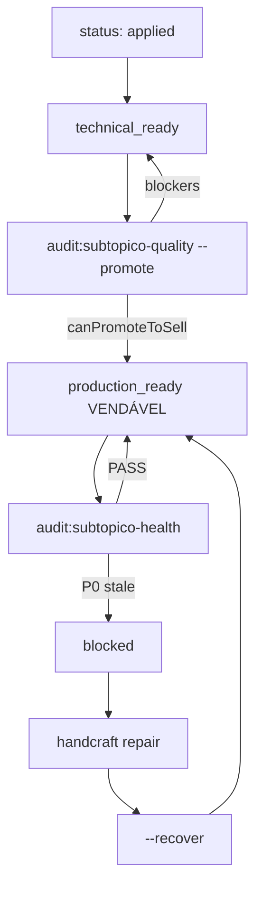

# Decisão — Qualidade híbrida vendável (ship + monitoramento contínuo)

**Data:** 2026-06-29  
**Status:** vigente  
**Escopo:** critério de **venda** e **manutenção pós-venda** de subtópicos handcraft no AVANT

Complementa:
- [`DECISAO_TRILHO_A_UNICO.md`](DECISAO_TRILHO_A_UNICO.md) — produção = handcraft golden-v1
- [`QUALITY_LAYERS_MODEL.md`](QUALITY_LAYERS_MODEL.md) — camadas L1–L6
- [`GOLDEN_HANDCRAFT_MODEL.md`](GOLDEN_HANDCRAFT_MODEL.md) — runbook handcraft
- [`CONTINUOUS_QUALITY_RUNBOOK.md`](CONTINUOUS_QUALITY_RUNBOOK.md) — operação diária pós-venda

---

## Contexto

O modelo anterior exigia **14 dias** ou **100 sessões** (`monitoring_until` / `min_sessions_30d`) **antes** de declarar `production_ready`. Isso atrasava a venda de pacotes já auditados (L1–L6) sem ganho proporcional de confiança.

Paralelamente, reportes P0 abertos precisavam de SLA pós-publicação distinto do gate de ship: bloqueio comercial só após aging (24h), não na primeira ocorrência.

---

## Decisão

Adotar modelo **híbrido** em duas fases:

| Fase | Momento | Mecanismo | Resultado |
|------|---------|-----------|-----------|
| **Ship (porta de venda)** | 1ª promoção do pacote | `audit:subtopico-quality --promote` + `canPromoteToSell()` | `production_status: production_ready` = **VENDÁVEL** |
| **Continuous (pós-venda)** | Diário / semanal | `audit:subtopico-health` | `blocked` se P0 stale; `--recover` após reparo |

### Regras confirmadas

1. **Sem bootstrap pré-venda:** o 1º `--promote` libera venda assim que L1–L6 + L5 PASS — **sem** esperar 14d/100 sessões.
2. **Monitoramento contínuo só pós-venda:** evolução via `audit:subtopico-health`; `blocked` pausa confiança comercial; `recover` após reparo.
3. **`blocked` ≠ demote:** `blocked` não reverte handcraft nem `status: applied`; só impede venda até health PASS + `--recover`.
4. **Retrocompat:** manter `production_status: "monitoring"` no schema; código aceita alias `bootstrap_monitoring` → `monitoring`, mas **não usa** como gate de venda.

---

## Regra de venda

```text
canSell(pacote) =
  production_status === 'production_ready'
  && production_status !== 'blocked'
```

Implementação: [`lib/catalogMigration/shipGate.ts`](../lib/catalogMigration/shipGate.ts) (`canSell`, `canPromoteToSell`).

> **Fase 3:** filtro na vitrine / entitlements via `vitrineQualityGate.ts` (`canSell`). Desligar: `QUALITY_VITRINE_GATE=false`.

---

## Ship gate (`canPromoteToSell`)

Critérios na **primeira promoção** — sem calendário:

| Gate | Fonte | Bloqueia ship? |
|------|--------|----------------|
| L1 | `audit:handcraft-dod` PASS | Sim |
| L2 | 0 alignment fails em todos lotes `g*` | Sim |
| L2b | 0 numeric fails | Sim |
| L6 | todos `anchor_second_review.status === 'pass'` | Sim |
| L5 | `evaluateContentHealth().pass` (warming: taxa 2% não bloqueia se sessions < 100) | Sim |
| L3 | artifact `artifacts/visual-mold-regression/summary.json` | Sim (strict); `--skip-l3` só emergência |
| L4 | capture por slug | **Não** (warn only) |

**Removido do ship gate:** `monitoring_until`, `monitoringDone`, blocker "aguardando 14d".

Comando:

```bash
npm run audit:subtopico-quality -- --subtopico="<nome canônico>" --promote
```

- Se `canPromoteToSell` → `production_ready`, `continuous.enabled: true`
- Se falha parcial (L1+L2+L2b OK) → `technical_ready_at` apenas; exit 1

---

## Loop contínuo pós-venda

Diferença **ship (L5)** vs **continuous (L5)**:

| Contexto | P0 aberto | Efeito |
|----------|-----------|--------|
| Ship (`--promote`) | qualquer P0 | bloqueia promoção |
| Continuous (health) | P0 recente (< 24h) | alerta; não bloqueia |
| Continuous (health) | P0 stale (> `p0_block_after_hours`, default 24h) | `production_status: blocked` |

Comando:

```bash
npm run audit:subtopico-health -- --subtopico="<nome canônico>"
npm run audit:subtopico-health -- --subtopico="..." --recover   # após reparo + health PASS
npm run audit:subtopico-health -- --all-production-ready
```

Runbook operacional: [`CONTINUOUS_QUALITY_RUNBOOK.md`](CONTINUOUS_QUALITY_RUNBOOK.md).

---

## Diagrama de estados



Estados legados `monitoring` / `bootstrap_monitoring` permanecem no registry para pacotes antigos; novos pacotes **não** passam por calendário pré-venda.

---

## Schema registry (`quality`)

Campos novos (ver migração em `handcraft-registry.json` → `quality_schema`):

```json
{
  "continuous": {
    "enabled": false,
    "last_audit_at": null,
    "last_audit_pass": null,
    "health_streak_days": 0,
    "last_blocked_at": null,
    "last_blocked_reason": null
  },
  "slo": {
    "p0_block_after_hours": 24
  }
}
```

`monitoring_until`: **deprecated** — legado; não é gate de venda.

---

## Proibições operacionais

| Proibido | Usar em vez disso |
|----------|-------------------|
| Segundo `--promote` rotineiro pós-venda | `audit:subtopico-health` |
| Declarar vendável só com `status: applied` | `--promote` com gates OK |
| Re-handcraft em massa por P1 isolado | repair pontual + health |

---

## Documentação canônica

| Doc | Papel |
|-----|--------|
| **Este arquivo** | ADR — ship = venda; loop contínuo |
| [`QUALITY_LAYERS_MODEL.md`](QUALITY_LAYERS_MODEL.md) | Camadas L1–L6 + §7 monitoramento |
| [`QUALITY_VENDAVEL_CONVERSA.md`](QUALITY_VENDAVEL_CONVERSA.md) | Prompt `Qualidade vendável: <subtópico>` |
| [`PIPELINE_COMPLETO_CONVERSA.md`](PIPELINE_COMPLETO_CONVERSA.md) | Prompt `Pipeline completo: <subtópico>` |
| [`CONTINUOUS_QUALITY_RUNBOOK.md`](CONTINUOUS_QUALITY_RUNBOOK.md) | Ops diária pós-venda |
| [`RUNBOOK_ERROR_REPORT_TRIAGE.md`](RUNBOOK_ERROR_REPORT_TRIAGE.md) | Triagem P0/P1 + repair |
| [`.cursor/rules/quality-vendavel.mdc`](../.cursor/rules/quality-vendavel.mdc) | Rule Cursor — qualidade vendável |
| [`.cursor/rules/pipeline-completo.mdc`](../.cursor/rules/pipeline-completo.mdc) | Rule Cursor — pipeline completo |

---

## Referências de código (Fases 1–2)

| Módulo | Função |
|--------|--------|
| `lib/catalogMigration/shipGate.ts` | `canPromoteToSell`, `canSell`, `normalizeProductionStatus` |
| `lib/catalogMigration/continuousQuality.ts` | `runContinuousAudit`, `applyContinuousAuditToRegistry` |
| `lib/catalogMigration/handcraftRegistry.ts` | `applyShipPromote`, `applyTechnicalReadyOnly` |
| `scripts/audit-subtopico-quality.ts` | Ship audit + `--promote` |
| `scripts/audit-subtopico-health.ts` | Health audit + `--recover` |
