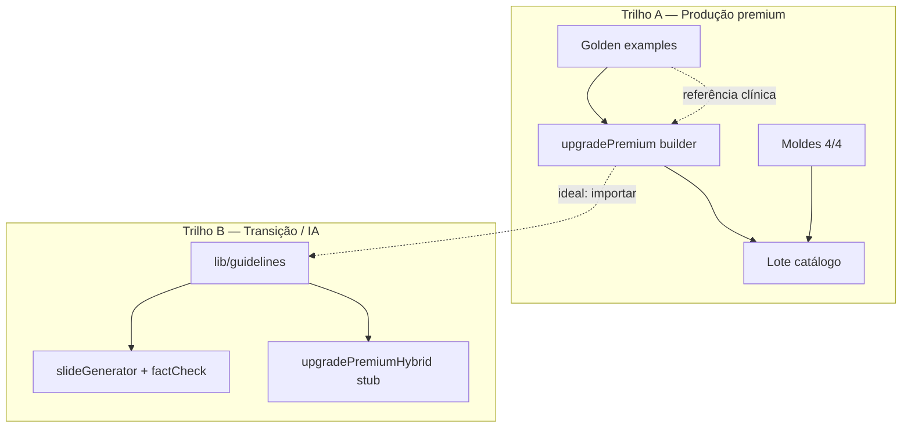

# Fonte normativa AVANT — Golden × Builder × Guideline

Governança de **onde vive a verdade clínica/normativa** no AVANT: três artefatos que se complementam, mas **não** são três rollouts paralelos com a mesma prioridade.

**Leitura rápida:** produção em escala = **golden + builder**; guideline = biblioteca auxiliar (IA, factcheck, transição). **Guideline não é pré-requisito do builder.**

Relacionados: [`PACOTE_PREMIUM_CHECKLIST.md`](PACOTE_PREMIUM_CHECKLIST.md) · [`GOLDEN_CONTENT_STANDARD.md`](GOLDEN_CONTENT_STANDARD.md) · [`GUIDELINE_DEEPENING_PLAN.md`](GUIDELINE_DEEPENING_PLAN.md)

---

## 1. Os três artefatos

| Artefato | Onde | Função |
|----------|------|--------|
| **Golden** | `examples/questao-premium-*.json` | Barra de qualidade pedagógica; revisão clínica item a item; `meta.sources`, `content_review` |
| **Builder** | `lib/catalogMigration/upgradePremium<Pacote>.ts` | Escala migração em lote; slides a partir do enunciado + família |
| **Guideline** | `lib/guidelines/*.ts` | Tabelas versionadas de fatos normativos; IA (`promptBuilder`), `runFactCheck`, `enrichGoldenMeta` |



---

## 2. Regra de ouro (prioridade)

```text
Para escalar o catálogo premium:
  1. Golden(s) por ramo forte (V/F, CE, interpretação…)
  2. Builder dedicado integrado em upgradePremiumHybrid
  3. Moldes bespoke + lote sem stubs

Guideline aprofundada NÃO bloqueia passos 1–3.
```

O hybrid genérico com stubs `[IA]` é **transição** — ver [`PACOTE_PREMIUM_CHECKLIST.md`](PACOTE_PREMIUM_CHECKLIST.md). O fechamento do subtópico é o **pacote premium**, não `gap_entries = 0` na guideline.

---

## 3. Matriz builder × guideline × golden

| Pergunta | Golden | Builder | Guideline |
|----------|--------|---------|-----------|
| Quem valida no Laboratório? | Sim (`golden-v1` lint) | Via lote / testes Jest | Não diretamente |
| Escala centenas de slugs? | Não (manual) | **Sim** | Não (corpus estático) |
| Revisão clínica humana? | **Obrigatória** | Amostra ~5% pós-lote | Recomendada na extração |
| Números normativos (dose, intervalo, SV) | `meta.sources` + slides | Lógica do builder | `GuidelineEntry.value` |
| Factcheck automático? | Lint golden-v1 | Indireto (testes) | **`runFactCheck`** |
| Obrigatório antes do builder? | **Recomendado** (1+ por ramo) | — | **Não** |

### Quem consome o quê (código)

| Consumidor | Golden | Builder | Guideline |
|------------|--------|---------|-----------|
| `catalog:upgrade-premium` / apply-lote | Referência no router | **Fonte dos slides** | Não importa hoje* |
| Laboratório / write spec | Validação | — | — |
| `slideGenerator` (IA) | — | — | **Prompt + factcheck** |
| `enrichGoldenMeta` | Preenche `meta.sources` | — | Sim |

\* *Estado atual (2026): builders dedicados como `upgradePremiumImunizacao.ts` embutem strings clínicas sem importar `lib/guidelines/`. Meta de evolução: builder importar guideline — ver §6.*

---

## 4. Dois trilhos por subtópico

### Trilho A — Produção (builder fechado)

**Quando:** subtópico com entrada em [`upgradePremiumDedicatedRouter.ts`](../lib/catalogMigration/upgradePremiumDedicatedRouter.ts).

**DoD:** checklist do pacote premium (golden + moldes + builder + lote, 0 stub).

**Guideline:** opcional. Se existir, usar para IA e para **sincronizar** números — não manter duas verdades (builder × `pni.ts`).

Builders dedicados atuais (router): Sinais Vitais, Imunização, Curativos, Punção, Coleta, Vias, Urgências, Oxigenoterapia, ISTs, Cálculo, SAE (Processo de Enfermagem), Sondas.

### Trilho B — Transição (sem builder)

**Quando:** catálogo ainda no hybrid ou geração só via Laboratório/IA.

**DoD temporário:** guideline mapeada + factcheck; **ou** golden manual pontual.

**Guideline:** substitui o builder até o pacote fechar. Ver workflow em [`GUIDELINE_DEEPENING_PLAN.md`](GUIDELINE_DEEPENING_PLAN.md).

---

## 5. Ordem de trabalho recomendada

| # | Entregável | Trilho A | Trilho B |
|---|------------|----------|----------|
| 1 | Golden(s) `examples/questao-premium-*.json` | Obrigatório | Recomendado |
| 2 | `upgradePremium<Pacote>.ts` + testes | Obrigatório | — |
| 3 | Moldes 4/4 + `SUBTOPIC_DESIGN_MAP` | Obrigatório | — |
| 4 | Piloto 3–5 slugs + lote | Obrigatório | — |
| 5 | `lib/guidelines/<pacote>.ts` | Opcional (sync pós-builder) | Se usar IA/hybrid |
| 6 | `update:guideline-status` | Se criou/atualizou tabela | Se criou tabela |

**Proibido como processo:** exigir guideline aprofundada (`target_merged_entries`, extração tier A completa) **antes** de iniciar golden ou builder no trilho A.

---

## 6. Uma verdade — evitar duplicação

Hoje é possível o mesmo fato normativo existir em:

- strings no builder (ex.: intervalos PNI em `upgradePremiumImunizacao.ts`);
- entries em `lib/guidelines/pni.ts`;
- slides do golden em `examples/`.

Isso gera **drift** (builder atualizado, guideline desatualizada, ou o contrário).

### Política alvo

| Situação | Fonte canônica |
|----------|----------------|
| Subtópico com builder dedicado | **Builder** (produção); guideline **derivada ou importada** pelo builder |
| Golden manual sem builder | **Golden** + `meta.sources` |
| Geração IA sem builder | **Guideline** (`GUIDELINE_TABLES`) |
| Conflito builder × guideline | Builder/lote vence para catálogo; abrir issue para alinhar guideline |

### Evolução desejada (não bloqueante)

Refatorar builders para **importar** `getGuidelineForSubtopico()` / entries por `id`, em vez de literais soltos — uma manutenção, dois consumidores (lote + IA).

---

## 7. Números normativos — quem pode inventar?

| Camada | Regra |
|--------|--------|
| Golden manual | Só com `meta.sources` tier A/B; lint `golden-v1` |
| Builder dedicado | Números da prova (enunciado/alternativas) + corpus clínico codificado no builder **ou** guideline importada |
| Builder hybrid / IA | **Não** inventar — `promptBuilder` restringe à GUIDELINE; `runFactCheck` audita |
| Sem guideline (factcheck) | `runFactCheck` não viola (modo conceitual) — não é licença para inventar em produção |

Ver [`GOLDEN_CONTENT_STANDARD.md`](GOLDEN_CONTENT_STANDARD.md) §2 (eixo Fonte) e §8 (Builders).

---

## 8. Checklist rápido por subtópico

### Fechou pacote premium (trilho A)?

- [ ] Golden(s) validados + revisão clínica
- [ ] Builder em `upgradePremiumDedicatedRouter`
- [ ] Moldes 4/4 wired
- [ ] Lote piloto ≥90% zod, 0 stub
- [ ] *(Opcional)* Guideline alinhada ao builder (sem duplicar strings)

### Ainda no hybrid (trilho B)?

- [ ] Guideline em `SUBTOPICO_GUIDELINE_IDS` **ou** golden pontual
- [ ] Se IA: factcheck sem violações em amostra
- [ ] Roadmap: builder dedicado (saída do trilho B)

---

## 9. Referências no código

| Arquivo | Papel |
|---------|--------|
| [`lib/catalogMigration/upgradePremiumDedicatedRouter.ts`](../lib/catalogMigration/upgradePremiumDedicatedRouter.ts) | Roteamento builder → golden de referência |
| [`lib/catalogMigration/upgradePremiumHybrid.ts`](../lib/catalogMigration/upgradePremiumHybrid.ts) | Fallback hybrid + stubs |
| [`lib/guidelines/index.ts`](../lib/guidelines/index.ts) | `GUIDELINE_TABLES`, `SUBTOPICO_GUIDELINE_IDS` |
| [`lib/guidelines/deepeningPlan.ts`](../lib/guidelines/deepeningPlan.ts) | Metas de aprofundamento (trilho B / IA) |
| [`lib/ai/factCheck.ts`](../lib/ai/factCheck.ts) | Auditoria número+unidade vs guideline |
| [`lib/ai/enrichGoldenMeta.ts`](../lib/ai/enrichGoldenMeta.ts) | `meta.sources` a partir de guidelines |
| [`lib/goldenContentStandard.ts`](../lib/goldenContentStandard.ts) | Lint golden-v1 |

---

## 10. Resumo em uma frase

**Golden define a barra, builder escala o catálogo, guideline apoia IA e factcheck — e guideline não precisa existir antes do builder no caminho premium.**
