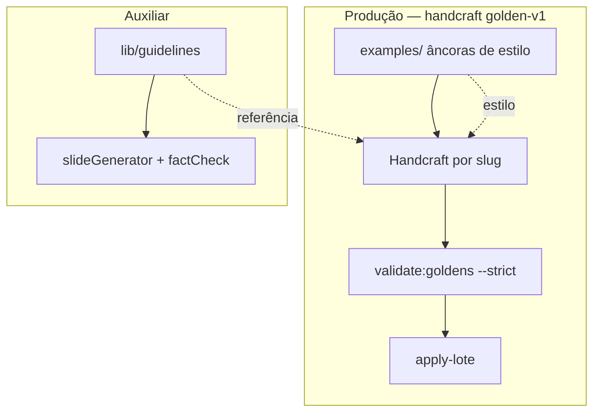

# Fonte normativa AVANT — Handcraft × Guideline × Legado

Governança de **onde vive a verdade clínica/normativa** no AVANT.

> **Decisão (2026-06-27):** produção premium = **handcraft golden-v1 por slug**. Ver [`DECISAO_TRILHO_A_UNICO.md`](DECISAO_TRILHO_A_UNICO.md).

Relacionados: [`GOLDEN_HANDCRAFT_MODEL.md`](GOLDEN_HANDCRAFT_MODEL.md) · [`GOLDEN_CONTENT_STANDARD.md`](GOLDEN_CONTENT_STANDARD.md) · [`GUIDELINE_DEEPENING_PLAN.md`](GUIDELINE_DEEPENING_PLAN.md)

---

## 1. Os três artefatos

| Artefato | Onde | Função |
|----------|------|--------|
| **Handcraft golden-v1** | `data/catalog-migration/<lote>/questions/*.json` | **Produção** — conteúdo específico por slug |
| **Golden âncora** | `examples/questao-premium-*.json` | Estilo/referência por ramo pedagógico |
| **Guideline** | `lib/guidelines/*.ts` | Referência normativa para o agente; IA/factcheck auxiliar |



---

## 2. Regra de ouro (prioridade)

```text
Para escalar o catálogo premium:
  1. Export + cluster (opcional)
  2. Âncora golden-v1 por ramo forte (examples/)
  3. Handcraft golden-v1 por slug em lotes gNN
  4. validate:goldens --strict → apply-lote

Guideline aprofundada NÃO bloqueia handcraft.
Builder/hybrid NÃO são caminho de produção.
```

---

## 3. Matriz handcraft × guideline × legado

| Pergunta | Handcraft | Golden âncora | Guideline | Builder (legado) |
|----------|-----------|---------------|-----------|------------------|
| Produção atual? | **Sim** | Referência de estilo | Auxiliar | Não — re-handcraft pendente |
| Escala catálogo? | Lotes g01…gNN | 1 por ramo | Não | ~~Sim~~ deprecado |
| Revisão clínica? | **Por slug** | Por âncora | Na extração | Amostra ~5% |
| Números normativos | `meta.sources` + slides | Idem | `GuidelineEntry.value` | Strings no builder |
| Factcheck automático? | Lint golden-v1 | Lint golden-v1 | `runFactCheck` | Testes Jest |

---

## 4. Legado — builder e hybrid (não usar em produção nova)

O repositório mantém `lib/catalogMigration/upgradePremium*.ts` e `upgradePremiumHybrid.ts` para:

- Conteúdo já migrado antes da decisão (Imunização, Curativos, Sinais Vitais…)
- Testes de regressão

**Política:** subtópicos legado entram na fila de **re-handcraft** até `handcraft_applied === total_slugs` no registry.

**Proibido:** `catalog:upgrade-premium`, `ai:generate` para novos lotes de catálogo.

---

## 5. Ordem de trabalho (handcraft)

| # | Entregável | Obrigatório |
|---|------------|-------------|
| 1 | Export `*-completo/manifest.json` | Sim |
| 2 | Cluster + âncoras `examples/` | Recomendado |
| 3 | Handcraft JSON por slug | Sim |
| 4 | `validate:goldens --lote --strict` | Sim |
| 5 | Piloto player + `apply-lote` | Sim |
| 6 | `lib/guidelines/<pacote>.ts` | Opcional (referência) |

---

## 6. Uma verdade — evitar duplicação

| Situação | Fonte canônica |
|----------|----------------|
| Questão em produção (pós-handcraft) | JSON handcraft + `meta.sources` |
| Estilo por ramo | Golden âncora em `examples/` |
| Referência normativa para agente | Guideline (tier A/B) |
| Conteúdo legado builder | **Temporário** — substituir por handcraft |

---

## 7. Números normativos — quem pode inventar?

| Camada | Regra |
|--------|--------|
| Handcraft golden-v1 | Só com `meta.sources` tier A/B; lint `golden-v1` strict |
| Golden âncora | Idem |
| Guideline / IA | Referência + factcheck — **não** produção de catálogo |
| Builder legado | Não estender — re-handcraft |

---

## 8. Checklist rápido por subtópico

### Fechou handcraft?

- [ ] 100% slugs com `content_standard: "golden-v1"`
- [ ] `validate:goldens --strict` 0 falhas
- [ ] Registry `status: applied`
- [ ] Amostra ≥5% no player

### Ainda legado builder/hybrid?

- [ ] Listar em `legacy_builder_subtopicos`
- [ ] Planejar lotes gNN de re-handcraft
- [ ] **Não** declarar fechado até handcraft completo

---

## 9. Punção Venosa — fontes `meta.sources` (handcraft)

Pacote: `puncao-venosa-e-cuidados-com-cateteres` · Enrich: `lib/catalogMigration/puncaoPedagogy.ts` · CLI: `npm run enrich:puncao-guideline-meta`

| ID | Tier | Issuer | Uso |
|----|------|--------|-----|
| `puncao-cateter-anvisa` | A | Anvisa / COFEN | AVP, bundle CVC, antissepsia, complicações, troca de equipos |
| `potter-perry-fundamentos-11ed-2024` | B | Elsevier / Potter & Perry | *Fundamentos de Enfermagem*, 11ª ed., Guanabara Koogan, 2024 — técnica e complicações AVP |
| `sae-cofen-358` | A | COFEN | Documentação / registro quando o enunciado ancora prontuário ou SAE |
| `manual-tecnico-enfermagem-avp` | B | Literatura técnica | Nomenclatura popular × norma (ex.: “flebite” coloquial = infiltração) |

**Regra:** todo golden-v1 Punção deve ter **Anvisa + Potter** em `meta.sources`; `guideline_snapshot` prefixa snapshot Anvisa e cita Potter quando aplicável. IDs legados (`cofen-puncao-complicacoes`, `cofen-res-358-2009` sem URL) são substituídos pelo enrich.

**Progresso (2026-07-11):** g01 (`puncao_flebite`) — 8/8 handcraft applied; subtópico 8/110; `production_status: none`.

---

## 10. Referências no código

| Arquivo | Papel |
|---------|--------|
| [`data/catalog-migration/handcraft-registry.json`](../data/catalog-migration/handcraft-registry.json) | Progresso handcraft |
| [`lib/goldenContentStandard.ts`](../lib/goldenContentStandard.ts) | Lint golden-v1 |
| [`lib/catalogMigration/puncaoPedagogy.ts`](../lib/catalogMigration/puncaoPedagogy.ts) | Enrich meta Punção (Anvisa + Potter + COFEN 358) |
| [`lib/guidelines/potterPerryFundamentos.ts`](../lib/guidelines/potterPerryFundamentos.ts) | Tier B — Potter & Perry 11ª ed. Brasil |
| [`lib/guidelines/index.ts`](../lib/guidelines/index.ts) | Referência normativa |
| [`lib/catalogMigration/upgradePremiumHybrid.ts`](../lib/catalogMigration/upgradePremiumHybrid.ts) | **Legado** — hybrid + stubs |
| [`lib/catalogMigration/upgradePremiumDedicatedRouter.ts`](../lib/catalogMigration/upgradePremiumDedicatedRouter.ts) | **Legado** — builders |

---

## 11. Resumo em uma frase

**Handcraft golden-v1 por slug é a produção; golden âncora guia o estilo; guideline apoia referência e factcheck — builder/hybrid são legado a substituir.**
