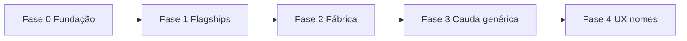

# NeuroSlides Geração 2 — Roadmap (Visual OS)

**Decisão:** [`DECISAO_NEUROSLIDES_GERACAO_2.md`](DECISAO_NEUROSLIDES_GERACAO_2.md)  
**Execução técnica:** [`NEUROSLIDES_VISUAL_STRATEGY.md`](NEUROSLIDES_VISUAL_STRATEGY.md)  
**Barra mínima + ratchet:** [`NEUROSLIDES_VISUAL_BAR.md`](NEUROSLIDES_VISUAL_BAR.md)  
**Demo visual (piso):** [`artifacts/neuroslides-g2-demo.html`](../artifacts/neuroslides-g2-demo.html)  
**Inventário variants ↔ primitives (2026-08-04):** [`artifacts/neuroslides-g2-primitives-inventory.md`](../artifacts/neuroslides-g2-primitives-inventory.md)  
**Status:** vigente · iniciado 2026-08-04  

> **Invariante:** não alterar os 4 `type` (`concept_map`, `logic_flow`, `golden_rule`, `danger_zone`). Evoluir primitives, shells, moldes e polish glanceable.

---

## Objetivo

Fazer o estudo reverso do AVANT **parecer e reter** no padrão de mercado (boards, chip+corpo, contraste, trilhos) sendo o **melhor material para TE de concurso** — porque cada pacote 4/4 ensina *esta* questão, com gesto espacial e gates L1–L6 intactos.

---

## Nomes de produto (UX) ↔ tipos técnicos

Usar nos chips / copy de designer; **nunca** no schema JSON.

| Momento (aluno) | `type` (código) | Função |
|-----------------|-----------------|--------|
| Mapa da cobrança | `concept_map` | Enquadramento sem spoiler |
| Trilho até a letra | `logic_flow` | Eliminação + gabarito (`tap` ou board 0 taps) |
| Decore clínico | `golden_rule` | Norma / tabela / macete portátil |
| Arena da pegadinha | `danger_zone` | Distrator × certo (`correct` único) |

---

## Fases



### Fase 0 — Fundação (já em grande parte entregue)

| Item | Fonte | DoD |
|------|-------|-----|
| Kit primitives + `boardTokens` | `components/slides/primitives/` | Import único; tokens G2 (massa / heroRing / footer) |
| Shells logic_flow | `logicFlowShells/` | Focus / Rail / Isolate — **Focus em primitives** (BoardChrome + PolarityPanel, 2026-08-04) |
| Strategy Ondas 0–5 | `NEUROSLIDES_VISUAL_STRATEGY.md` Camada 5 | Documentado + piloto |
| Lei de retenção | skill `avant-neuroslides-visual` | 7 leis + anti-cópia |
| Inventário gap | [`artifacts/neuroslides-g2-primitives-inventory.md`](../artifacts/neuroslides-g2-primitives-inventory.md) | **P0 fechado**. P1 lote 1–6 ✅ (… · SoftStack cauda). Próximo: Fábrica por pacote / IV·Urgencias residual |

**Saída:** Visual OS utilizável; nenhuma variant nova sem compor primitives (exceto exceção documentada).  
**P0:** FocusShell + ConceptMap / GoldenRule / DangerZone genéricos — **fechado** (2026-08-04).

---

### Fase 1 — Flagships (prova de barra)

Pacotes que **definem** o padrão G2 para o resto do catálogo. Preferir já `production_ready` ou em nota-10.

| Ordem | Pacote / âncora | O que fechar |
|------:|-----------------|--------------|
| 1 | Saúde do Adolescente (ética + glanceable) | Referência 4/4 boards |
| 2 | Imunização (EXCETO + calendário) | Compare + LabelBodyRow |
| 3 | Urgências (XABCDE / RCP) | Rail + tap ≤3 |
| 4 | Farmacodinâmica (ADME) | Journey rail |
| 5 | Vias de Administração (amostra ramo forte) | Glanceable + regressão L3 |

**DoD por flagship:**

```text
□ Metáfora 4/4 nomeada (brief ou mold map)
□ Orçamento de clique da família (strategy Camada 4)
□ Barra visual PASS — docs/NEUROSLIDES_VISUAL_BAR.md (piso = demo G2)
□ visual_bar: pass no report + o que subiu vs. molde anterior (ratchet)
□ Playwright do pacote OU captures âncora (visual_gallery)
□ 0 hardcode gabarito/letra no TSX
□ artifacts/<prefix>-nota10-report.md com barra visual verde (se onda nota-10)
```

**Não** reabrir handcraft em massa só por visual.  
**Não** ship de molde abaixo do piso nem com regressão vs. o gesto anterior.

---

### Fase 2 — Fábrica (nota-10 visual em `production_ready`)

Alinha à **Camada 7** de [`NEUROSLIDES_VISUAL_STRATEGY.md`](NEUROSLIDES_VISUAL_STRATEGY.md):

Ordem canônica Fábrica:  
**Mulher → Processo → Curativos → Imunização → Vias → Punção → Peri → CME → Mental → Trabalho.**

Prompt operacional: [`PROMPT_FABRICA_VISUAL_G2.md`](PROMPT_FABRICA_VISUAL_G2.md) (Fábrica + P1 shells).

| Situação | Ação |
|----------|------|
| Gesto já mapeado + molde existe | Reusar + Design visual / Modo A |
| Só densidade / captura | Polish + captures; sem React |
| Gesto novo **ou** ≥5 questões sem board | Brief → Design visual → `Implementar molde:` |
| Cauda textual | `ok_generico` premium |

**1 pacote por conversa** — checklist PASS da Camada 7.

---

### Fase 3 — Cauda genérica premium

Layouts genéricos (`grid`, `reference_table`, `compare`, shells Focus/Isolate) devem **parecer G2** sem exigir molde bespoke:

| Slide | Alvo visual |
|-------|-------------|
| concept_map | Deck / pilares glanceable; ≤7 slots |
| logic_flow | Shell Focus (≤3 taps) ou Isolate (EXCETO) |
| golden_rule | SoftLens / LabelBodyRow / CriticalNumber |
| danger_zone | Compare aberto; `correct` únicos |

Gates: `visual-mold-regression` onde houver ramo; amostra player nos genéricos.

---

### Fase 4 — Nomes de produto no player (opcional)

Só depois das Fases 0–2 estáveis:

1. Mapear `chip_label` / títulos default por `type` (e override por ramo se brief pedir).  
2. Copy de onboarding / material: “4 momentos”.  
3. **Não** renomear campos no JSON exportado nem no Zod.

---

## Ordem de trabalho recomendada (chat)

| Trigger | Quando |
|---------|--------|
| `Design visual: <ramo>` | Calibrar gesto / retenção (sem React) |
| `Brief TE: <Subtópico> — <ramo>` | Antes de molde novo |
| `Implementar molde:` | React + wiring (pedido explícito) |
| `Fábrica visual G2: SUBTÓPICO: …` | Fase 2 — 1 pacote nota-10 ([`PROMPT_FABRICA_VISUAL_G2.md`](PROMPT_FABRICA_VISUAL_G2.md)) |
| `P1 NeuroSlides G2:` / `Wrap logic_tap:` | Migrar taps → shells (mesmo doc) |
| `Visual:` / Polish vitrine | **Fora** deste roadmap (Trilho A app UI) |

---

## Métricas leves (não inventar dashboard)

| Sinal | Como olhar |
|-------|------------|
| Cobertura primitives | Variants novas importam de `@/components/slides/primitives` |
| Flagships verdes | Reports + Playwright grep do pacote |
| Fábrica | Contagem de pacotes com `*-nota10-report.md` barra visual PASS |
| Regressão | `e2e/visual-mold-regression.spec.ts` nos ramos mapeados |

---

## Fora de escopo (explícito)

- Novos `type` no `QuestaoCompletaSchema`
- `ai:generate` / `catalog:upgrade-premium` para “modernizar”
- Clone de carrossel / assets 3D / watermark de feed
- Segundo `--promote` rotineiro só por polish visual
- Rewrite de milhares de JSONs sem mudança de gesto/slots

---

## Referências rápidas

| Doc | Papel |
|-----|--------|
| [`PROMPT_FABRICA_VISUAL_G2.md`](PROMPT_FABRICA_VISUAL_G2.md) | Prompt Fábrica + P1 shells (1 conversa / pacote) |
| [`DECISAO_NEUROSLIDES_GERACAO_2.md`](DECISAO_NEUROSLIDES_GERACAO_2.md) | ADR |
| [`NEUROSLIDES_VISUAL_STRATEGY.md`](NEUROSLIDES_VISUAL_STRATEGY.md) | Camadas 1–7 |
| [`VARIANT_MOLDS.md`](VARIANT_MOLDS.md) | Engenharia molde |
| [`DESIGNER_FRONT_AVANT.md`](DESIGNER_FRONT_AVANT.md) | Hub Trilho B |
| Skill `avant-neuroslides-visual` | Retenção |
| [`artifacts/pre-onda3-print-to-primitives-catalog.md`](../artifacts/pre-onda3-print-to-primitives-catalog.md) | Print → primitivo |
