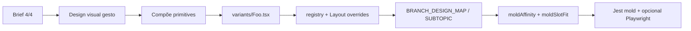

> **Status: SUPERADO PARCIALMENTE (skin visual).** Trechos que obrigam shell Cyber Clinical (#010409 / neon) no player de NeuroSlides foram superados pelo desfecho A. Autoridade de pele: [uditoria-visual-v2/NEUROSLIDES-VISUAL-SPEC-v2.md](design-system/NEUROSLIDES-VISUAL-SPEC-v2.md) · Direction: [uditoria-visual-v2/tokens/AVANT-VISUAL-DIRECTION-v4.md](design-system/AVANT-VISUAL-DIRECTION-v4.md) · ADR: [DECISAO_VISUAL_EDITORIAL_PREMIUM_V4.md](DECISAO_VISUAL_EDITORIAL_PREMIUM_V4.md).
> Seções afetadas: leis de produto que fixam shell Cyber no reverso.
> Pedagogia (4 tipos, spoiler, barra, gesto) permanece válida nas seções não marcadas.

---
# NeuroSlides — Estratégia visual (primitivos + glanceable + ondas)

Runbook canônico da **estratégia visual** dos NeuroSlides: idioma de mercado (cards coloridos, chip+corpo, contraste certo×errado) **sem** copiar feed/Instagram e **sem** uma variant React por print.

**Governança de produto (Geração 2):** [`DECISAO_NEUROSLIDES_GERACAO_2.md`](DECISAO_NEUROSLIDES_GERACAO_2.md) — mesmo cérebro (4 `type`); novo corpo (Visual OS). Roadmap: [`NEUROSLIDES_GERACAO_2_ROADMAP.md`](NEUROSLIDES_GERACAO_2_ROADMAP.md).
**Barra mínima + ratchet:** [`NEUROSLIDES_VISUAL_BAR.md`](NEUROSLIDES_VISUAL_BAR.md) — piso = [`artifacts/neuroslides-g2-demo.html`](../artifacts/neuroslides-g2-demo.html); cada molde só melhora.

**Frase norte:** inspiração de retenção, não template de cópia — [`.cursor/skills/avant-neuroslides-visual/SKILL.md`](../.cursor/skills/avant-neuroslides-visual/SKILL.md).

**Piloto de referência:** pacote Adolescente ética v2 (`ADOLESCENTE_ETHICS_MOLD` em [`lib/slides/pedagogicalBranch.ts`](../lib/slides/pedagogicalBranch.ts)):

| Slide | `layout_variant` | Modo |
|-------|------------------|------|
| concept_map | `adolescent-care-pillars-deck` | glanceable |
| golden_rule | `adolescent-speak-barrier-board` | glanceable |
| logic_flow | `adolescent-exceto-isolate-board` | glanceable (0 taps) |
| danger_zone | `adolescent-exceto-compare` | glanceable |

---

## Lei de produto (invariantes)

1. **Gesto = decisão da prova** — visual sem gesto é decoração.
2. **Inspiração ≠ cópia** — pegar chunking/hierarquia/cor=categoria; deixar 3D, @handle, likes, carrossel N/M, apostila de 15+ cards numa tela.
3. **Skin AVANT** — shell Cyber; **superfície do slide = editorial light** (cards brancos). Não forçar pastel Instagram no player.
4. **JSON alimenta tudo** — zero gabarito/letra hardcoded no TSX.
5. **Metáfora 4/4** — um universo por ramo; brief nomeia `layout_variant`; catálogo omite.
6. **Orçamento de clique do pacote**, não só do slide:
   - Tabela / norma / calendário / EXCETO-compare → **0–1 tap** (board).
   - Funil / eliminação sequencial (crase, XABCDE, VF I–III) → **tap com ≤3 steps** úteis.
   - Se 5 taps mostram o que um board de mercado mostra de uma vez → enxugar `steps` ou trocar para board.

---

## Camada 1 — Primitivos (fundação)

Pasta: [`components/slides/primitives/`](../components/slides/primitives/).
**Barra G2 (2026-08-04):** primitives carregam o piso visual — massa, herói (`emphasized` / `heroRing`), footer escuro de transferência. Ver [`NEUROSLIDES_VISUAL_BAR.md`](NEUROSLIDES_VISUAL_BAR.md).

| Primitivo | Props essenciais | Uso típico |
|-----------|------------------|------------|
| `BoardChrome` | `theme`, `eyebrow?`, `title?`, `footerRule?`, `footerLabel?`, `maxWidth` | Shell wash + max-w + footer G2 |
| `PolarityPanel` | `tone`, `emphasized?` | Painel keep / exception / command (+ herói) |
| `LabelBodyRow` | `chip`, `body`, `tone?`, `layout?: default\|rail` | Calendário, legis, Falar×Barreira |
| `CategoryStrip` | `label`, `tone` | Chip sólido de grupo / pilar |
| `TwoColumnBoard` | `left`, `right`, `emphasize?` | Keep×exception, falar×barreira |
| `PillarDeck` | `items[]`, `activeIndex?` | Care-pillars, 3 colunas CF |
| `ProtocolRailRow` | `badge`, `title`, `detail` | XABCDE, I–V, ADME |
| `AlertCallout` | `tone: info \| warn`, `icon?` | Banner de comando / atenção |
| `CriticalNumber` | `value`, `unit?`, `emphasis` | Doses, prazos |

**Tokens:** [`boardTokens.ts`](../components/slides/primitives/boardTokens.ts) — `tone` → classes Tailwind canônicas (emerald keep / rose exception / sky command / amber transfer / indigo rights). Reusa superfícies de [`slideSurface.ts`](../components/slides/core/slideSurface.ts) onde couber. **Não** misturar neon Cyber nos cards de conteúdo.

**Export:** `import { BoardChrome, … } from '@/components/slides/primitives'`.

**Regra:** variants novas **compõem** primitives (exceto exceção documentada). Refator piloto: os 4 moldes ética v2 e o SoftLens (`GoldenRuleSoftLensBoard` + wrappers `*-reference-board`) consomem o kit.

---

## Camada 2 — Tradução print → AVANT

| Padrão de mercado (visual) | Gesto AVANT | Tipo de slide típico | Preferência |
|----------------------------|-------------|----------------------|-------------|
| Chip/rótulo + corpo | `LabelBodyRow` / rows+badge | golden_rule | glanceable |
| Cor = categoria | `CategoryStrip` + tone | concept / golden | glanceable |
| Compare ✗×✔ | `TwoColumnBoard` / danger compare | danger_zone, golden | glanceable |
| Protocolo letra em círculo | `ProtocolRailRow` + tap ≤3 se funil | logic_flow | rail; tap só se sequência (`protocolTapBudget`) |
| Calendário idade × lista | `LabelBodyRow` stack | golden_rule | glanceable; partir se >7 linhas |
| Decreto em chunks | deck de fases ou logic 3 steps | concept / logic | ≤3 taps |
| Mapa mental 3 colunas | `PillarDeck` 3 items | concept_map | glanceable |
| Número crítico | `CriticalNumber` | golden / danger | glanceable |
| Callout “Atenção” | `AlertCallout` | qualquer footer | glanceable |

**Proibido importar:** assets 3D, watermark, tipografia all-caps de feed como chrome do player, 18 mini-cards numa tela mobile.

Detalhe vivo: [`.cursor/skills/avant-neuroslides-visual/reference-retencao.md`](../.cursor/skills/avant-neuroslides-visual/reference-retencao.md) §2 · catálogo expandido §2c (ago/2026) · artifact [`artifacts/pre-onda3-print-to-primitives-catalog.md`](../artifacts/pre-onda3-print-to-primitives-catalog.md).

### Camada 2b — Glossário de ondas (não confundir)

| Nome | Significado |
|------|-------------|
| **Onda 0–5 (este doc, Camada 5)** | Rollout de **moldes/primitives** no produto (Imunização EXCETO = Onda 3 aqui) |
| **Onda 3 Fábrica 20** | Programa local: **nota-10 visual** em 10 pacotes já `production_ready` (Mulher → Trabalho) |

Fábrica Onda 3 **reusa** o kit das Ondas 0–5; **não** reabre a entrega Imu EXCETO nem cria 1 variant por print de feed.

### Camada 2c — Famílias TE frequentes (ago/2026)

| Família de print | Gesto | Primário | Preferência |
|------------------|-------|----------|-------------|
| XABCDE / ADPIE / vigilância 1–N | Trilho | `ProtocolRailRow` | glanceable; tap ≤3 se ordem de prova |
| Calendário / Pneumo idade×dose | Chip + corpo | `LabelBodyRow` + `CategoryStrip` | golden; partir >7 linhas |
| Manchester / risco por cor | Cor = categoria | `CategoryStrip` + `PolarityPanel` | 0 taps |
| Mapa mental / NIC–NOC / pilares | Deck | `PillarDeck` | concept; sem mascote |
| Protocolo empilhado + Atenção + dose | Callout + número | `AlertCallout` + `CriticalNumber` | golden SoftLens |
| Fluxo / zigzag / RN | Funil | `LogicFocusShell` ≤3 **ou** `LogicIsolateShell` | não clonar PNG; sem pilha de N cards |
| Grade SV / multi-card patologia | Deck / rows | `PillarDeck` / `rows` | ≤6–7; partir |

---

## Camada 3 — Contrato de molde

Fluxo alinhado a [`VARIANT_MOLDS.md`](VARIANT_MOLDS.md):



Checklist por variant: ver [`VARIANT_MOLDS.md`](VARIANT_MOLDS.md) Fase 4–5 + § Primitivos.

**Regra de criação:** só nasce molde novo se (a) gesto espacial novo **ou** (b) família de prova ≥5 questões no ramo. Caso contrário: reusar board/rail genérico + handcraft.

---

## Camada 4 — Orçamento de clique

| Família | logic_flow | Outros slides |
|---------|------------|---------------|
| EXCETO / INCORRETA | **board** (0 taps) — padrão ética | compare aberto |
| VF I–II–III | juggle/weave **≤4** cartas ou resumo glanceable | — |
| Protocolo sequencial | tap-flow **≤3** steps | rail concept |
| Calendário / tabela / norma | vertical/auto ou board; sem step gate | golden rows |
| Funil (crase etc.) | tap por estágio **≤3** | funnel deck |

Gate de handcraft: ao fechar lote, contar taps do pacote 4/4; se >10 no total para EXCETO, falha de Densidade.

Conteúdo: `steps[]` continua existindo; **board ignora serialização**. Enxugar steps redundantes é obrigação de conteúdo.

**Onda 4 — helper de runtime:** [`lib/slides/protocolTapBudget.ts`](../lib/slides/protocolTapBudget.ts) (`PROTOCOL_TAP_BUDGET = 3`) condensando overflow nos tap-flows XABCDE / RCP / farmaco.

### Shells premium (convergência logic_flow — Fase A+B)

Pasta: [`components/slides/logicFlowShells/`](../components/slides/logicFlowShells/). **Não** apaga `layout_variant` IDs — só o miolo.

| Shell | Gesto | Uso |
|-------|-------|-----|
| `LogicFocusShell` | 1 card + dots + CTA; budget ≤3 | Genéricos tap (`vertical`/`cards`/`horizontal`); `LogicFlowStepLadder` + maioria `*-tap-flow` |
| `LogicRailShell` | `ProtocolRailRow` + ≤3 | XABCDE, RCP, farmaco-protocol, NSP, urgencias-protocol |
| `LogicIsolateShell` | Board 0 taps | EXCETO genérico (`urgencias-exceto`, `cam-exceto`, `iv-exceto`); Adolescente/PNI boards bespoke permanecem |

Regra: novas variants **compõem** shell; galeria `/dev/variant-gallery?type=logic_flow` continua listando os mesmos IDs.

---

## Camada 5 — Rollout em ondas

| Onda | Escopo | Status |
|------|--------|--------|
| **0** | Ship `adolescent-exceto-isolate-board`; docs v2 | piloto ética |
| **1** | `primitives/` + `boardTokens` + este doc + refator ética → primitives | entregue |
| **2** | Adolescente: violência, saúde mental, desenvolvimento, genérico → `ADOLESCENTE_GLANCEABLE_MOLD` (reuso; sem IDs novos) | entregue |
| **3** | Imunização EXCETO (`pni-exceto-isolate-board` · `pni-exceto-compare`) + calendário `LabelBodyRow` | entregue |
| **4** | Urgências XABCDE / RCP; Farmacodinâmica ADME; PT compare/funil | entregue |
| **5** | SoftLens → `BoardChrome` + `LabelBodyRow` | entregue |

**Não** trocar ~250 variants de uma vez.

---

## Camada 6 — Gates / DoD por onda (moldes React)

- [ ] Gesto único nomeado no brief
- [ ] Lei 7 retenção aplicável (skill visual)
- [ ] Variant composita primitives (exceto exceção documentada)
- [ ] Orçamento de clique da família respeitado
- [ ] Wiring completo (registry + overrides + affinity + slotFit + map)
- [ ] Jest mold verde; Playwright do pacote se flagship
- [ ] Skin editorial cards; sem chrome de feed
- [ ] Deploy só após commit explícito + promote

---

## Camada 7 — DoD Onda 3 Fábrica 20 (nota-10 visual)

Para pacotes **já** `applied` + `production_ready`. Objetivo: barra visual máxima **sem** handcraft em massa e **sem** 1 React por print.

### Quando reusar vs `Implementar molde:`

| Situação | Ação |
|----------|------|
| Gesto mapeado na Camada 2 / 2c e molde/primitivo já no ramo | **Reusar** + Modo A/V + JSON |
| Só polish glanceable / densidade / captura | Design visual + captures; **sem** React novo |
| Gesto espacial **novo** **ou** ≥5 questões no ramo forte sem board adequado | Brief → Design visual → **`Implementar molde:`** → wire + testes |
| Cauda longa / pegadinha só textual | `ok_generico` 3/3; genérico premium |

### Checklist PASS (1 pacote / chat)

```text
□ 1 gesto nomeado por ramo forte (ou ok_generico no brief)
□ Tradução print → primitivo (Camada 2c ou artifacts/pre-onda3-print-to-primitives-catalog.md)
□ ≤7 slots; orçamento de clique da família
□ 0 hardcode gabarito/letra no TSX
□ Skin editorial; sem feed chrome / 3D / watermark
□ Evidência: Playwright do pacote OU captures âncora (visual_gallery / questao-review)
□ artifacts/<pacote_prefix>-nota10-report.md — barra visual verde
□ React novo só com Implementar molde: + justificativa
□ Sem ai:generate / sem promote rotineiro
```

Ordem Fábrica: Mulher → Processo → Curativos → Imunização → Vias → Punção → Peri → CME → Mental → Trabalho.
Prompt canônico: [`PROMPT_FABRICA_VISUAL_G2.md`](PROMPT_FABRICA_VISUAL_G2.md) (Fábrica + P1 shells; substitui o legado `artifacts/p0-onda3-nota10-visual-prompt.md` quando ausente).

---

## O que esta estratégia deliberadamente NÃO faz

- Clonar calendário/mapa mental/carrossel pixel a pixel.
- Uma variant por print do WhatsApp/Instagram.
- Desligar `reveal_mode: tap` em todo o catálogo.
- Substituir SoftLens e todos os `*-tap-flow` na Onda 1.
- Mudar conteúdo clínico dos prints de referência.

---

## Referências

| Doc / código | Uso |
|--------------|-----|
| [`VARIANT_MOLDS.md`](VARIANT_MOLDS.md) | Engenharia React + catálogo §5 |
| [`PROMPT_VARIANTES_NEUROSLIDES.md`](PROMPT_VARIANTES_NEUROSLIDES.md) | Brief 4/4 |
| Skill `avant-neuroslides-visual` | Retenção / anti-cópia |
| `components/slides/primitives/` | Kit de composição |
| `ADOLESCENTE_ETHICS_MOLD` / `ADOLESCENTE_GLANCEABLE_MOLD` | Piloto ética + Onda 2 (reuso 4 ramos) |
| `IMUNIZACAO_EXCETO_MOLD` / `pni-calendar-board` | **Strategy** Onda 3 — EXCETO board/compare + calendário LabelBodyRow |
| `urgencias-xabcde-rail` / `urgencias-*-tap-flow` / `adme-journey-rail` / `pt-crase-*` | Strategy Onda 4 — ProtocolRailRow + tap ≤3 + PolarityPanel no funil PT |
| [`pre-onda3-print-to-primitives-catalog.md`](../artifacts/pre-onda3-print-to-primitives-catalog.md) | Catálogo print→gesto→primitivo (Fábrica Onda 3) |
| Camada 7 (este doc) | DoD **Fábrica** Onda 3 nota-10 visual |
