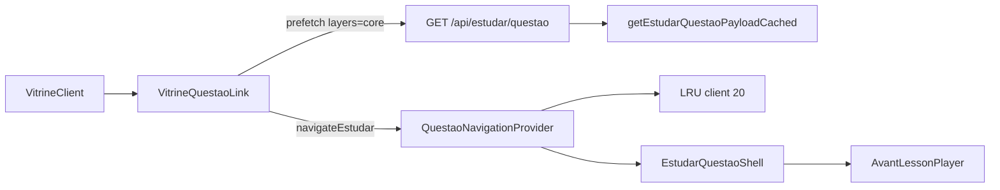

# Otimizações de performance — vitrine e questões

**Última atualização:** 2026-06-02  
**Plano canônico:** [`PLANO_PERFORMANCE_INSTANTANEO.md`](PLANO_PERFORMANCE_INSTANTANEO.md)

Este documento descreve o **estado atual** do código (não o legado de jan/2026). Para SLOs, baseline e checklists, use o plano acima.

---

## Arquitetura atual

Rotas sob `(authenticated)/estudar/` com layout único: `QuestaoNavigationProvider` + `EstudarQuestaoShell`.

---

## 1. Prefetch na vitrine

**Componentes:** [`VitrineQuestaoLink.tsx`](../components/vitrine/VitrineQuestaoLink.tsx), [`useVitrineVisiblePrefetch.ts`](../hooks/useVitrineVisiblePrefetch.ts)

- Clique chama `navigateEstudar` (não `<Link>` puro) com fallback para navegação nativa em modified-click.
- **Hover/focus:** `prefetchEstudar` → `GET /api/estudar/questao?layers=core` (payload menor, sem NeuroSlides).
- **Scroll:** IntersectionObserver, debounce 150 ms, máx. 5 slugs visíveis (`data-vitrine-slug-com-query`).
- **Save-Data / 2g:** prefetch desligado ([`prefetchPolicy.ts`](../lib/estudar/prefetchPolicy.ts)); clique continua funcionando.
- Query da vitrine (`banca`, `assunto`, `q`, `page`) repassada via [`buildVitrineEstudarQuery`](../lib/vitrine/estudarQuery.ts) — paridade com prefetch e dots do player.

---

## 2. Cache em camadas

| Camada | Onde | TTL / tamanho |
|--------|------|----------------|
| LRU browser | `QuestaoNavigationProvider` | 20 entradas |
| `unstable_cache` questão | `getEstudarQuestaoPayloadCached` | 120 s, tags `questao-{slug}`, `user-{id}` |
| Catálogo / vitrine | `getVitrinePageCached`, facets 15 min | ver [`lib/cache.ts`](../lib/cache.ts) |
| Questão por slug (anon) | `getQuestaoBySlugCached` | 10 min |

Invalidação: webhook `POST /api/cache/revalidate` (tags Supabase).

---

## 3. Payload `core` vs `full`

- **Prefetch / navegação rápida:** `layers=core` — enunciado, alternativas (sem gabarito), nav; **sem** `reverse_study_slides`.
- **Estudo reverso:** player busca `layers=full` ao entrar na fase de slides se ausentes ([`AvantLessonPlayer.tsx`](../components/lesson/AvantLessonPlayer.tsx)).
- Schema: `EstudarQuestaoQuerySchema` em [`lib/validations.ts`](../lib/validations.ts).

---

## 4. Feedback visual (sem tela vazia)

- [`EstudarQuestaoSkeleton.tsx`](../components/lesson/EstudarQuestaoSkeleton.tsx) — layout alinhado ao player.
- [`EstudarQuestaoShell.tsx`](../components/lesson/EstudarQuestaoShell.tsx) — skeleton quando payload não casa com a rota; player com `key` estável entre slugs.
- View Transitions (progressive enhancement) em `navigateEstudar`.
- Prefetch **403:** toast "Sem acesso", sem navegar.

---

## 5. Vitrine backend / frontend

- Listagem: RPC `get_vitrine_page` (alerta se fallback `strategy: js` — ver logs).
- Facets separados: `GET /api/vitrine/facets`, cache 15 min.
- Frontend: **SWR** em `VitrineClient` — mantém grupos anteriores + indicador "Atualizando…".

---

## 6. Telemetria e regressão

- Dev/staging: `NEXT_PUBLIC_ESTUDAR_NAV_TELEMETRY=1` → `window.__avantEstudarNavTelemetry`.
- CI: `perf-smoke` em PRs que tocam cache/vitrine/estudar (ver plano § Governança CI).
- E2E: [`e2e/estudar-nav.spec.ts`](../e2e/estudar-nav.spec.ts).

---

## Arquivos principais

| Área | Arquivo |
|------|---------|
| Navegação | [`lib/estudar/navigation.ts`](../lib/estudar/navigation.ts) |
| Provider | [`components/lesson/QuestaoNavigationProvider.tsx`](../components/lesson/QuestaoNavigationProvider.tsx) |
| Vitrine UI | [`components/vitrine/VitrineClient.tsx`](../components/vitrine/VitrineClient.tsx) |
| API questão | [`app/api/estudar/questao/route.ts`](../app/api/estudar/questao/route.ts) |
| RSC questão | [`app/(dashboard)/(authenticated)/estudar/[slug]/page.tsx`](../app/(dashboard)/(authenticated)/estudar/[slug]/page.tsx) |
| Cache | [`lib/cache.ts`](../lib/cache.ts) |

---

## Opcional (fase 11 do plano)

Camadas L0 avançadas — implementadas com flags de produto:

| Passo | Recurso | Arquivo / flag |
|-------|---------|----------------|
| **11.1** | IndexedDB L0 (persiste LRU após refresh) | [`lib/estudar/questaoIdbCache.ts`](../lib/estudar/questaoIdbCache.ts) — default on; `NEXT_PUBLIC_ESTUDAR_IDB_L0=0` desliga |
| **11.2** | Intercepting Routes `@modal` (questão sobre vitrine, mobile) | [`app/(dashboard)/(authenticated)/estudar/@modal/`](../app/(dashboard)/(authenticated)/estudar/@modal/) — opt-in `NEXT_PUBLIC_ESTUDAR_MODAL_ROUTE=1` |
| **11.3** | Service Worker cache L0 | [`public/sw.js`](../public/sw.js) — GET `/api/estudar/questao`, TTL 120 s, `Vary: Authorization`; `NEXT_PUBLIC_ESTUDAR_SW_L0=0` desliga |

Telemetria IDB: `idbHit`, `idbMiss`, `idbHydrate` em `window.__avantEstudarNavTelemetry.snapshot()`.
