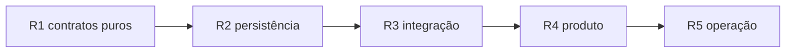

# Plano de implementação — Revisão espaçada FSRS MVP

**Data:** 2026-07-27  
**Status:** R1 contratos (pré-commit) — R2/R3 **não** autorizados; sem ship automático  

**ADR normativo:** [`DECISAO_REVISAO_FSRS_MVP.md`](DECISAO_REVISAO_FSRS_MVP.md) (prevalece em conflito)  
**Ship:** não autorizado por este documento  

**Baseline worktree R1:** `feat/fsrs-mvp-r1-contracts` @ merge-base `origin/main`. Evidence Engine permanece em main; este plano **não** remove nem liga EE.

---

## 0. Estado verificado (fundação)

### 0.1 Dependência FSRS

| Verificação | Resultado |
|-------------|-----------|
| Pin R1 | `ts-fsrs@5.4.1` em `package.json` / lock (já instalado no worktree R1) |
| Constante auditável | `FSRS_MVP_PACKAGE_VERSION = '5.4.1'` em `lib/fsrs/defaults.ts` (não ler package.json em runtime) |
| Esta tarefa (R1.1) | **Não** atualizar a versão do pin |

**Dependência:** `ts-fsrs@5.4.1` (MIT).

### 0.2 Legado reutilizável

| Peça | Arquivo | Reuso |
|------|---------|-------|
| Gabarito server-side | [`lib/estudar/questionPayload.ts`](../lib/estudar/questionPayload.ts) L98–L116 `resolveQuestionAttempt` | Obrigatório em R3 |
| Fila UI / limite 10 | [`plano-diario/page.tsx`](../app/(dashboard)/(authenticated)/plano-diario/page.tsx) L7–L28 | Shell R4 |
| Cards do plano | [`components/dashboard/daily-plan/*`](../components/dashboard/daily-plan) | Adaptar labels R4 |
| API reviews | [`app/api/analytics/reviews/route.ts`](../app/api/analytics/reviews/route.ts) | Branch por flag R4 |
| Nav `fromPlano` | [`lib/estudar/questaoPlayerPayload.ts`](../lib/estudar/questaoPlayerPayload.ts) L189–L201 | Trocar fonte da lista R4 |
| Histórico + RLS padrão | `historico_questoes` migrations | Modelo de RLS; **não** reusar como ledger FSRS |
| Testes SM-2 / tentativa | `__tests__/lib/spaced-repetition.test.ts`, `__tests__/api/registrar-tentativa.test.ts` | Manter; novos testes FSRS em paralelo |
| Timezone freemium | [`lib/freemium/constants.ts`](../lib/freemium/constants.ts) `toFreemiumTimezoneYmd` | Alinhar “hoje” da fila |

### 0.3 Não reutilizar como scheduler

| Peça | Motivo |
|------|--------|
| `simulateSm2FromAttempts` / `getTodayReviews` | SM-2 por slug; on-the-fly |
| `calculateSpacedRepetitionScore` | Heurística de recomendação |
| `lib/evidence/fsrsSkill.ts` (main) | Stub gated RCT-1; não é `ts-fsrs` |
| `data/evidence/pilot-pt-*.json` | Inventário fictício / `minimum_inventory_confirmed: false` |

### 0.4 Evidence Engine (congelar)

Manter em main sem trabalho de produto neste plano:

- Docs ADR/SPEC/plano EE + `docs/EVIDENCE_FASE*.md`
- `lib/evidence/**`, `components/evidence/**`
- Migration `supabase/migrations/20260724180000_evidence_attempt_events.sql`
- Flag `EE_V1_INSTRUMENTATION` default off (`lib/env.ts` em main)
- Dual-write em `registrar-tentativa` / `simulado/responder` quando flag on — **não** expandir; MVP FSRS tem hook próprio isolado

---

## 1. Mapa dos cinco lotes



| Lote | Entrega | PR policy | Complexidade |
|------|---------|-----------|--------------|
| **R1** | Adapter `ts-fsrs`, rating Again/Good, eligibility gate, testes determinísticos | Sem migration, sem runtime de rota | M |
| **R2** | Tabelas + RLS + unique + idempotência | **Só** migration + tipos/persistence pura; **sem UI** | M |
| **R3** | Hook server pós-tentativa elegível | Rotas + flag; sem superfície nova | M |
| **R4** | Fila, seletor, “Revisões de hoje”, limite, beta | UI isolada da migration (já em main via R2) | L |
| **R5** | Métricas, retenção observada, decisão de params | Observabilidade; sem mudar rating policy | S–M |

**Invariante de PR:** migration (R2) **≠** PR de UI (R4).

---

## 2. Lote R1 / R1.1 — Contratos puros

### 2.1 Objetivo

Pacote TypeScript puro em `lib/fsrs/` (isolado de `lib/evidence/` e de `lib/spaced-repetition.ts`).

### 2.2 Escopo (R1.1)

| Item | Detalhe |
|------|---------|
| Dependência | `ts-fsrs@5.4.1` pinado (sem bump) |
| Adapter | `createFsrsScheduler`; `createInitialCard(now)` **obrigatório**; `review` exige `reviewedAt`; sem relógio oculto; inputs imutáveis |
| Rating | `mapCorrectToRating(isCorrect)` / `planFsrsRating` → Again/Good; nunca Hard/Easy |
| Eligibility | `FsrsAttemptContext` fechado; só `cold_practice` \| `scheduled_review`; fail-closed; **sem `isReplay`** |
| Review unit | `fsrs:v1:discipline=…:cluster|subtopico=…`; NFC + escape; cluster só com `clusterInventoryConfirmed` |
| Serialização | `FsrsMvpSerializedCard` (`schemaVersion: 1`, `algorithm`, `algorithmVersion`); round-trip com `elapsedDays` |
| Testes | Unidade + elegibilidade + rating + adapter + serialização + golden determinístico |

### 2.3 Fora de R1/R1.1

- Migration, Supabase, rotas, UI, `lib/env.ts`, flags de produto.
- Qualquer import de `lib/evidence/*`.
- R2/R3.

### 2.4 DoD R1.1

- [x] Namespace inclui disciplina + NFC
- [x] Elegibilidade semântica fail-closed; `isReplay` fora do contrato
- [x] Serialização versionada sem perda; rejeita NaN/Infinity/schema inválido
- [x] Sem relógio oculto; inputs imutáveis
- [x] Gates verdes + revisão independente final (pré-commit)
  - testes FSRS / typecheck / architecture: OK
  - ESLint local: indisponível por falha preexistente minimatch/braceExpand (também em arquivo legado; R1 não alterou a cadeia)

### 2.5 Complexidade

**M** — contratos; risco baixo se permanecer puro.

---

## 3. Lote R2 — Persistência

### 3.1 Objetivo

DDL isolado + camada de persistência server-only.

### 3.2 Migration (arquivo novo único)

Sugestão de nome: `supabase/migrations/YYYYMMDDHHMMSS_spaced_review_fsrs_mvp.sql`

| Objeto | Regras |
|--------|--------|
| `spaced_review_cards` | Unique `(user_id, review_unit_id)`; índices `(user_id, due_at)` |
| `spaced_review_logs` | Append-only; **unique** `(attempt_id)`; sem policy de UPDATE/DELETE para `authenticated` |
| RLS | SELECT/INSERT próprios; UPDATE só em `spaced_review_cards` (não em logs); escrita preferencial via service role nas APIs (padrão EE / `createServerSupabase`) |
| Grants | Espelhar padrão de `evidence_attempt_events` (authenticated SELECT; writes service_role) |

### 3.3 Código R2

| Módulo | Papel |
|--------|-------|
| `lib/fsrs/persistence.ts` | upsert card + insert log idempotente |
| Tipos DB | Atualizar snapshot/types só se o repo exigir no mesmo PR de migration |

### 3.4 Fora de R2

- UI, wire em `registrar-tentativa`, feature flag de produto (pode tipar env sem default-on).

### 3.5 DoD R2

- [ ] Migration aplica em staging
- [ ] Teste de idempotência (mesmo `attempt_id` → um log)
- [ ] Teste unique `(user_id, review_unit_id)`
- [ ] **Nenhum** componente React no PR

### 3.6 Complexidade

**M** — zona vermelha (RLS); revisão humana obrigatória antes de merge.

---

## 4. Lote R3 — Integração

### 4.1 Objetivo

Atualizar FSRS **após** tentativa elegível, sem bloquear o aluno.

### 4.2 Pontos de integração

| Rota | Ação MVP |
|------|----------|
| `POST /api/registrar-tentativa` | Após sucesso de histórico + gabarito server: se `FSRS_MVP_ENABLED` e elegível → `applyFsrsReview` em try/catch; falha só `logger` + métrica |
| `POST /api/simulado/responder` | **Não** integrar no MVP |
| `POST /api/concluir-estudo-reverso` | **Não** chamar FSRS |
| Client player | Enviar `attempt_id` (UUID) no body no Confirmar; **não** enviar rating/acertou como fonte de verdade |

### 4.3 Regras de wiring

1. `isCorrect` = retorno de `resolveQuestionAttempt` (servidor) — **nunca** confiar no client como fonte de verdade.
2. Mapear sinais confiáveis do servidor → `FsrsAttemptContext` (ADR §6). **Não** usar `isReplay` como proxy de pós-explicação: `isReplay` é sinal técnico/histórico sem semântica pedagógica suficiente.
3. Só `cold_practice` e `scheduled_review` atualizam FSRS; demais contextos → skip.
4. Contexto de revisão (`from_plano` / header / body de sessão) deve ser traduzido explicitamente para `scheduled_review` quando o servidor puder atestar isso.
5. Primeira exposição em unidade (opcional R3.b): pode **criar** card com rating da primeira tentativa elegível — decidir explicitamente no PR.
6. Ordem: histórico legado primeiro; FSRS depois (sem 2PC).
7. Resposta HTTP **nunca** 5xx por falha FSRS.
8. `knowledgeClusterId` + `clusterInventoryConfirmed` só quando inventário estiver atestado no servidor; senão subtópico.

### 4.4 Env

| Var | Default | Papel |
|-----|---------|-------|
| `FSRS_MVP_ENABLED` | off | Master switch |
| `FSRS_REQUEST_RETENTION` | `0.90` | Server-only |
| `FSRS_MIN_CLUSTER_INVENTORY` | `3` | Limiar cluster (caller confirma) |

Validar em `lib/env.ts` (padrão do projeto) — **somente no R3**.

### 4.5 DoD R3

- [ ] Testes de rota: elegível atualiza; contextos inelegíveis não; falha FSRS ainda retorna 200 com gabarito
- [ ] Sem UI nova
- [ ] EE flags intocadas
- [ ] Sem coexistência SM-2 + FSRS na mesma superfície

### 4.6 Complexidade

**M** — cuidado com regressão freemium e mapeamento semântico de contexto (não reintroduzir `isReplay` como regra FSRS).

---

## 5. Lote R4 — Produto

### 5.1 Objetivo

Fila due + seletor + superfície **“Revisões de hoje”** + beta.

### 5.2 Backend de fila

| Função | Comportamento |
|--------|---------------|
| `listDueReviewCards(userId, now, limit)` | `due_at <= now` ordenado |
| `selectQuestionForUnit(...)` | ADR §7; marca `same_stem_fallback` |
| Limite diário | Default 10 (paridade Plano diário L7) |
| Fallback inventário | Skip + contador `inventory_missing` |

### 5.3 UI

| Opção | Recomendação |
|-------|----------------|
| Nova rota `/revisoes-hoje` | Preferida (copy clara; ADR decisão 17) |
| Rebrand de `/plano-diario` | Alternativa sob flag; risco de confundir SM-2 residual |

Reusar `PlanoDiarioView` / `PlanoDiarioTopicCard` com props mínimas (`ReviewItem` pode ganhar `review_unit_id`, `same_stem_fallback`).

Preservar links para `/estudar` (vitrine livre) no empty state (já existe em `PlanoDiarioView` L46–L50).

### 5.4 Player

- Query `?fromRevisoes=1` (ou reutilizar `fromPlano`) para: (a) montar lista; (b) marcar tentativa como `review_session` elegível a FSRS.
- Após resposta: avançar para próxima da fila (paridade navegação atual do plano).

### 5.5 Freemium

Definir no PR (proposta):

- Item **due** de revisão **não** consome `FREEMIUM_ESTUDO_REVERSO_DAILY_LIMIT` da mesma forma que questão **nova** nunca tentada — alinhar com produto; documentar teste.

### 5.6 Rollout beta

- Allowlist e-mails (padrão similar a `EE_V1_INTERNAL_EMAILS`, **flag separada**).
- SM-2 permanece para quem está off.

### 5.7 DoD R4

- [ ] Beta interno consegue esvaziar fila due
- [ ] Vitrine sem regressão e2e smoke
- [ ] `same_stem_fallback` visível só em telemetria (não copy de “domínio”)
- [ ] PR **sem** nova migration

### 5.8 Complexidade

**L** — maior superfície; mais QA manual.

---

## 6. Lote R5 — Operação

### 6.1 Objetivo

Observabilidade para go/no-go de default-on e futura otimização de parâmetros (adiada).

### 6.2 Instrumentação

| Sinal | Como |
|-------|------|
| Logs estruturados | `logger.info` / `warn` com `review_unit_id`, `attempt_id`, `rating`, `same_stem_fallback` (sem PII além de user id já padrão) |
| Contadores | Sucesso apply / skip ineligible / persist fail / idempotent hit |
| Queries | Views ou scripts SQL read-only sobre `spaced_review_logs` |

### 6.3 Métricas de produto (mínimo)

1. Retenção observada (Good rate em reviews com intervalo ≥ 7d).
2. Acerto após 7 e 14 dias (primeira tentativa elegível pós-due).
3. Lapses / usuário / dia.
4. Carga diária (due servidos / limite).
5. Taxa `same_stem_fallback` e `inventory_missing`.

### 6.4 Decisão futura (não implementar em R5)

- Otimizar pesos FSRS / retention por coorte.
- Convergir com EE RCT-2.
- Ligar `Hard`.

### 6.5 DoD R5

- [ ] Dashboard ou artefato `artifacts/fsrs-mvp-ops-*.md` gerado por script
- [ ] Critérios numéricos de go/no-go documentados (mesmo que provisórios)
- [ ] Nenhum change de rating policy sem novo ADR

### 6.6 Complexidade

**S–M**.

---

## 7. Ordem de PRs (anti-dívida)

```text
PR-R1  feat(fsrs): contratos + ts-fsrs + testes
PR-R2  feat(fsrs): migration spaced_review_* + persistence (sem UI)
PR-R3  feat(fsrs): hook registrar-tentativa + env flags
PR-R4  feat(fsrs): Revisões de hoje + seletor + beta
PR-R5  feat(fsrs): métricas ops + script retenção
```

Gates por PR: typecheck + testes do pacote; R2/R3 → Security Review humano (zona vermelha/amarela).

---

## 8. Divergências explícitas (plano × código atual)

| Divergência | Estado atual | FSRS MVP |
|-------------|--------------|----------|
| Unidade | `modulo_slug` | cluster/subtópico |
| Persistência de due | Recalcula SM-2 | Tabelas novas |
| Replay | UPDATE histórico + bump `created_at` (player) | Inelegível FSRS |
| Append-only | Só EE `evidence_attempt_events` | `spaced_review_logs` |
| `attempt_id` | Só no stream EE (quando flag on) | Obrigatório para apply FSRS |
| FSRS lib | Ausente; stub EE gated | `ts-fsrs` real |
| Superfície | “Plano diário” | “Revisões de hoje” (paralela no beta) |
| Simulado | Sync histórico | Fora do MVP |

---

## 9. Riscos e mitigação (execução)

| Risco | Lote | Mitigação |
|-------|------|-----------|
| Inventário pobre → same-stem | R4–R5 | Métrica + não claim de transferência |
| Drift `meta.subtopico` × coluna | R1/R4 | Normalização + preferência meta |
| Dupla fila SM-2/FSRS | R4 | Uma flag; uma superfície ativa |
| Import acidental EE FSRS | R1 | Boundary lint / review checklist |
| Migration+UI no mesmo PR | — | Proibido (ADR + este plano) |
| Freemium regressão | R3–R4 | Testes de gate explícitos |

---

## 10. Estimativa por complexidade (não datas)

| Lote | Complexidade | Notas |
|------|--------------|-------|
| R1 | **M** | Lib + testes puros |
| R2 | **M** | RLS/migration |
| R3 | **M** | Wire cuidadoso |
| R4 | **L** | UX + seletor + beta |
| R5 | **S–M** | Ops |
| **Total** | **~4×M + 1×L** | Sequencial; R4 é o gargalo |

---

## 11. Checklist de invariantes (todos os lotes)

- [ ] Mesma tentativa não atualiza card 2×
- [ ] Slides / concluir-estudo / T1 / pós-explicação não atualizam
- [ ] Sem confiança em correct/rating do client
- [ ] Sem LLM runtime
- [ ] Sem domínio por um acerto
- [ ] Falha scheduler não bloqueia aluno
- [ ] Logs append-only
- [ ] Migration ≠ PR de UI
- [ ] EE não apagado; flags EE default off

---

## 12. Próximo passo exato

1. **Revisão humana** de:
   - [`DECISAO_REVISAO_FSRS_MVP.md`](DECISAO_REVISAO_FSRS_MVP.md)
   - este plano
2. Aprovação explícita (mensagem tipo: “pode iniciar R1”).
3. Só então: branch `feat/fsrs-mvp-r1-contracts`, instalar `ts-fsrs`, implementar R1.

**Não iniciar R1 sem essa aprovação.**
