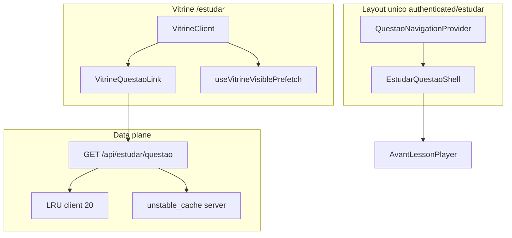

# Plano — performance instantânea AVANT

Documento canônico no repositório para execução passo a passo da vitrine (`/estudar`), navegação para questão e player.

**Como pedir execução:** *"Execute o passo X.Y"* (ex.: *"Execute o passo 1.1"*).

**Princípios:** manter Next.js 16 + Supabase; diff focado por passo; um PR por passo (ou subgrupo 1.x quando indicado); testes antes de marcar passo concluído.

---

## SLOs finais (referência)

| Métrica | Meta |
|---------|------|
| Cache hit na navegação vitrine → questão | ≥ 80% |
| P95 abrir questão | < 800 ms |
| P95 vitrine página 1 | < 800 ms |
| UX no clique | Sem tela vazia |

---

## Tabela de status (checkbox por passo)

Marque `[x]` ao concluir cada passo (incluir testes/validação indicados na fase).

### Fase 0 — Preparação e medição

- [x] **0.1** — Criar este doc com índice, SLOs e tabela de status
- [x] **0.2** — Documentar procedimento de baseline (§ Baseline)
- [x] **0.3** — Rodar baseline e preencher tabela **Antes**

### Fase 1 — Rotas e navegação unificada

- [x] **1.1** — Mover `estudar/layout.tsx` → `(authenticated)/estudar/layout.tsx`
- [x] **1.2** — Mover `[slug]/page.tsx` e `loading.tsx` para `(authenticated)/estudar/[slug]/`
- [x] **1.3** — Remover pasta antiga; corrigir imports, testes e E2E
- [x] **1.4** — Validar: mesmo `QuestaoNavigationProvider`; auth de matrícula intacta

### Fase 2 — Vitrine: clique com prefetch

- [x] **2.1** — Criar `VitrineQuestaoLink.tsx` (prefetch + navigate + fallback Link)
- [x] **2.2** — Integrar em `VitrineClient.tsx` (sem `<Link href=/estudar/>` direto nos cards)
- [x] **2.3** — Criar `useVitrineVisiblePrefetch.ts` e integrar (IO, debounce 150 ms, máx. 5)
- [x] **2.4** — Testes `VitrineQuestaoLink.test.tsx`
- [x] **2.5** — Telemetria staging: `navigateHit` após hover + clique (ver nota abaixo)

**Nota 2.5 — validar `navigateHit` em staging:** com `NEXT_PUBLIC_ESTUDAR_NAV_TELEMETRY=1` (ou `localStorage.setItem('avant:estudar-nav-telemetry','1')`), login → `/estudar` → **hover ~1 s** no card ou link → clique. No console: `window.__avantEstudarNavTelemetry.snapshot()` — esperar `navigateHit` > 0 e `navigateHitRatePct` alto após série de 20 cliques (protocolo § Baseline). Prefetch em scroll: cards com `data-vitrine-slug-com-query` disparam até 5 prefetches visíveis (debounce 150 ms). Save-Data / 2g: sem prefetch (`lib/estudar/prefetchPolicy.ts`), navegação por clique permanece.

### Fase 3 — Feedback visual (sem tela vazia)

- [x] **3.1** — Criar `EstudarQuestaoSkeleton.tsx`
- [x] **3.2** — Cold path: `EstudarQuestaoSkeleton` no shell (`[slug]/loading.tsx` só boundary, sem UI duplicada)
- [x] **3.3** — Shell: skeleton quando payload não casa com a rota; player obsoleto oculto entre slugs
- [x] **3.4** — Checklist CLS/mobile (§ Fase 3 — checklist mobile abaixo)

**Checklist 3.4 (mobile / CLS):** abrir `/estudar/[slug]` em viewport ~390px; confirmar que não há flash branco no clique vitrine→questão nem ao trocar slug pelos dots; card skeleton com `min-height` estável; `aria-busy` no status; após hidratar, layout do player ocupa área semelhante (sem salto grande do header/alternativas). Validar em Chrome Android ou DevTools device mode.

### Fase 4 — Transições e erros de prefetch

- [x] **4.1** — View Transitions em `navigateEstudar` (progressive enhancement)
- [x] **4.2** — Prefetch 403: toast “Sem acesso”, sem navegar
- [x] **4.3** — Manter player montado entre slugs (revisar `key`)
- [x] **4.4** — *(Opcional)* Speculation Rules no layout estudar

### Fase 5 — Payload em camadas (servidor + API)

- [x] **5.1** — `layers: 'core' | 'full'` em `EstudarQuestaoQuerySchema` (default `full`)
- [x] **5.2** — `buildEstudarQuestaoPlayerPayload`: `core` omite slides
- [x] **5.3** — Expor `layers` em `GET /api/estudar/questao`
- [x] **5.4** — Prefetch client com `layers=core`

### Fase 6 — Payload em camadas (player + cache)

- [x] **6.1** — Player: buscar slides (L1) ao entrar estudo reverso se ausentes
- [x] **6.2** — `getEstudarQuestaoPayloadCached` (TTL 120 s, tags por slug/usuário)
- [x] **6.3** — RSC `[slug]/page.tsx` usa cache quando aplicável
- [x] **6.4** — `perf-smoke` com budget `estudar_questao_core`
- [x] **6.5** — Medir payload mediano core (< 80 KB gzip) → tabela **Depois**

### Fase 7 — Vitrine rápida (backend)

- [x] **7.1** — Alerta quando `getVitrinePage` usa `strategy: 'js'`
- [x] **7.2** — Revisar caminho `isAdmin` (evitar pipeline JS lento)
- [x] **7.3** — Confirmar facets separados + cache 15 min
- [x] **7.4** — Estender/rodar `paridadeNav.test.ts`

### Fase 8 — Vitrine rápida (frontend)

- [x] **8.1** — SWR em `VitrineClient` (grupos anteriores + “Atualizando…”)
- [x] **8.2** — Paridade `estudarQuery` vitrine ↔ prefetch
- [x] **8.3** — P95 `/api/vitrine` pág. 1 em staging (< 800 ms meta)

### Fase 9 — Infraestrutura

- [ ] **9.1** — Checklist Supabase pooler + região Vercel (§ Operação)
- [ ] **9.2** — Advisors: índices `historico_questoes`, `modulos_estudo`
- [ ] **9.3** — Decisão streaming/Suspense na vitrine SSR

### Fase 10 — Governança e regressão

- [ ] **10.1** — `perf-smoke` obrigatório em PRs sensíveis (regra no doc)
- [ ] **10.2** — Playwright: vitrine → questão → próxima
- [ ] **10.3** — Atualizar `OTIMIZACOES_PERFORMANCE_QUESTOES.md`
- [ ] **10.4** — Tabela **Depois** + critérios SLO marcados

### Fase 11 — Opcional (após 10.4)

- [ ] **11.1** — IndexedDB para LRU L0 persistido
- [ ] **11.2** — Intercepting Routes (`@modal`) questão sobre vitrine
- [ ] **11.3** — Service Worker cache L0

---

## Medições — Antes / Depois

Preencher no passo **0.3** (baseline) e atualizar nas fases **6.5**, **8.3** e **10.4**.

### Antes (baseline staging)

| Métrica | Valor | Data | Notas |
|---------|-------|------|-------|
| P95 vitrine pág. 1 | **2339 ms** | 2026-06-02 | `GET /api/vitrine?page=1` autenticado, 20 amostras; local `http://localhost:3000`, commit `dcc1987`. Servidor (`getVitrinePage`) P95 **1216 ms** no mesmo run. |
| P95 abrir questão | **4572 ms** | 2026-06-02 | `GET /api/estudar/questao?slug=…` autenticado, 20 slugs; mesmo ambiente. |
| % vitrine `strategy: rpc` vs `js` | **100% rpc** / **0% js** | 2026-06-02 | 20× `getVitrinePage` (usuário com matrícula, sem filtros). |
| `navigateHit` / `navigateMiss` | **0** / **0** (hit rate N/A) | 2026-06-02 | Vitrine ainda usa `<Link>` (fase 2 pendente); LRU do `QuestaoNavigationProvider` não instrumenta os 20 cliques. Telemetria ligada via `localStorage` no Playwright. |
| Payload mediano questão (gzip) | **2,3 KB** (2302 B) | 2026-06-02 | Mediana do corpo gzip de 20 respostas `/api/estudar/questao`. Catálogo DB: `json_bytes.p95` **2500 B** ([`perf-baseline-2026-06-02.json`](perf-baseline-2026-06-02.json)). |

Artefatos: [`perf-baseline-2026-06-02.json`](perf-baseline-2026-06-02.json) · [`perf-baseline-staging-2026-06-02.json`](perf-baseline-staging-2026-06-02.json) · [`../artifacts/perf-smoke-baseline-staging-report.json`](../artifacts/perf-smoke-baseline-staging-report.json) (smoke local, exit 1 por tetos — esperado em dev). Comando: `npm run perf:baseline` / `npm run perf:baseline:staging`.

### Depois

| Métrica | Valor | SLO atingido? |
|---------|-------|----------------|
| Cache hit navegação | — | ≥ 80% |
| P95 abrir questão | — | < 800 ms |
| P95 vitrine pág. 1 | **1188 ms** HTTP (`GET /api/vitrine?page=1`, 20×, `www.avant.enf.br`) · **850 ms** servidor local (`getVitrinePage`, pós 7.x) | < 800 ms — **HTTP ainda acima**; servidor −30% vs baseline (**1216 → 850 ms**). Deploy pendente para medir HTTP com 7.x–8.x. |
| Payload mediano `layers=core` | **1,2 KB** JSON (1198 B no cenário `estudar_questao_core` / perf-smoke; fixture premium, slides omitidos) | < 80 KB gzip |
| Tela vazia no clique | — | Não |

---

## Baseline

Procedimento reproduzível para o passo **0.3** (preencher a tabela **Antes**). Executar sempre no **mesmo ambiente** (recomendado: deploy de **staging** com catálogo representativo e conta de teste com matrícula ativa).

### Pré-requisitos

| Item | Detalhe |
|------|---------|
| URL | `NEXT_PUBLIC_APP_URL` do staging (ex.: preview Vercel ou URL fixa de staging) |
| Conta | Usuário aluno com matrícula que enxerga ≥ 1 página de vitrine e slugs em `/estudar` |
| Navegador | Chrome ou Edge (DevTools → Network; Performance opcional) |
| Secret (opcional) | `METRICS_SECRET` no staging, para `GET /api/metrics` autenticado por Bearer |

Registrar no baseline: data (ISO), commit ou tag do deploy, URL e se o catálogo está “quente” (já visitou `/estudar` antes) ou “frio” (aba anônima / hard refresh).

### 1 — Telemetria de navegação (`navigateHit` / `navigateMiss`)

A telemetria vive em [`lib/estudar/navigationTelemetry.ts`](../lib/estudar/navigationTelemetry.ts) e expõe `window.__avantEstudarNavTelemetry` no browser quando ativa.

**Ativar (escolher uma):**

1. **Build staging (recomendado para comparar deploys):** variável de ambiente no deploy  
   `NEXT_PUBLIC_ESTUDAR_NAV_TELEMETRY=1`
2. **Só nesta sessão (sem redeploy):** DevTools → Console  
   `localStorage.setItem('avant:estudar-nav-telemetry', '1')`  
   e recarregar `/estudar`
3. **Local:** em `development` a telemetria já vem ligada por padrão (`NODE_ENV === 'development'`)

**Reset antes da amostra:**

```js
window.__avantEstudarNavTelemetry?.reset()
```

**Protocolo — 20 cliques vitrine → questão**

1. Abrir `/estudar` (página 1, sem filtros extras na primeira rodada).
2. Para **10** questões: passar o mouse no card da lista **≥ 500 ms**, depois clicar (simula prefetch por hover).
3. Para **10** questões: clicar **sem** hover prévio (cold path).
4. Em cada clique, abrir uma questão **diferente** quando possível (evitar repetir o mesmo `slug`).
5. Voltar à vitrine com o botão do browser ou link “Estudar” — não usar F5 no meio da série.
6. Ao terminar, capturar o snapshot:

```js
window.__avantEstudarNavTelemetry?.snapshot()
```

**Registrar na tabela Antes:**

- `navigateHit`, `navigateMiss`, `navigateHitRatePct` (do snapshot)
- Nota se houve `navigateMissInflight` (prefetch ainda em voo no clique)

Logs no console (nível `debug`): prefixo `[estudar-nav]` — útil para auditar `prefetch_ok` / `navigate_miss`.

### 2 — `perf-smoke` (regressão automatizada + pipeline sintético)

Script: [`scripts/perf-smoke.ts`](../scripts/perf-smoke.ts) · comando: `npm run perf:smoke`.

**CI (referência):** job `perf-smoke` em [`.github/workflows/test.yml`](../.github/workflows/test.yml) — `PERF_BASE_URL=http://127.0.0.1:3000`, baseline `docs/perf-smoke-baseline-ci.json`.

**Contra staging (recomendado):**

1. Copiar [`.env.staging.example`](../.env.staging.example) → `.env.staging.local` e preencher `PERF_BASE_URL` / `NEXT_PUBLIC_APP_URL` com a preview Vercel (Supabase permanece no `.env.local`).
2. Rodar:

```bash
# Baseline completo (HTTP + browser + relatório docs/perf-baseline-staging-YYYY-MM-DD.json)
npm run perf:baseline:staging

# Só smoke HTTP (tetos em docs/perf-smoke-baseline-staging.json)
npm run perf:smoke:staging
```

Equivalente manual (PowerShell), se não usar `.env.staging.local`:

```powershell
$env:PERF_TARGET = "staging"
$env:PERF_BASE_URL = "https://SEU-STAGING.vercel.app"
npm run perf:baseline
```

Variáveis opcionais no `.env.staging.local`: `PERF_BASELINE_EMAIL`, `METRICS_SECRET`, `VERCEL_PROTECTION_BYPASS` (preview com protection), `PERF_ENV_FILE`.

| Variável | Padrão | Uso |
|----------|--------|-----|
| `PERF_BASE_URL` | `http://127.0.0.1:3000` | Host alvo |
| `PERF_BUDGET_BASELINE_FILE` | — | JSON de tetos P95 (`docs/perf-smoke-baseline-staging.json`) |
| `PERF_REPORT_OUTPUT` | `artifacts/perf-smoke-report.json` | Relatório salvo (commitar só se for evidência do 0.3) |
| `PERF_DURATION_MS` | `30000` | Janela por cenário HTTP |
| `PERF_CONCURRENCY` | `20` | Workers paralelos |
| `PERF_REGRESSION_TOLERANCE` | `0.2` | Falha se P95 > baseline × (1 + tolerância) |
| `PERF_SKIP_HTTP` | — | `1` = só cenário sintético `synthetic_10k_pipeline` |
| `METRICS_SECRET` | — | Header Bearer em `api_metrics` |

**O que o smoke mede hoje:** rotas **sem sessão** (espera `401`), health, metrics e **pipeline JS sintético** 10k módulos — **não** substitui P95 autenticado de `/api/vitrine` nem tempo percebido no clique. Use o relatório JSON para regressão de infraestrutura; use a seção 3 abaixo para os SLOs da tabela **Antes**.

### 3 — P95 vitrine (pág. 1) e P95 abrir questão (autenticado)

Meta de produto: **&lt; 800 ms P95** (ver [SLOs finais](#slos-finais-referência)).

**Opção A — DevTools (recomendado para baseline manual)**

1. Login no staging → `/estudar`.
2. Network → desmarcar “Disable cache” na **primeira** medição fria; repetir série “quente” separadamente se quiser comparar.
3. Recarregar `/estudar` → localizar `GET /api/vitrine?page=1` (e variantes com filtros, se fizer parte do baseline).
4. Anotar **Time** (ou **Waiting for server response**) de **≥ 20** requisições (navegar páginas/filtros ou repetir reload controlado).
5. Calcular P95 (planilha ou ordenar tempos e tomar o percentil 95).
6. Para **abrir questão**: repetir 20× vitrine → clique em card → medir `GET /api/estudar/questao?...` (e, se relevante, o documento RSC `/estudar/[slug]` — anotar qual endpoint entrou no número).

**Opção B — `curl` com JWT da sessão**

1. DevTools → Application → cookies / ou Network em request autenticada → copiar `Authorization: Bearer …` (ou token Supabase usado pelo app).
2. Disparar 20×:

```bash
curl -s -o /dev/null -w "%{time_total}\n" \
  -H "Authorization: Bearer SEU_TOKEN" \
  "https://SEU-STAGING.vercel.app/api/vitrine?page=1"
```

3. Idem para `/api/estudar/questao?slug=SLUG_VALIDO` (mesmos query params que a vitrine envia: `banca`, `assunto`, `q`, `page`, etc., quando existirem).

**Opção C — Métricas in-memory no servidor** (staging com `METRICS_SECRET`)

```bash
curl -s -H "Authorization: Bearer $METRICS_SECRET" \
  "https://SEU-STAGING.vercel.app/api/metrics?type=performance&endpoint=/api/vitrine" | jq .stats.p95TTFB

curl -s -H "Authorization: Bearer $METRICS_SECRET" \
  "https://SEU-STAGING.vercel.app/api/metrics?type=performance&endpoint=/api/estudar/questao" | jq .stats.p95TTFB
```

Requisições anteriores ao deploy **não** entram no buffer — gerar tráfego (seção 1 + reloads) **depois** do deploy medido, ou reiniciar instância / usar ambiente dedicado.

### 4 — % vitrine `strategy: rpc` vs `js`

Contadores em [`lib/metrics.ts`](../lib/metrics.ts) (`recordVitrineStrategy`), expostos em:

```bash
curl -s -H "Authorization: Bearer $METRICS_SECRET" \
  "https://SEU-STAGING.vercel.app/api/metrics?type=vitrine" | jq .vitrineStrategy
```

Interpretar `rpc.sharePercent` vs `js.sharePercent` após tráfego real de `/api/vitrine` (cada page view incrementa o bucket conforme [`getVitrinePage`](../lib/vitrine/service.ts)).

**Sem metrics API:** logs estruturados `Vitrine service resolved` com campo `strategy: 'rpc' | 'js'` (Vercel Logs / Supabase não aplica — usar observabilidade do host).

### 5 — Payload mediano da questão (gzip)

Na aba Network, coluna **Size** (transferido, gzip) de `GET /api/estudar/questao` em **≥ 10** slugs diferentes. Mediana dos bytes transferidos → tabela **Antes**. (Após fase 5–6, repetir com `layers=core`.)

### 6 — Consolidar resultados (passo 0.3)

1. Preencher a tabela [Antes (baseline staging)](#antes-baseline-staging) neste doc (data + notas “frio/quente”, commit).
2. Opcional: anexar `artifacts/perf-smoke-baseline-staging-report.json` do passo 2.
3. Opcional: evidência de catálogo em `docs/perf-baseline-YYYY-MM-DD.json` seguindo [`perf-baseline-template.json`](perf-baseline-template.json) e [`SCALE_HEALTH.md`](SCALE_HEALTH.md) (`npm run scale:health -- --json`).

**Checklist “baseline 0.3 concluído”**

- [x] Telemetria: protocolo 20 cliques tentado no Playwright; snapshot inválido por navegação — **0/0** documentado (vitrine sem `VitrineQuestaoLink`)
- [x] P95 `/api/vitrine?page=1` (autenticado) registrado
- [x] P95 abrir questão (`/api/estudar/questao`) registrado
- [x] % RPC vs JS anotado
- [x] Payload mediano questão anotado
- [x] `npm run perf:smoke` contra **local** executado (staging URL não configurada no `.env.local`; ver artefato smoke)
- [x] Tabela **Antes** sem células `—` nas métricas obrigatórias

### Referências cruzadas

| Tópico | Doc / código |
|--------|----------------|
| Captura baseline 0.3 (local) | `npm run perf:baseline` → [`scripts/capture-perf-baseline.ts`](../scripts/capture-perf-baseline.ts) |
| Captura baseline staging | `npm run perf:baseline:staging` + [`.env.staging.example`](../.env.staging.example) |
| perf-smoke staging | `npm run perf:smoke:staging` |
| Métricas HTTP | [`MONITORAMENTO_PERFORMANCE.md`](MONITORAMENTO_PERFORMANCE.md) |
| Tetos perf-smoke staging | [`perf-smoke-baseline-staging.json`](perf-smoke-baseline-staging.json) |
| Saúde do catálogo 10k | [`SCALE_HEALTH.md`](SCALE_HEALTH.md) |
| Testes de telemetria | [`__tests__/lib/estudar/navigationTelemetry.test.ts`](../__tests__/lib/estudar/navigationTelemetry.test.ts) |

---

## Operação

> Seção a completar no passo **9.1**: Supabase pooler, região Vercel, checklist de produção.

---

## Visão da arquitetura alvo



---

## Índice detalhado por fase

### Fase 0 — Preparação e medição

| Passo | O que fazer | Arquivos principais | Pronto quando |
|-------|-------------|---------------------|---------------|
| **0.1** | Este documento com índice, SLOs e checkboxes | `docs/PLANO_PERFORMANCE_INSTANTANEO.md` | Doc no repo |
| **0.2** | Procedimento de baseline reproduzível | doc § Baseline | Seção preenchida |
| **0.3** | Baseline “antes” na tabela acima | `docs/perf-smoke-baseline-staging.json` (opcional) | Tabela Antes preenchida |

**Dependência:** nenhuma.

---

### Fase 1 — Rotas e navegação unificada

| Passo | O que fazer | Arquivos | Pronto quando |
|-------|-------------|----------|---------------|
| **1.1** | Mover `app/(dashboard)/estudar/layout.tsx` → `app/(dashboard)/(authenticated)/estudar/layout.tsx` | layout | Build ok |
| **1.2** | Mover `[slug]/page.tsx` e `loading.tsx` → `(authenticated)/estudar/[slug]/` | pages | URLs `/estudar/[slug]` iguais |
| **1.3** | Remover pasta `estudar/` antiga; corrigir imports, testes, `e2e/` | testes | `npm test` verde |
| **1.4** | Validar: vitrine e questão no mesmo `QuestaoNavigationProvider`; matrícula ok | — | Checklist manual OK |

**Dependência:** Fase 0 recomendada (não bloqueia 1.1).

---

### Fase 2 — Vitrine: clique com prefetch

| Passo | O que fazer | Arquivos | Pronto quando |
|-------|-------------|----------|---------------|
| **2.1** | `VitrineQuestaoLink`: `prefetchEstudar`, `navigateEstudar`, fallback `Link`; Save-Data/2g | `components/vitrine/VitrineQuestaoLink.tsx` | Teste unitário verde |
| **2.2** | Substituir `<Link>` em `VitrineClient` (assunto + lista) | `VitrineClient.tsx` | Sem Link direto nos cards |
| **2.3** | `useVitrineVisiblePrefetch` (IO, `firstSlug`, debounce 150 ms, máx. 5) | hook + VitrineClient | Prefetch em scroll documentado |
| **2.4** | Testes unitários | `__tests__/components/vitrine/VitrineQuestaoLink.test.tsx` | CI verde |
| **2.5** | Telemetria: `navigateHit` sobe após hover + clique | — | % anotado no doc |

**Dependência:** Fase 1 (1.1–1.4).

---

### Fase 3 — Feedback visual (sem tela vazia)

| Passo | O que fazer | Arquivos | Pronto quando |
|-------|-------------|----------|---------------|
| **3.1** | Skeleton alinhado ao player (header, enunciado, 4 alternativas) | `EstudarQuestaoSkeleton.tsx` | Revisão visual OK |
| **3.2** | Skeleton no `loading.tsx` (substituir `return null`) | `(authenticated)/estudar/[slug]/loading.tsx` | Cold path com skeleton |
| **3.3** | Shell: rota questão + `displayPayload` null → skeleton | `EstudarQuestaoShell.tsx` | Sem flash branco entre slugs |
| **3.4** | Validar CLS/percepção mobile | — | Checklist manual OK |

**Dependência:** Fase 1.

---

### Fase 4 — Transições e erros de prefetch

| Passo | O que fazer | Arquivos | Pronto quando |
|-------|-------------|----------|---------------|
| **4.1** | View Transitions em `navigateEstudar` | `QuestaoNavigationProvider.tsx` | Chrome ok; fallback seguro |
| **4.2** | Prefetch 403: toast “Sem acesso”, não navegar | provider + toast | Teste entitlement |
| **4.3** | Player montado entre slugs (`key` no shell/player) | shell, player | Menos remount |
| **4.4** | *(Opcional)* Speculation Rules no layout estudar | layout | Documentado |

**Dependência:** Fases 2 e 3.

---

### Fase 5 — Payload em camadas (servidor + API)

| Passo | O que fazer | Arquivos | Pronto quando |
|-------|-------------|----------|---------------|
| **5.1** | `layers: 'core' \| 'full'` no schema (default `full`) | `lib/validations.ts` | Schema exportado |
| **5.2** | `core` omite slides no builder | `lib/estudar/questaoPlayerPayload.ts` | Testes payload |
| **5.3** | API expõe `layers` | `app/api/estudar/questao/route.ts` | `__tests__/api/estudar/questao.test.ts` verde |
| **5.4** | Prefetch client com `layers=core` | `lib/estudar/navigation.ts`, provider | Menos bytes no prefetch |

**Dependência:** Fase 2.

---

### Fase 6 — Payload em camadas (player + cache)

| Passo | O que fazer | Arquivos | Pronto quando |
|-------|-------------|----------|---------------|
| **6.1** | Player busca slides L1 se ausentes no estudo reverso | `AvantLessonPlayer.tsx` | Fluxo pedagógico intacto |
| **6.2** | `getEstudarQuestaoPayloadCached` (TTL 120 s, tags) | `lib/cache.ts` | Invalidação webhook ok |
| **6.3** | RSC usa cache quando aplicável | `(authenticated)/estudar/[slug]/page.tsx` | P95 melhora staging |
| **6.4** | Budget `estudar_questao_core` no perf-smoke | scripts, doc | Budget commitado |
| **6.5** | Payload mediano core < 80 KB gzip | doc | Tabela Depois parcial |

**Dependência:** Fase 5.

---

### Fase 7 — Vitrine rápida (backend)

| Passo | O que fazer | Arquivos | Pronto quando |
|-------|-------------|----------|---------------|
| **7.1** | Log/alerta quando `getVitrinePage` usa `strategy: 'js'` | `lib/vitrine/service.ts` | Visível em logs |
| **7.2** | Caminho `isAdmin` sem pipeline JS lento | service | Admin RPC ou path dedicado |
| **7.3** | Facets separados, cache 15 min | `facets.ts`, `/api/vitrine/facets` | Paginação não recalcula facets |
| **7.4** | Paridade nav | `__tests__/lib/vitrine/paridadeNav.test.ts` | CI verde |

**Dependência:** Baseline 0.3 (comparar P95).

---

### Fase 8 — Vitrine rápida (frontend)

| Passo | O que fazer | Arquivos | Pronto quando |
|-------|-------------|----------|---------------|
| **8.1** | SWR: grupos anteriores + “Atualizando…” | `VitrineClient.tsx` | Sem spinner full-page |
| **8.2** | `estudarQuery` idêntico vitrine ↔ prefetch | VitrineClient, navigation | Paridade URL manual |
| **8.3** | P95 `/api/vitrine` pág. 1 staging | — | Registrado no doc |

**Dependência:** Fase 7.

---

### Fase 9 — Infraestrutura

| Passo | O que fazer | Arquivos | Pronto quando |
|-------|-------------|----------|---------------|
| **9.1** | Checklist pooler + região Vercel | doc § Operação | Itens verificados |
| **9.2** | Índices Supabase (migrations se necessário) | `supabase/migrations/` | Advisors sem crítico |
| **9.3** | Decisão streaming/Suspense vitrine SSR | page vitrine | Fazer ou adiar documentado |

**Dependência:** pode intercalar após 0.3.

---

### Fase 10 — Governança e regressão

| Passo | O que fazer | Arquivos | Pronto quando |
|-------|-------------|----------|---------------|
| **10.1** | `perf-smoke` em PRs que tocam cache/vitrine/estudar/lesson | CI | Regra neste doc |
| **10.2** | E2E vitrine → questão → próxima | `e2e/` | E2E verde |
| **10.3** | Alinhar `OTIMIZACOES_PERFORMANCE_QUESTOES.md` | docs | Código = doc |
| **10.4** | Tabela Depois + SLOs finais | doc | Plano concluído |

**Dependência:** Fases 1–8.

---

### Fase 11 — Opcional

| Passo | O que fazer | Nota |
|-------|-------------|------|
| **11.1** | IndexedDB LRU L0 | Reabrir questão após refresh |
| **11.2** | Intercepting Routes `@modal` | UX mobile avançada |
| **11.3** | Service Worker cache L0 | Escopo produto explícito |

**Dependência:** passo 10.4 concluído.

---

## Ordem recomendada (estrita)

```
0.1 → 0.2 → 0.3
→ 1.1 → 1.2 → 1.3 → 1.4
→ 2.1 → 2.2 → 2.3 → 2.4 → 2.5
→ 3.1 → 3.2 → 3.3 → 3.4
→ 4.1 → 4.2 → 4.3 → [4.4]
→ 5.1 → 5.2 → 5.3 → 5.4
→ 6.1 → 6.2 → 6.3 → 6.4 → 6.5
→ 7.1 → 7.2 → 7.3 → 7.4
→ 8.1 → 8.2 → 8.3
→ 9.1 → 9.2 → 9.3   (pode intercalar após 0.3)
→ 10.1 → 10.2 → 10.3 → 10.4
→ [11.x opcional]
```

**Não pular:** 1.x antes de 2.x; 5.x antes de 6.x; 7.x antes de 8.x.

---

## O que NÃO fazer

- Trocar stack (Next/Supabase).
- `QuestaoNavigationProvider` no layout global do dashboard.
- Cache CDN público de JSON de questão.
- Reduzir `SCALE_LIMITS.VITRINE_MODULOS`.
- Vários passos em um PR sem pedido explícito.

---

## Referências no repo

| Área | Arquivo |
|------|---------|
| Cache | [`lib/cache.ts`](../lib/cache.ts) |
| Navegação estudar | [`lib/estudar/navigation.ts`](../lib/estudar/navigation.ts) |
| Provider | [`components/lesson/QuestaoNavigationProvider.tsx`](../components/lesson/QuestaoNavigationProvider.tsx) |
| Vitrine | [`components/vitrine/VitrineClient.tsx`](../components/vitrine/VitrineClient.tsx) |
| Doc performance legado | [`OTIMIZACOES_PERFORMANCE_QUESTOES.md`](OTIMIZACOES_PERFORMANCE_QUESTOES.md) |
| Onboarding geral | [`../CLAUDE.md`](../CLAUDE.md) |

---

*Última atualização do índice: passo 0.3 concluído (baseline local 2026-06-02).*
