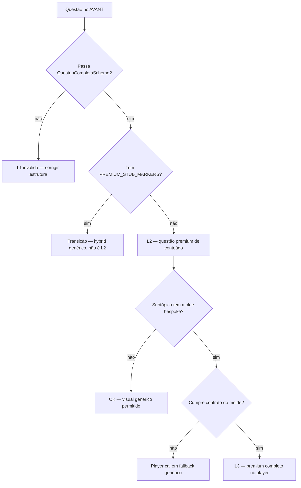

# O que é uma questão premium no AVANT

**Definição canônica** — leitura estimada: **~5 minutos**.

Use este arquivo quando alguém perguntar “o que é premium?”. Ele **define e aponta**; não repete checklists de rollout nem receitas pedagógicas completas.

> **Em uma frase:** questão de concurso cujo estudo reverso ensina *esta* prova com conteúdo específico (sem placeholders genéricos), em 4 NeuroSlides válidos; quando o subtópico tem moldes bespoke, o JSON também entrega o contrato visual para o player não cair em layout genérico.

**Se o doc e o código divergirem, o código ganha** — os gates abaixo são a fonte executável.

---

## Três níveis (não confundir)

| Nível | Nome | O que significa | Critério objetivo |
|:-----:|------|-----------------|-------------------|
| **L1** | Estrutural | Toda questão AVANT válida | `QuestaoCompletaSchema` + 4 slides planos |
| **L2** | Conteúdo premium | Estudo reverso específico da questão | L1 + **zero** `PREMIUM_STUB_MARKERS` |
| **L3** | Experiência premium | Visual bespoke do subtópico no player | L2 + contrato do molde (`premiumGate`) |

**No dia a dia**, “questão premium” = **L2 no mínimo**.

**“Pacote premium fechado”** = 100% slugs handcraft golden-v1 — ver [`DECISAO_TRILHO_A_UNICO.md`](DECISAO_TRILHO_A_UNICO.md) e [`handcraft-registry.json`](../data/catalog-migration/handcraft-registry.json).

```text
L1  Estrutural     →  toda questão AVANT
L2  Conteúdo       →  premium de verdade (sem stub)
L3  Experiência    →  moldes bespoke + contrato de dados
     └── Rollout    →  Fases 0–6 do checklist (escala por subtópico)
```

---

## Diagrama de decisão



---

## L1 — Estrutural (obrigatório para todas)

| Requisito | Detalhe |
|-----------|---------|
| 4 slides | `concept_map`, `golden_rule`, `logic_flow`, `danger_zone` |
| Formato plano | `items` / `rows` / `steps` / `content` no mesmo nível que `type` — **não** aninhar |
| `meta.subtopico` | Nome canônico (CLAUDE.md §9) — controla design automático |
| Validação | `QuestaoCompletaSchema` + `LIMITS` |
| Proibições | TecConcursos; ícones só Lucide válidos |
| Slides | `logic_flow.steps` = array de strings; `danger_zone` com `content`; `golden_rule` com `content` ou `rows` |
| Layout | **Não** enviar `template` nem `layout_variant` salvo override intencional |

**Gate:** [`lib/validations.ts`](../lib/validations.ts) · [`lib/questaoSpec/validateQuestaoForWrite.ts`](../lib/questaoSpec/validateQuestaoForWrite.ts)

---

## L2 — Conteúdo premium

Além de L1:

| Requisito | Detalhe |
|-----------|---------|
| Sem stub | Zero marcadores em `PREMIUM_STUB_MARKERS` (`[IA]`, “conceito central”, “relacione o tema”, etc.) |
| Específico | Texto da **esta** questão — não copiável entre questões do mesmo subtópico |
| Pedagogia | `concept_map` mapeia o que a banca cobra; `logic_flow` ensina a chegar na letra; `danger_zone` explica distractors reais |
| Interação nova | `logic_flow` com `reveal_mode: "tap"` (conteúdo novo) |
| Golden recomendado | `meta.content_standard: "golden-v1"`, `family`, `sources`, `content_review` — ver [`GOLDEN_CONTENT_STANDARD.md`](GOLDEN_CONTENT_STANDARD.md) |

O **hybrid genérico** e conteúdo via **builder legado** não contam como L2 golden-v1 — re-handcraft pendente. Ver [`DECISAO_TRILHO_A_UNICO.md`](DECISAO_TRILHO_A_UNICO.md).

**Alinhamento enunciado ↔ slides (L2 semântico):** além de zero stub, o estudo reverso deve usar vocabulário e gabarito **desta** prova — não de outro tema do subtópico (ex.: “bundle CVC” numa questão EXCETO). O gate estrutural (`premiumGate`) não cobre isso; use cluster report + gate semântico + amostra no player — ver [`PACOTE_PREMIUM_CHECKLIST.md`](PACOTE_PREMIUM_CHECKLIST.md) § Qualidade por ramos.

**Gates:**
- [`lib/catalogMigration/upgradePremiumHybrid.ts`](../lib/catalogMigration/upgradePremiumHybrid.ts) — `hasPremiumStubMarkers` / `PREMIUM_STUB_MARKERS`
- [`__tests__/premium-no-stub.test.ts`](../__tests__/premium-no-stub.test.ts)
- Goldens em `examples/questao-premium-*.json` **devem** passar

**Receitas por família (V/F, legis, protocolo…):** [`PLAYBOOK_ESTUDO_REVERSO_PREMIUM.md`](PLAYBOOK_ESTUDO_REVERSO_PREMIUM.md)

---

## L3 — Experiência premium (moldes bespoke)

Quando `isPremiumSubtopico(meta.subtopico)` é verdadeiro — subtópico com ao menos um `layout_variant` bespoke no `SUBTOPIC_DESIGN_MAP` — o JSON deve entregar o **contrato de dados** do molde. Sem isso, o player usa fallback genérico.

| Slide (se molde bespoke) | Contrato mínimo |
|--------------------------|-----------------|
| `concept_map` | ≥3 `items` com `label`, `detail`, `icon` |
| `golden_rule` | `rows[]` com `label` + `value` (quando o molde exige tabela) |
| `logic_flow` | ≥3 `steps` + `reveal_mode: "tap"` (warn se ausente) |
| `danger_zone` | `items[]` com `label`, `detail`, **`correct`** |

**Gates:**
- [`lib/catalogMigration/premiumGate.ts`](../lib/catalogMigration/premiumGate.ts) — `auditPremiumQuestao`, `premiumGateErrors`
- Chokepoint de escrita: `applyLoteToSupabase` com `premiumGate: true`
- Presença de molde: [`__tests__/slidePresentationSubtopicMold.test.ts`](../__tests__/slidePresentationSubtopicMold.test.ts)

**Wiring visual:** [`VARIANT_MOLDS.md`](VARIANT_MOLDS.md) · [`MOLD_AFFINITY_RESOLVER.md`](MOLD_AFFINITY_RESOLVER.md) · [`AGENT_AVANT_TEMPLATES_E_LAYOUT.md`](AGENT_AVANT_TEMPLATES_E_LAYOUT.md)

### L2.5 — Ramo pedagógico (afinidade de molde)

O subtópico canônico (`meta.subtopico`) é **bucket**; o **ramo** define qual pacote L3 o player aplica. Sem ramo explícito, o resolver infere a partir do enunciado + slides.

| Campo | Uso |
|-------|-----|
| `meta.pedagogical_branch` | Opcional — força ramo (`adolescente_etica_sigilo`, `adolescente_desenvolvimento`, …) |
| Inferência automática | `lib/slides/pedagogicalBranch.ts` — padrões no corpus da questão |
| Afinidade + slots | `moldAffinity` + `moldSlotFit` — rejeita molde sem fit semântico ou com 0 slots |
| Fallback runtime | `slidePresentation` — se molde bespoke não renderiza, cai em layout genérico |

**Gate na escrita:** `detectMoldL3Mismatch` em [`premiumGate.ts`](../lib/catalogMigration/premiumGate.ts) — warn em `mold_l3_zero_slots` / `mold_l3_runtime_fallback`; erro bloqueante só em zero slots quando o subtópico exige molde.

**Exemplo:** questão de puberdade em Saúde do Adolescente → ramo `adolescente_desenvolvimento` → `morphological` / `compare`, **não** cortinas de sigilo (0/0 pilares).

---

## Cartão de bolso (agentes e Laboratório)

Copiar para prompts de IA ou colar no fluxo de revisão:

```text
QUESTÃO PREMIUM (L2):
✓ 4 slides planos (concept_map, golden_rule, logic_flow, danger_zone)
✓ Conteúdo ESPECÍFICO desta prova (não copiável entre questões)
✓ Sem [IA], "conceito central", "relacione o tema"
✓ danger_zone com pegadinhas reais; golden_rule com rows quando couber
✓ logic_flow com reveal_mode: "tap" (conteúdo novo)
✓ meta.subtopico canônico; QuestaoCompletaSchema ok

SE subtópico tem molde bespoke (L3):
✓ concept_map ≥3 items com icon
✓ golden_rule com rows label+value (se molde exige)
✓ logic_flow ≥3 steps + tap
✓ danger_zone items com correct
```

---

## Para quem é cada doc

| Papel | Começar por | Depois |
|-------|-------------|--------|
| Agente / Laboratório | Este arquivo (L1 + L2) | [`avant-agent-json.mdc`](../.cursor/rules/avant-agent-json.mdc) |
| Revisor clínico | L2 + golden-v1 | [`GOLDEN_CONTENT_STANDARD.md`](GOLDEN_CONTENT_STANDARD.md) |
| Engenharia / migração | L3 + gates | [`PACOTE_PREMIUM_CHECKLIST.md`](PACOTE_PREMIUM_CHECKLIST.md) |
| Design de moldes | L3 contrato | [`VARIANT_MOLDS.md`](VARIANT_MOLDS.md) |
| Onboarding geral | Este arquivo | [`CLAUDE.md`](../CLAUDE.md) §8 |

---

## Como verificar

```bash
# Gate anti-stub (L2) + goldens em examples/
npm test -- premium-no-stub

# Builder de um pacote + hybrid
npm test -- upgradePremium

# Presença de moldes por subtópico (L3)
npm test -- slidePresentationSubtopicMold

# Auditoria do catálogo (stub + premiumGate)
npx tsx scripts/audit-premium-catalog.ts
```

Validação unificada de escrita (Zod + premiumGate + golden lint):

```typescript
import { validateQuestaoForWrite } from '@/lib/questaoSpec/validateQuestaoForWrite';

validateQuestaoForWrite(payload, { premiumGate: true, goldenLint: true });
```

---

## Rollout por subtópico (além de L2/L3)

Fechar um **pacote** no subtópico inteiro exige o fluxo completo — não confundir com “uma questão premium”:

| Fase | Entrega |
|------|---------|
| 0 | Famílias, cor, goldens planejados |
| 1 | Golden(s) em `examples/` + revisão clínica |
| 1b | Cluster report (ramos × volume × drift) |
| 2 | 4 moldes bespoke + `SUBTOPIC_DESIGN_MAP` + `NeuroSlide.tsx` |
| 3 | `upgradePremium<Pacote>.ts` (V/F + MCQ + C/E) + testes |
| 3b | Infra arena/gate + ciclo por ramo (golden + perfil + repair) |
| 4 | Piloto 3–5 slugs |
| 5 | Lotes de 50 (`export` → `upgrade --force` → `apply`) |
| 6 | `npm test` + cluster (drift ≈ 0) + audit + amostra no player |

Detalhe completo: [`PACOTE_PREMIUM_CHECKLIST.md`](PACOTE_PREMIUM_CHECKLIST.md) § **Runbook** e § **Qualidade pedagógica por ramos**.

**DoD builder:** lote com ≥90% `zodValid` e **zero** stub nos slides.

---

## Metadado opcional (rastreabilidade)

Não renderizado no player. Útil para Laboratório, review queue e auditoria:

```json
"meta": {
  "content_standard": "golden-v1",
  "premium_tier": "L2",
  "premium_review": {
    "reviewed_at": "2026-06-18",
    "reviewer": "humano",
    "stub_free": true
  }
}
```

`premium_tier` é **documentação interna** — os gates continuam sendo código + testes, não este campo.

---

## Referências cruzadas

| Arquivo | Conteúdo |
|---------|----------|
| [`PACOTE_PREMIUM_CHECKLIST.md`](PACOTE_PREMIUM_CHECKLIST.md) | **Runbook** Fases 0–6, matriz por subtópico, comandos de lote |
| [`GOLDEN_CONTENT_STANDARD.md`](GOLDEN_CONTENT_STANDARD.md) | Gramática de slots, fontes tier A/B, `golden-v1` |
| [`PLAYBOOK_ESTUDO_REVERSO_PREMIUM.md`](PLAYBOOK_ESTUDO_REVERSO_PREMIUM.md) | Famílias pedagógicas, anti-repetição |
| [`FONTE_NORMATIVA_AVANT.md`](FONTE_NORMATIVA_AVANT.md) | Prioridade golden × builder × guideline |
| [`AVANT_AGENT_SOURCES.md`](AVANT_AGENT_SOURCES.md) | Índice para agentes |
| [`examples/questao-premium-urgencias-rcp.json`](../examples/questao-premium-urgencias-rcp.json) | Golden de referência (protocolo) |
| [`examples/questao-premium-cpcon-imunizacao-intervalos-vf.json`](../examples/questao-premium-cpcon-imunizacao-intervalos-vf.json) | Golden piloto golden-v1 (imunização) |

**Implementação dos gates:** [`premiumGate.ts`](../lib/catalogMigration/premiumGate.ts) · [`upgradePremiumHybrid.ts`](../lib/catalogMigration/upgradePremiumHybrid.ts)
