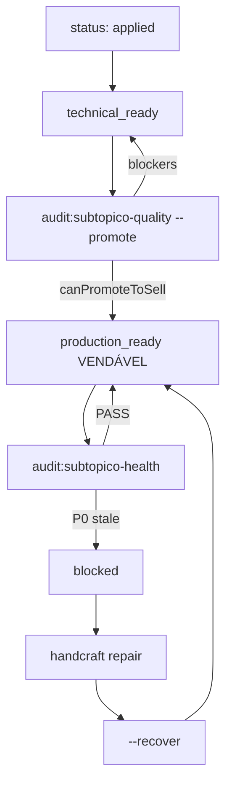

# Modelo de Camadas de Qualidade — Subtópico vendável

**North star:** subtópico **vendável** = `production_ready` no [`handcraft-registry.json`](../data/catalog-migration/handcraft-registry.json), não apenas `applied`.

Complementa:
- [`DECISAO_QUALITY_HIBRIDA.md`](DECISAO_QUALITY_HIBRIDA.md) — ADR: ship = venda; loop contínuo pós-venda
- [`GOLDEN_HANDCRAFT_MODEL.md`](GOLDEN_HANDCRAFT_MODEL.md) — runbook handcraft (produção por slug)
- [`QUALITY_VENDAVEL_CONVERSA.md`](QUALITY_VENDAVEL_CONVERSA.md) — prompt `Qualidade vendável: <subtópico>`
- [`CONTINUOUS_QUALITY_RUNBOOK.md`](CONTINUOUS_QUALITY_RUNBOOK.md) — operação diária pós-venda
- [`RUNBOOK_ERROR_REPORT_TRIAGE.md`](RUNBOOK_ERROR_REPORT_TRIAGE.md) — SLA e correção pós-publicação
- [`ANCHOR_SECOND_REVIEW_PROMPT.md`](ANCHOR_SECOND_REVIEW_PROMPT.md) — segundo par de olhos na âncora do lote

---

## 1. Contrato de status

Cada entrada em `handcraft-registry.json` → `pacotes` estende o status legado com campos de qualidade:

| Campo | Valores | Significado |
|-------|---------|-------------|
| `status` | `pending` \| `in_progress` \| `applied` | Handcraft gravado no Supabase (critério atual) |
| `production_status` | `none` \| `monitoring` \| `bootstrap_monitoring` \| `production_ready` \| `blocked` | Prontidão comercial (`bootstrap_monitoring` = alias legado → `monitoring`) |
| `quality` | objeto | Metadados de camadas, datas e SLOs |

### Schema `quality`

```json
{
  "technical_ready_at": null,
  "production_ready_at": null,
  "monitoring_until": null,
  "layers": {
    "L1": false,
    "L2": false,
    "L2b": false,
    "L3": false,
    "L4": false,
    "L5": false,
    "L6": false
  },
  "continuous": {
    "enabled": false,
    "last_audit_at": null,
    "last_audit_pass": null,
    "health_streak_days": 0,
    "last_blocked_at": null,
    "last_blocked_reason": null
  },
  "slo": {
    "open_p0": 0,
    "open_p1_max": 2,
    "report_rate_max_pct": 2.0,
    "min_sessions_30d": 100,
    "p0_block_after_hours": 24
  }
}
```

`monitoring_until`: **deprecated** — legado; não é gate de venda (ver [`DECISAO_QUALITY_HIBRIDA.md`](DECISAO_QUALITY_HIBRIDA.md)).

### Transições



| Estado | Critério |
|--------|----------|
| `applied` | 100% slugs handcraft no Supabase; `handcraft_applied === total_slugs` |
| `technical_ready` | L1 + L2 + L2b PASS (ver §2); `quality.technical_ready_at` preenchido |
| `production_ready` | L1–L6 + L5 PASS; `audit:subtopico-quality --promote` com `canPromoteToSell` OK |
| `blocked` | P0 stale > `p0_block_after_hours` (default 24h) via `audit:subtopico-health` |
| `monitoring` / `bootstrap_monitoring` | **Legado** — não bloqueia nem exige calendário pré-venda em pacotes novos |

> **Não declarar Completo/vendável** só com `status: applied`. `canSell()` exige `production_status: production_ready` e ≠ `blocked`.

---

## 2. Camadas (L1–L6)

### L1 — Gates estáticos (pré-apply)

Consolida validação estrutural e golden-v1 antes de gravar no banco.

| Gate | Comando / código |
|------|------------------|
| Zod + forma | `QuestaoCompletaSchema` |
| Golden-v1 strict | `npm run validate:goldens -- --lote=<lote> --strict` |
| Readiness A1–A3 | `npm run audit:questao-readiness` |
| DoD subtópico | `npm run audit:handcraft-dod` |
| Stub / molde | `premiumGate` em `applyLote` |
| Contrato L2 | `detectDuplicateDangerJustifications`, `detectSlideTopicDrift` |

**Pipeline obrigatório por lote:**

```bash
npm run catalog:preflight -- --lote=<lote>
npm run catalog:apply-lote -- --lote=<lote> --apply
npm run audit:handcraft-dod -- --subtopico="<nome canônico>"
```

`catalog:preflight` = `validate:goldens --strict` + `audit:questao-readiness` no lote (exit 1 se error).

### L2 — Alignment semântico

Verifica que slides **ensinam esta questão**, não um molde genérico.

| Código | Regra resumida |
|--------|----------------|
| `align_gabarito_letter` | Gabarito nos slides ↔ alternativa correta |
| `align_logic_not_recycle` | `logic_flow` não reciclado entre slugs |
| `align_instruction_terms` | ≥30% termos do enunciado (≥5 chars) nos slides |
| `align_correct_option_ref` | Substring significativa da opção correta em concept_map/golden_rule |
| `align_danger_distractors` | `danger_zone` semântico; `correct` únicos |
| `align_branch_declared` | `meta.pedagogical_branch` coerente com inferência |

Comando: `npm run audit:slug-alignment -- --lote=<lote> --strict`  
Artefato: `artifacts/slug-alignment-audit.json`

Regras por `meta.family`: `lib/catalogMigration/slugAlignmentByFamily.ts`.

### L2b — Factcheck numérico

Claims numéricos (doses, SAL, intervalos, %) confrontados com guidelines do subtópico.

Comando: `npm run audit:numeric-factcheck`  
Artefato: `artifacts/numeric-factcheck-audit.json`

Política `exam_vs_current`: se documentado em `content_review`, mismatch vira **warn** (slides ensinam gabarito da prova).

### L3 — Regressão visual por molde

Snapshots Playwright dos 4 slides por `pedagogical_branch` (desktop + mobile).

- Mapa: `data/catalog-migration/visual-anchors.json`
- Rota dev: `/dev/slide-mold-review`
- Spec: `e2e/visual-mold-regression.spec.ts`
- CI: nightly; PR gate se tocar `components/slides/**`

### L4 — Capture cirúrgico por slug

PNG do fluxo completo: enunciado → feedback → 4 slides.

- Rota dev: `/dev/questao-review?slug=&source=local|supabase`
- Comando: `npm run capture:questao-review -- --slug=<slug>`
- Saída: `artifacts/questao-review/<slug>/*.png`

Gatilho pós-apply: `anchor_slug` do `lote-meta.json`.

#### Galeria visual leve por ramo (espelho das âncoras)

Indexa no playbook o mesmo capture como **âncora visual operacional** (não posters externos):

| Campo | Onde |
|-------|------|
| `pedagogical_branches[].visual_gallery` | Playbook (`status`, `anchor_slug`, `layouts`, `captures_dir`) |
| Índice humano | `l3_visual_gallery_index` no playbook (ex. `artifacts/l3-visual-gallery-lingua-portuguesa-index.md`) |
| Skill | `avant-neuroslides-visual` |

Fluxo: JSON âncora `[READY]` → `capture:questao-review` → `status: pilot` → React bespoke → re-capture → `ready`.  
Piloto: `pt_crase` em `handcraft-playbooks/lingua-portuguesa.json`.

### L5 — Reporte + saúde de conteúdo

Métricas de `error_reports` + `historico_questoes` por subtópico/slug.

Comando: `npm run audit:content-health`  
Integração: [`RUNBOOK_ERROR_REPORT_TRIAGE.md`](RUNBOOK_ERROR_REPORT_TRIAGE.md)

**SLOs padrão** (`quality.slo`):

| Métrica | Limite |
|---------|--------|
| `open_p0` | 0 |
| `open_p1_max` | ≤ 2 |
| `report_rate_max_pct` | < 2,0% (abertos / sessões 30d × 100) |
| `min_sessions_30d` | 100 (warming: taxa 2% não bloqueia ship se sessions < 100) |
| `p0_block_after_hours` | 24 (continuous: P0 stale → `blocked`) |

### L6 — Segundo par de olhos na âncora

Por lote `g*`, revisão do `anchor_slug` antes de promover o pacote.

- Checklist: [`ANCHOR_SECOND_REVIEW_PROMPT.md`](ANCHOR_SECOND_REVIEW_PROMPT.md)
- Campo em `lote-meta.json`: `anchor_second_review`
- Comando: `npm run audit:anchor-review -- --lote=<lote>`
- Artefato: `artifacts/anchor-review/<lote>.json`

Gate: nenhum lote do pacote sem `anchor_second_review.status === "pass"`.

---

## 3. Comando unificado (ship gate)

```bash
# Audit only
npm run audit:subtopico-quality -- --subtopico="Enfermagem em Central de Material e Esterilização (CME)"

# Ship — 1ª promoção = VENDÁVEL (sem bootstrap 14d/100 sessões)
npm run audit:subtopico-quality -- --subtopico="..." --promote
```

Ordem interna:
1. `audit:handcraft-dod` (L1)
2. `audit:slug-alignment --strict` (L2)
3. `audit:numeric-factcheck` (L2b)
4. `anchor_second_review` em todos os lotes (L6)
5. L3 — `artifacts/visual-mold-regression/summary.json`
6. `audit:content-health` (L5)
7. `canPromoteToSell()` → `production_ready` se `--promote` e gates OK

Artefato: `artifacts/subtopico-quality/<pacote>.json` (inclui `can_sell`, `ship_gate`, `continuous_eligible`).

Lógica: [`lib/catalogMigration/shipGate.ts`](../lib/catalogMigration/shipGate.ts).

---

## 4. Critério final vendável

Subtópico **vendável** quando `audit:subtopico-quality --promote` com `canPromoteToSell` OK:

- [ ] `technical_ready: true` (L1–L2b)
- [ ] `anchor_reviews: all_pass` (L6)
- [ ] `visual_molds: pass` (L3, branches do pacote)
- [ ] `content_health: pass` (L5 — P0=0, P1≤2, taxa < 2% ou warming)
- [ ] **Sem** espera de 14d/100 sessões pré-venda

Atualizar registry: `production_status: "production_ready"`, `quality.production_ready_at`, `quality.layers.*` = `true`, `quality.continuous.enabled: true`.

Prompt de conversa: [`QUALITY_VENDAVEL_CONVERSA.md`](QUALITY_VENDAVEL_CONVERSA.md).

---

## 5. Rollout

| Fase | Escopo |
|------|--------|
| Piloto | CME + Processamento (retro L1–L6) |
| Onda 2 | Demais 8 subtópicos `applied` no registry |
| Novos | Pipeline completo desde o primeiro `g01` |

Ao fim de cada conversa handcraft, reportar **`technical_ready`** vs **`production_ready`** — não confundir os dois.

---

## 6. Riscos e mitigações

| Risco | Mitigação |
|-------|-----------|
| Alignment com falsos positivos | Calibrar em piloto; `--strict` só após calibração |
| Factcheck sem entry na guideline | `audit:guideline-coverage` + expandir `lib/guidelines/*.ts` |
| Capture flaky | `reducedMotion`, dismiss microtips, rotas `/dev/*` estáveis |
| Pouco tráfego pós-venda | Continuous usa warming (taxa 2% não bloqueia); streak incrementa em PASS |
| Scope creep | Retro em massa só após comando unificado PASS nos pilotos |

---

## 7. Monitoramento contínuo (pós-venda)

Após `production_ready`, a confiança comercial é mantida pelo loop contínuo — **não** por segundo `--promote`.

### Comando

```bash
npm run audit:subtopico-health -- --subtopico="<nome canônico>"
npm run audit:subtopico-health -- --all-production-ready
npm run audit:subtopico-health -- --subtopico="..." --recover
```

### Ship vs continuous (L5)

| Contexto | P0 aberto | Efeito |
|----------|-----------|--------|
| Ship (`--promote`) | qualquer | bloqueia promoção |
| Continuous (health) | recente (< 24h) | alerta |
| Continuous (health) | stale (> `p0_block_after_hours`) | `production_status: blocked` |

### Campos `quality.continuous`

| Campo | Uso |
|-------|-----|
| `health_streak_days` | dias consecutivos com health PASS |
| `last_audit_pass` | resultado do último audit |
| `last_blocked_*` | motivo e data do último block |

Runbook: [`CONTINUOUS_QUALITY_RUNBOOK.md`](CONTINUOUS_QUALITY_RUNBOOK.md) · Código: [`lib/catalogMigration/continuousQuality.ts`](../lib/catalogMigration/continuousQuality.ts).

> **Fase 3:** vitrine e entitlements filtrados por `canSell()` — [`lib/catalogMigration/vitrineQualityGate.ts`](../lib/catalogMigration/vitrineQualityGate.ts). Desligar: `QUALITY_VITRINE_GATE=false`.
