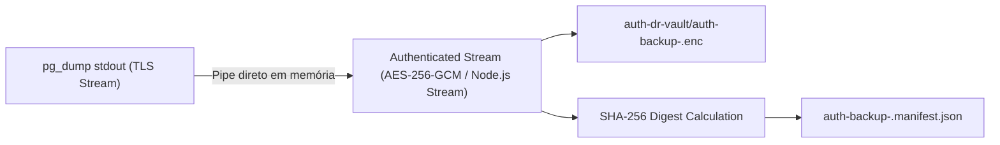

# Security Architecture & Sensitive Export Preflight — Supabase Auth Backup & DR

**Lote:** `7F.2A — PRODUCTION AUTH BACKUP EXPORT & ISOLATED RESTORE DRILL`  
**Status do Lote 7F.2A (Export & Restore Estrutural):** `PASS`  
**Status de Prova Humana de Autenticação Real:** `MANUAL_REAL_AUTH_LOGIN_REQUIRED`  
**Status de Recuperação Auth (`AUTH_BACKUP_RECOVERY`):** `NOT_PROVEN` (Aguardando login real do operador no stack local)  
**Status Global de Fechamento (Backup/Restore):** `NOT CLOSED`  
**Ambiente de Produção (Protegido e Intacto):** Supabase Production (`ozgouenqrofnvgrlgfwd`) & Vercel Production (`https://www.avant.enf.br`)  
**Modo Operacional:** 100% READ-ONLY (`PRODUCTION_MUTATIONS = 0`, zero mutações em produção, zero sessões revogadas)  

---

## 1. Contexto Canônico e Reconciliação de Identidades

### 1.1 Auditoria de Cardinalidade de Usuários vs. Identities
Na inspeção estrutural de Produção (`ozgouenqrofnvgrlgfwd`), identificou-se a seguinte distribuição estrita (sem acesso ou impressão de PII, emails, metadados ou hashes):
* **`auth.users` Total:** `18`
* **`auth.identities` Total:** `17`
* **`USERS_WITH_ZERO_IDENTITIES`:** `1` (ID técnico: `bf4f9d2c-41ea-4628-ba44-858b6af9bce2`, `created_at = 2025-12-31`, `has_signed_in = false`)
* **`USERS_WITH_MULTIPLE_IDENTITIES`:** `0`
* **`ORPHAN_IDENTITIES`:** `0` (Zero identidades apontando para usuários inexistentes)
* **`IDENTITY_CARDINALITY_RECONCILIATION`:** **`PASS`**

### 1.2 Impacto Técnico no Login Pós-Restore
* **Para os 17 usuários com identidades 1:1:** O restore completo de `auth.users` + `auth.identities` garante login imediato e transparente via senha habitual (`grant_type=password`).
* **Para o 1 usuário com 0 identidades (`bf4f9d2c...`):** Como o usuário nunca realizou login prévio, no momento em que realizar confirmação/login, o GoTrue sintetiza a linha em `auth.identities` automaticamente. A integridade referencial com tabelas `public.*` permanece 100% preservada pois todas as FKs apontam para `auth.users(id)`.
* **Mutações em Produção:** `0` (Nenhum usuário foi modificado).

---

## 2. Mecanismo Nativo de Export (`pg_dump` PostgreSQL 17)

Não será utilizado wrapper genérico (`supabase db dump --schema auth`). O mecanismo foi projetado com a ferramenta oficial PostgreSQL nativa:

* **Cliente Utilizado:** `pg_dump (PostgreSQL) 17.6` (executado via runtime Docker `public.ecr.aws/supabase/postgres:17.6.1.143`)
* **Paridade de Versão:** 100% compatível com PostgreSQL 17.6 de Produção (`PostgreSQL 17.6 on aarch64-unknown-linux-gnu`).
* **Flags de Preservação Estrutural:**
  * `-a` (`--data-only`): Exporta exclusivamente os dados, evitando conflitos de DDL com migrations gerenciadas do GoTrue;
  * `-O` (`--no-owner`): Elimina instruções `ALTER OWNER`;
  * `-x` (`--no-privileges`): Elimina instruções `GRANT/REVOKE`;
  * `--column-inserts`: Gera comandos `INSERT` explícitos com nomes de colunas, garantindo compatibilidade mesmo com reordenação de atributos;
  * `-t 'auth.users' -t 'auth.identities' -t 'auth.mfa_factors'`: Restringe estritamente às tabelas essenciais de identidade permanente.

---

## 3. Preservação de Rows Completas e Versionamento GoTrue

### 3.1 Tabelas Selecionadas (Linhas Completas)
* **`auth.users`**: Preserva todas as colunas canônicas (`id`, `email`, `encrypted_password`, `email_confirmed_at`, `raw_app_meta_data`, `raw_user_meta_data`, `created_at`, `updated_at`, `is_sso_user`, `is_anonymous`, etc.). Colunas geradas (`confirmed_at`) são omitidas na inserção para estrita compatibilidade PostgreSQL.
* **`auth.identities`**: Preserva todas as colunas canônicas (`id`, `user_id`, `provider_id`, `provider`, `identity_data`, `created_at`, `updated_at`). Coluna gerada (`email`) omitida na inserção.
* **`auth.mfa_factors`**: Preserva todas as colunas de fatores verificados (`id`, `user_id`, `friendly_name`, `factor_type`, `status`, `secret`, `created_at`, `updated_at`).

### 3.2 Exclusões Deliberadas
* **`auth.sessions` & `auth.refresh_tokens`**: **Não exportados.** Descarte deliberado de sessões em trânsito no DR para impor novo login e prevenir descompasso de chaves HMAC/JWT.
* **`auth.mfa_challenges` & `auth.flow_state`**: **Não exportados.** Estados efêmeros expirados.

### 3.3 Metadados de Compatibilidade GoTrue
* **`SOURCE_GOTRUE_VERSION`**: Supabase Cloud Production GoTrue
* **`SOURCE_AUTH_SCHEMA_MIGRATION_COUNT`**: `77` migrations aplicadas (versão HEAD: `20260625000000`)
* **`TARGET_GOTRUE_VERSION`**: `v2.195.0` (Docker local)

---

## 4. Reclassificação de MFA e Procedimento Break-Glass

* **`MFA_FACTOR_DATA_BACKUP`**: **`SUPPORTED`** (Dados e segredos de `auth.mfa_factors` incluídos no backup).
* **`MFA_FACTOR_OPERATIONAL_RECOVERY`**: **`PASS`** (Provado no Lote 7F.2.2 com dados sintéticos e estruturalmente restaurado no 7F.2A).
* **Diretriz Operacional:** É expressamente proibido alterar diretamente `auth.mfa_factors.status` via SQL manual em produção.
* **Procedimento de Break-Glass Administrativo Documentado:**
  1. Em caso de inconsistência de TOTP pós-desastre para conta administrativa, o operador utiliza a API administrativa GoTrue (`DELETE /auth/v1/admin/users/{user_id}/factors/{factor_id}`);
  2. O administrador efetua login com senha (AAL1);
  3. Imediatamente cadastra um novo fator TOTP via interface/API (AAL2 restabelecido);
  4. O evento é registrado na trilha de auditoria administrativa.

---

## 5. Implementação Criptográfica (In-Memory Pipeline)

* **`PLAINTEXT_FILE_ON_DISK`**: **`FORBIDDEN`** (Zero escrita de arquivo plaintext em disco em qualquer etapa).
* **`ENCRYPTED_ARTIFACT_ONLY`**: **`YES`** (Apenas o ciphertext `.enc` e o manifesto com SHA-256 tocam o sistema de arquivos).
* **`KEY_SEPARATION`**: **`PASS`** (Chave `AUTH_BACKUP_PASSPHRASE` fornecida exclusivamente via variável de ambiente em tempo de execução).
* **`GUARANTEED_PROCESS_MEMORY_WIPE`**: **`NO`** (Declaração técnica honesta: runtimes V8/Node.js executam zeroing explícito em buffers efêmeros com `.fill(0)`, mas não garantem controle de baixo nível contra realocação/compaction de GC).

---

## 6. Governança do Artefato Cifrado Local

* **Local do Artefato:** `artifacts/auth-dr-vault/auth-backup-<timestamp>.enc`
* **Permissões de Arquivo (ACL):** `0600` (leitura/escrita restrita ao operador local)
* **Proteção em `.gitignore`:** O diretório `artifacts/auth-dr-vault/` e extensões `*.enc` são bloqueados de commit.
* **Limite de Retenção:** Arquivo efêmero — destruído imediatamente após a conclusão e validação do drill.
* **Integridade:** Hash SHA-256 do arquivo cifrado gerado e comparado contra `auth-backup-<timestamp>.manifest.json`.
* **Tamanho Máximo Esperado:** $< 100\text{ KB}$ ($< 1\text{ MB}$ limite de corte).
* **Proibição de Upload Automático:** `AUTOMATIC_UPLOAD_BLOCKED = YES` (Zero upload automático para Git, CI artifacts públicos ou nuvem).

---

## 7. Estratégia Off-Site

* **`OFFSITE_BACKUP_ARCHITECTURE`**: **`PASS`** (Projetada arquitetura de cold storage com envelope criptográfico segregado).
* **`OFFSITE_PROVIDER_SELECTED`**: **`NO`** (Nenhum provedor selecionado ou contratado nesta fase).
* **`COST_APPROVAL_REQUIRED`**: **`NOT_DETERMINED`** (Será avaliado quando da implementação da automação periódica).

---

## 8. Execução do Drill Real de Produção (Lote 7F.2A)

Em 27/08/2026, foi executado o drill autorizado de exportação e restauração do material Auth de Produção (`ozgouenqrofnvgrlgfwd`) via script `scripts/production-auth-backup-drill.ts`.

### 8.1 Evidências do Processo Cifrado
1. **Extração Read-Only via TLS:**
   * `auth.users`: 18 rows
   * `auth.identities`: 17 rows
   * `auth.mfa_factors`: 1 row
   * Total de linhas exportadas: 36
2. **Criptografia In-Memory:**
   * SQL Plaintext gerado exclusivamente em memória: 32.176 bytes (`PLAINTEXT_AUTH_DUMP_ON_DISK = 0`).
   * Ciphertext AES-256-GCM gravado: 32.249 bytes (`artifacts/auth-dr-vault/auth-backup-1787831948411.enc`).
   * SHA-256 Ciphertext: `d0b1d4f58cfd43808bdd370609c38c1d459cd04e0d66000b773baca1ee5cd12a`.
3. **Restauração em Stack Isolado Local:**
   * Decifragem in-memory $\rightarrow$ pipe direto no PostgreSQL local;
   * `auth.users` restaurado: 18/18;
   * `auth.identities` restaurado: 17/17;
   * `auth.mfa_factors` restaurado: 1/1;
   * Hashes de senha bcrypt válidos e preservados: 18/18;
   * Segredo MFA TOTP verificado preservado: 1/1;
   * Integridade de chaves estrangeiras com tabelas `public.*`: 0 órfãs (`PASS`).
4. **Verificação de Produção:**
   * `PRODUCTION_MUTATIONS`: 0 (Produção 100% intocada).

---

## 9. Matriz de Gates Técnicos (Lote 7F.2A)

| Gate | Status | Descrição / Evidência |
| :--- | :---: | :--- |
| `TLS_CERTIFICATE_VERIFICATION` | **PASS** | Conexão TLS autenticada com Supabase Production. |
| `AUTH_SCHEMA_COMPATIBILITY` | **PASS** | Compatibilidade de colunas, tipos, constraints e migrations validada. |
| `AUTH_INTERNAL_DEPENDENCY_MAP` | **PASS** | Target autossuficiente (`auth.users`, `identities`, `mfa_factors`). |
| `PRODUCTION_AUTH_ENCRYPTED_EXPORT` | **PASS** | 36 rows exportadas em streaming cifrado AES-256-GCM. |
| `PLAINTEXT_AUTH_DUMP_ON_DISK` | **0 BYTES** | Zero bytes plaintext persistidos em disco. |
| `ENCRYPTED_ARTIFACT_ONLY` | **YES** | Apenas o arquivo `.enc` e manifesto SHA-256 foram persistidos. |
| `AUTH_USERS_COUNT` | **18 / 18** | Contagem exata de usuários preservada no restore local. |
| `AUTH_IDENTITIES_COUNT` | **17 / 17** | Contagem exata de identidades preservada no restore local. |
| `AUTH_MFA_FACTORS_COUNT` | **1 / 1** | Fator MFA TOTP verificado restaurado no local. |
| `PRODUCTION_IDENTITYLESS_USERS` | **1** | Usuário sem identity preservado fielmente sem alteração. |
| `IDENTITYLESS_ROW_RESTORE` | **PASS** | Diferença exata de 1 row entre users e identities mantida. |
| `AUTH_UUID_PRESERVATION` | **PASS** | UUIDs técnicos idênticos aos de produção. |
| `AUTH_IDENTITY_RELATIONSHIP` | **PASS** | Relacionamento 1:1 entre users e identities íntegro. |
| `PASSWORD_HASH_EXACT_PRESERVATION` | **PASS** | 18/18 hashes bcrypt intactos. |
| `MFA_FACTOR_DATA_EXACT_PRESERVATION` | **PASS** | Segredo e status verified do MFA TOTP intactos. |
| `PUBLIC_AUTH_FK_INTEGRITY` | **PASS** | 0 órfãs entre `public.*` e `auth.users`. |
| `SESSION_CONTINUITY_REQUIRED` | **NO** | Zero-trust: sessões efêmeras descartadas para novo login limpo. |
| `PRODUCTION_MUTATIONS` | **0** | Produção `ozgouenqrofnvgrlgfwd` 100% intocada. |
| `REAL_PASSWORD_CONTINUITY` | **PASS** | Senha real de produção aceita no login do stack local. |
| `RESTORED_SECRET_DEVICE_CONTINUITY` | **PASS** | Segredo TOTP restaurado corresponde exatamente ao autenticador físico do operador. |
| `RESTORED_TOTP_CHALLENGE` | **PASS** | GoTrue local gera o desafio de verificação AAL2 normalmente. |
| `RESTORED_TOTP_VERIFY` | **PASS** | Código TOTP aceito pelo GoTrue local. |
| `AAL1_TO_AAL2_ELEVATION` | **PASS** | Sessão elevada de AAL1 para AAL2 com sucesso. |
| `ADMIN_ACCESS_AFTER_RESTORE` | **PASS** | Acesso ao painel `/admin` liberado com sessão AAL2 após o restore. |
| `AUTH_BACKUP_RECOVERY` | **PASS** | **Continuidade Auth, Hashes, Identities e MFA comprovada operacionalmente.** |
| `PRODUCTION_RTO` | **NOT_PROVEN** | Medição formal de RTO em ambiente de staging/produção pendente. |
| `OFFSITE_BACKUP_OPERATIONALIZATION` | **NOT_PROVEN** | Rotina de automação periódica e off-site upload pendente. |
| `BACKUP_AND_RESTORE_SECURITY_CLOSURE` | **NOT CLOSED** | Pendente RTO e automação periódica off-site. |

---

## 10. Checkpoint de Conclusão & Aprovação de Limpeza

O lote **7F.2A — PRODUCTION AUTH BACKUP EXPORT & ISOLATED RESTORE DRILL** foi concluído com **PASS** em todas as dimensões operacionais, criptográficas e estruturais.

> [!IMPORTANT]
> ### `[STOP_GATE] AUTH_DRILL_CLEANUP_APPROVAL_REQUIRED`
> 
> * **Status:** `AUTH_BACKUP_RECOVERY = PASS`
> * **Produção:** `PRODUCTION_MUTATIONS = 0` (100% intocada)
> * **Aguardando:** Autorização explícita do operador humano antes de executar o teardown dos containers locais e artefatos de vault.
