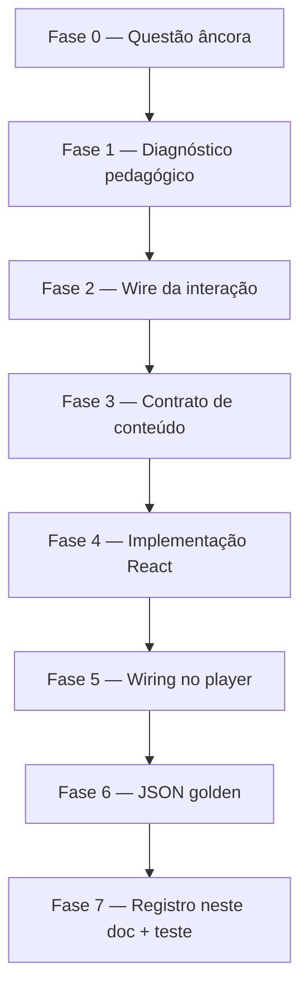

# Moldes premium de NeuroSlides — lógica de construção

Leitura estimada: **~15 minutos**. Guia para criar uma **variante inédita** com alto padrão visual, interatividade e conteúdo específico de concurso — e deixá-la como **modelo replicável** (código + JSON golden + contrato para o agente).

**Público:** devs, agentes de conteúdo, revisores.

**Complementa:** [`PLAYBOOK_ESTUDO_REVERSO_PREMIUM.md`](PLAYBOOK_ESTUDO_REVERSO_PREMIUM.md) (pedagogia), [`AGENT_AVANT_TEMPLATES_E_LAYOUT.md`](AGENT_AVANT_TEMPLATES_E_LAYOUT.md) (layouts genéricos).

---

## 1. Princípio central

Um molde premium não é “mais bonito que `grid`”. É uma **metáfora interativa** alinhada a **como a banca cobra o tema**:

| Camada | Pergunta |
|--------|----------|
| **Pedagógica** | O que o aluno precisa *ver* e *fazer* para não errar questões parecidas? |
| **Visual** | Qual estrutura espacial fixa isso (trilho, órbita, matriz, timeline)? |
| **Conteúdo** | Que texto no JSON alimenta cada slot da UI? |
| **Engenharia** | Como o player resolve o molde sem `layout_variant` no JSON? |

**Ordem de trabalho:** pedagogia → wire mental → componente → mapa subtópico → questão golden → contrato de conteúdo.

---

## 1b. Moldes arena / compare — regras de engenharia

Variantes interativas (`*-arena`, `*-trap-chips`, compare com toque) **só renderizam dados do JSON** — não reinterpretam o golden de referência do pacote.

| Proibido no componente React | Obrigatório |
|------------------------------|-------------|
| Gabarito default (`?? 'B'`) | Letra do gabarito via `items[].correct` no formato `Gabarito letra X — …` |
| `trapHint` fixo por letra (A/C/D do golden piloto) | `item.detail` / `item.correct` / `footer_rule` da questão |
| Texto pedagógico fixo (“bundle de prevenção…”) | Conteúdo vindo do builder ou golden |

Contrato canônico de `danger_zone.items[].correct`: `Gabarito letra {id} — {explicação}` (`lib/catalogMigration/slideContract.ts`).

Code review antes de escalar migração: buscar no variant `?? '`, `if (letter === '` e strings que citam **um** caso de prova específico.

Processo de rollout por ramos: [`PACOTE_PREMIUM_CHECKLIST.md`](PACOTE_PREMIUM_CHECKLIST.md) § Qualidade pedagógica por ramos.

---

## 2. Quando criar molde bespoke (vs. layout genérico)

| Use layout genérico | Crie molde bespoke |
|---------------------|-------------------|
| Tema aparece 1–2 vezes no catálogo | Subtópico recorrente + padrão de prova repetível |
| `compare` + `tap` + `rows` já comunicam | Erro típico é **espacial** (escopo legal, via errada, calendário vacinal, matriz de responsabilidade) |
| Família `conceito` sem estrutura fixa | Aluno ganha ao **manipular** slots (tocar via, montar Art. 4º, revelar norma) |

**Regra prática:** se você consegue explicar a pegadinha com duas colunas texto × texto, `danger_zone` + `compare` basta. Se a pegadinha é “falta bloco X no Art. 4º” ou “letra A = perfil IV”, vale molde com **trilho visual**.

---

## 3. Pipeline em 7 fases

> **Rollout do pacote inteiro:** Fases **0–6** em [`PACOTE_PREMIUM_CHECKLIST.md`](PACOTE_PREMIUM_CHECKLIST.md) § Runbook. As fases abaixo são **só** para criar um molde (dentro da Fase 2 do runbook).



### Fase 0 — Questão âncora

Escolha **uma prova real** que será o modelo (não invente enunciado genérico).

- `meta` completo (banca, ano, `cargo_header` TEC quando couber)
- `question_data` espelho do caderno — **sem cola** no enunciado
- Gabarito e distractors reais (A–E)

**Exemplos no repo:** `examples/questao-premium-vunesp-via-subcutanea.json`, `questao-premium-sus-lei-8080-cesgranrio.json`.

### Fase 1 — Diagnóstico pedagógico

1. Classifique a **família** ([`PLAYBOOK` §3](PLAYBOOK_ESTUDO_REVERSO_PREMIUM.md)): `legis`, `protocolo`, `calc`, `vf`, `certo_errado`, `conceito`, `text_fragment`.
2. Defina o **subtópico canônico** (41 nomes em `CLAUDE.md` §9).
3. Liste em uma frase o **erro reproduzível** que o molde deve tornar óbvio.

### Fase 2 — Wire da interação

Documente em 3–5 bullets (antes de codar):

- **Gesto do aluno:** tocar, revelar passo, comparar lado a lado, montar blocos?
- **Estado inicial vs. final:** o que está oculto até interagir?
- **Par conceito + perigo:** qual `danger_zone` combina? (ex.: `absorption-speed-rail` + `route-trap`)
- **Mobile:** alvos ≥ 44px; `prefers-reduced-motion` revela tudo de uma vez?

### Fase 3 — Contrato de conteúdo

Decida como o JSON alimenta a UI:

| Estratégia | Prós | Contras |
|------------|------|---------|
| **A — Inferência por texto** (padrão atual) | JSON plano (`label`, `detail`, `icon`); agente não aprende schema novo | Frágil se o texto não usar palavras-gatilho |
| **B — Campo estruturado** (`slot`, `lane`, `block` no item) | Agente e validação explícitos | Exige Zod + migração |

**Para modelo inédito:** comece com **A** (como `SusArt4OrbitConceptMap` e `AbsorptionSpeedRailConceptMap`); documente palavras-gatilho neste arquivo. Evolua para **B** se a inferência falhar em >10% das questões do subtópico.

**Campos JSON sempre válidos (Zod):**

- `concept_map`: `items[]` com `label`, `detail`, `icon` (Lucide)
- `golden_rule`: `content` e/ou `rows[]` (`label`, `value`; opcional `emphasis`, `badge`)
- `logic_flow`: `steps[]` strings, `reveal_mode: "tap"`
- `danger_zone`: `content`, `items[]` com `label`, `detail`, **`correct`**, opcional `bullet_style: "x_icon"`

### Fase 4 — Implementação React

| Requisito | Padrão AVANT |
|-----------|--------------|
| Arquivo | `components/slides/variants/<NomePascal>.tsx` |
| Client | `'use client'` se houver estado/toque |
| Tema | Prop `theme: ThemeColors` de `themeGenerator` |
| Ícones | `resolveLucideIcon` — não inventar nome |
| Motion | Framer Motion + `useReducedMotion()` |
| Superfície | Cards claros sobre shell cyber (`ReverseStudyShell`); legibilidade WCAG |
| Inferência | Função `infer*` isolada e testável no topo do arquivo |

**Padrão de inferência (recomendado):**

```typescript
function inferSlot(title: string, description: string): SlotId | 'shared' {
  const text = `${title} ${description}`.toLowerCase();
  if (/palavra-gatilho-do-slot/.test(text)) return 'slot-a';
  // ...
  return 'default';
}
```

### Fase 5 — Wiring no player

Checklist obrigatório (sem um item, o molde não aparece):

| # | Arquivo | Ação |
|---|---------|------|
| 1 | `components/slides/variants/<Molde>.tsx` | Componente |
| 2 | `components/slides/core/NeuroSlide.tsx` | `import` + `if (layoutVariant === 'meu-molde')` no `switch` de `concept_map`, **ou** ramo em `DangerZone.tsx` para danger |
| 3 | `components/slides/core/themeGenerator.ts` | `SUBTOPIC_DESIGN_MAP`: `conceptMap` / `dangerZone` com slug kebab-case |
| 4 | `components/slides/core/conceptMapLayout.ts` | Adicionar slug em `CONCEPT_MAP_MOLD_OVERRIDES` (concept_map) |
| 5 | `components/slides/core/dangerZoneLayout.ts` | Adicionar slug em `DANGER_ZONE_LAYOUT_OVERRIDES` + ramos em `resolveDangerZoneLayoutVariant` (danger) |
| 6 | `components/slides/core/dangerZoneRevealMode.ts` | Se danger interativo por tap |
| 7 | `components/slides/index.ts` | Export |
| 8 | `__tests__/slidePresentationSubtopicMold.test.ts` | Assert: subtópico → `layout_variant` esperado |

**Resolução em runtime:**

```
meta.subtopico → SUBTOPIC_DESIGN_MAP → fallback layout por slide
→ resolveSlidePresentation() → layoutVariant
→ NeuroSlideHub switch → componente bespoke
```

JSON **não precisa** de `layout_variant` quando o subtópico está mapeado.

### Fase 6 — JSON golden

Crie `examples/questao-premium-<banca>-<tema-curto>.json`:

- [ ] 4 slides, formato plano
- [ ] `meta.subtopico` = nome que dispara o molde
- [ ] Conteúdo **só desta questão** (checklist anti-repetição — [`PLAYBOOK` §7](PLAYBOOK_ESTUDO_REVERSO_PREMIUM.md))
- [ ] `danger_zone`: cada distractor real com `correct`
- [ ] `logic_flow`: passos citando letras A–E
- [ ] Validar: `QuestaoCompletaSchema` + preview Laboratório
- [ ] Confirmar visualmente: trilhos/rails preenchidos, taps funcionando

### Fase 7 — Registro e manutenção

1. Adicione entrada na **§5 Catálogo de moldes** (abaixo).
2. Atualize [`AVANT_AGENT_SOURCES.md`](AVANT_AGENT_SOURCES.md) se for golden de referência.
3. Opcional: linha em [`PLAYBOOK` §8](PLAYBOOK_ESTUDO_REVERSO_PREMIUM.md) tabela de exemplos.

---

## 4. Pacote visual por subtópico (`SUBTOPIC_DESIGN_MAP`)

Cada subtópico premium pode definir **4 layouts** (um por slide):

```typescript
'vias de administração': {
  template: 'emerald',
  conceptMap: 'absorption-speed-rail',
  goldenRule: 'center',      // ou reference_table automático com rows[]
  logicFlow: 'cards',
  dangerZone: 'route-trap',
},
```

**Pares que funcionam bem juntos** compartilham a mesma metáfora (trilho de vias, blocos do Art. 4º, matriz SAE).

---

## 5. Catálogo de moldes premium (atual)

### Concept map

| `layout_variant` | Subtópico(s) | Interação | Golden |
|------------------|--------------|-----------|--------|
| `absorption-speed-rail` | Vias de Administração | Trilho IV/IM/SC/VO + barras de velocidade | `questao-premium-vunesp-via-subcutanea.json` |
| `dose-equivalence-rail` | Cálculo de Administração de Medicamentos e Infusões | Trilho 20 · 60 · 3 · U-100 | `questao-premium-idecan-calculo-equivalencias-gotas.json` |
| `sus-art4-orbit` | Promoção à Saúde e Prevenção de Agravos | Órbita + montagem blocos Art. 4º | `questao-premium-sus-lei-8080-cesgranrio.json` |
| `sae-responsibility-matrix` | Processo de Enfermagem | Colunas enfermeiro × equipe × norma | (FEPese SAE) |
| `survival-chain` | Urgências e Emergências | Cadeia de sobrevivência | `questao-premium-urgencias-rcp.json` |
| `vitals-panel` | Verificação de Sinais Vitais | Painel SV | — |
| `procedure-protocol` | Instalação e Manejo de Sondas | Protocolo passo a passo | — |
| `vaccine-timeline` | Imunização | Timeline vacinal | `questao-premium-fundatec-meningococica-3meses.json` |
| `sus-legal-pillars` | (componente pronto; mapear subtópico quando houver golden) | Pilares legais SUS | — |
| `sae-documentation` | (componente pronto; mapear quando houver golden) | Documentação SAE | `questao-premium-fepese-anotacao-enfermagem-sae.json` |
| `etiology-kingdom-rail` | Doenças Bacterianas e Fúngicas | Trilho 4 reinos etiológicos | `questao-premium-ibgp-agentes-etiologicos-todas-bacterias.json` |
| `itu-closed-system-rail` | Infecções no Contexto da Biossegurança (`biosseg_iras_itu_cateter`) | Trilho bundle fechado meato → fechado → fluxo → bolsa | `questao-premium-idib-umirim-itu-cateter-exceto.json` |

### Danger zone

| `layout_variant` | Par tipico | Interação | Palavras-gatilho em `label`/`detail`/`correct` |
|------------------|------------|-----------|--------------------------------------------------|
| `route-trap` | `absorption-speed-rail` | Trilho de via errada × certa | IV, IM, SC, VO, absorção rápida/lenta, letra A–E |
| `dose-trap` | `dose-equivalence-rail` | Trilho de constante errada × certa | 20, 60, 3, U-100, 10 UI, 35 micro, letra A–E |
| `scope-trap` | `sus-art4-orbit` | Blocos Art. 4º faltando | ações e serviços, esferas, direta e indireta, fundações |
| `norm-reveal` | `sae-responsibility-matrix` | Revela norma por item | COFEN, Res., anotação, registro |
| `trap-reveal` | `survival-chain`, `vitals-panel` | Compare com revelação sequencial | ordem, proporção, parâmetro numérico |
| `calendar-mismatch` | `vaccine-timeline` | Calendário × idade errada | meses, dose, reforço, calendário |
| `itu-catheter-trap` | `itu-closed-system-rail` | Trilho bundle violado × restaurado | meato, fechado, fluxo, bolsa, pinçar, letra A–E |

Layouts genéricos (`compare`, `list`, `cards`) continuam em [`AGENT_AVANT_TEMPLATES_E_LAYOUT.md`](AGENT_AVANT_TEMPLATES_E_LAYOUT.md).

### Logic flow (slide 3)

| `layout_variant` | Subtópico(s) | Interação | Golden |
|------------------|--------------|-----------|--------|
| `itu-exceto-tap` | Infecções no Contexto da Biossegurança (`biosseg_iras_itu_cateter`) | Painel de letras + tap EXCETO | `questao-premium-idib-umirim-itu-cateter-exceto.json` |
| `etiology-elimination-tap` | Doenças Bacterianas e Fúngicas | Eliminação por reino | `questao-premium-ibgp-agentes-etiologicos-todas-bacterias.json` |

### Golden rule (slide 2)

| `layout_variant` | Subtópico(s) | Interação | Golden |
|------------------|--------------|-----------|--------|
| `soft-lens-board` | Cálculo de Administração de Medicamentos e Infusões | Painel de lentes suaves — toque em cada `row` | `questao-premium-idecan-calculo-equivalencias-gotas.json` |
| `itu-bundle-letter-board` | Infecções no Contexto da Biossegurança (`biosseg_iras_itu_cateter`) | Espectro de letras bundle ok × EXCETO | `questao-premium-idib-umirim-itu-cateter-exceto.json` |
| `etiology-letter-spectrum` | Doenças Bacterianas e Fúngicas | Espectro letras bacteriana × intruso | `questao-premium-ibgp-agentes-etiologicos-todas-bacterias.json` |
| `reference_table` | (automático com `rows` quando sem molde) | Tabela rótulo × valor | vários |
| `center` / `banner` / `minimal` / `compact` | demais subtópicos | Tipografia ou faixa | — |

---

## 6. Contratos de conteúdo (inferência por texto)

### `absorption-speed-rail` + `route-trap`

**Concept map — inclua itens que cubram:**

| Papel | Exemplo de `label` | Gatilhos no `detail` |
|-------|-------------------|----------------------|
| Via IV | Intravenosa (IV) | imediata, corrente sanguínea |
| Via IM | Intramuscular (IM) | mais rápida que SC |
| Via SC | Subcutânea (SC) | lenta e contínua, hipodérmico |
| Via VO | Oral (VO) | TGI, variável |
| Comparativo | Comparativo de vias | IV = imediata, VO = variável |
| Técnica | Técnica resumida | ângulo, prega (painel secundário) |
| Banca | Padrão VUNESP | banca, padrão |

**Danger `route-trap`:** `label` com **Letra X**; `detail` descreve perfil errado; `correct` nomeia via certa (SC lenta, etc.).

### `dose-equivalence-rail` + `dose-trap`

**Concept map — inclua itens que cubram:**

| Papel | Exemplo de `label` | Gatilhos no `detail` |
|-------|-------------------|----------------------|
| mL → gotas | 1 mL = 20 gotas | macrogota, constante padrão |
| mL → micro | 1 mL = 60 microgotas | microgota, equipo |
| gota → micro | 1 gota = 3 microgotas | conversão macrogota |
| Insulina | Insulina U-100 | 100 UI, U-100 |
| Comparativo | Trio 20-60-3 | comparativo, decore |
| Exceção | Exceções do enunciado | fogem aos padrões |
| Banca | Padrão IDECAN | banca, padrão |

**Danger `dose-trap`:** `label` com **Letra X**; cite o número errado (10 UI, 35 micro…); `correct` traz a constante certa (20, 60, 3, 100 UI/mL).

### `soft-lens-board` (golden_rule — slide 2)

**Quando:** subtópico mapeado + `rows[]` com `label`, `value`; opcional `emphasis` (`highlight` violeta suave, `success` teal, `alert` rose) e `badge`.

**Conteúdo ideal:**

- `content` curto (≤36 chars) como mnemônico central — ex.: `"20 · 60 · 3"`
- `rows` com gabarito (`emphasis: success`), constantes (`highlight`), erros por letra (`alert` ou default)
- `footer_rule` com estratégia de prova em uma linha

**Interação:** aluno toca cada lente à esquerda; painel à direita amplia valor + dica contextual inferida.

### `sus-art4-orbit` + `scope-trap`

**Concept map — blocos do Art. 4º:**

- Ações + serviços
- Três esferas (federais, estaduais, municipais)
- Administração direta e indireta
- Fundações mantidas pelo Poder Público
- Contexto: princípios CF (não confundir com composição)
- Padrão da banca

**Danger `scope-trap`:** distractor que omite bloco → trilho mostra o que falta vs. gabarito completo.

### `sae-responsibility-matrix` + `norm-reveal`

Separe itens por **responsável**: enfermeiro (diagnóstico, prescrição SAE), equipe (execução), norma/ética (COFEN, registro), padrão de prova.

---

## 7. Exemplo completo — molde inédito “trilho de vias”

**Problema de prova:** VUNESP pergunta indicação da SC; distractors descrevem IV (rápida) ou dose grande.

**Wire:** trilho horizontal IV→IM→SC→VO; toque destaca via; danger mostra qual via cada letra “pertence”.

**Implementação (já no repo):**

1. `AbsorptionSpeedRailConceptMap.tsx` — `inferConceptKind()`
2. `DangerZoneRouteTrap.tsx` — `extractRoutes()`
3. Mapa: `'vias de administração'` → `absorption-speed-rail` + `route-trap`
4. Golden: `examples/questao-premium-vunesp-via-subcutanea.json`

**O agente gera JSON sem `layout_variant`** — só `subtopico: "Vias de Administração"` e texto que segue §6.

---

## 8. Checklist de publicação do molde

### Código
- [ ] Componente com `useReducedMotion`
- [ ] Wiring NeuroSlide + allowlists layout
- [ ] Entrada `SUBTOPIC_DESIGN_MAP`
- [ ] Export `index.ts`
- [ ] Teste `slidePresentationSubtopicMold`

### Conteúdo
- [ ] Golden em `examples/`
- [ ] `QuestaoCompletaSchema.safeParse` OK
- [ ] Preview Laboratório (desktop + 375px)
- [ ] Rails/slots não vazios com texto do golden

### Agente
- [ ] Entrada neste doc §5–§6
- [ ] Link em `AVANT_AGENT_SOURCES.md`
- [ ] Anti-repetição §7 playbook passou

---

## 9. Anti-padrões

| Evitar | Por quê |
|--------|---------|
| Molde sem questão âncora | UI bonita, conteúdo genérico |
| Só componente sem `themeGenerator` | JSON correto, layout genérico |
| Esquecer `CONCEPT_MAP_MOLD_OVERRIDES` | Rotação geométrica sobrescreve o molde |
| Inferência opaca sem doc | Agente escreve texto que não acende a UI |
| `layout_variant` em todo JSON do catálogo | Duplica fonte de verdade; use subtópico |
| Interação só hover | Mobile não funciona |
| Animação sem reduced-motion | Acessibilidade |

---

## Referências no código

| Arquivo | Função |
|---------|--------|
| `components/slides/core/NeuroSlide.tsx` | Hub — roteamento por `layoutVariant` |
| `components/slides/core/slidePresentation.ts` | Resolve layout + tap + rows enhance |
| `components/slides/core/themeGenerator.ts` | `SUBTOPIC_DESIGN_MAP` |
| `components/slides/core/conceptMapLayout.ts` | Moldes concept_map |
| `components/slides/core/dangerZoneLayout.ts` | Moldes danger_zone |
| `lib/catalogMigration/familyLayoutProfile.ts` | Âncora por família pedagógica (7 goldens) |
| `lib/catalogMigration/classifyFamily.ts` | Classificação automática da questão |
