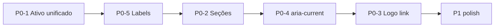

# Sidebar — backlog priorizado (pós-auditoria)

**Data:** 2026-06-11  
**Escopo:** menu lateral desktop + drawer mobile (`DashboardShell.tsx`, `MenuNavIconChip.tsx`, `PlanStatusCard.tsx`, `AvantBrandMark.tsx`, `lib/layout/dashboardNav.ts`)  
**Nota inicial:** 7,2/10 · **Meta pós-P0:** 8,5/10 · **Meta pós-P1:** 9/10  
**Status:** **P0 + P1 implementados** (2026-06-11) · P1-5 e P2 em backlog

---

## Status de implementação

| ID | Tarefa | Status |
|----|--------|--------|
| P0-1 | `MENU_NAV_ACTIVE` + barra/fundo verde unificados | ✅ |
| P0-2 | Seções Estudar / Métricas / Organizar (`lib/layout/dashboardNav.ts`) | ✅ |
| P0-3 | Logo linkável (`brandHref` + `createQueryString('/estudar')`) | ✅ |
| P0-4 | `aria-current="page"` na nav + admin | ✅ |
| P0-5 | Labels curtos + `title` tooltip | ✅ |
| P1-1 | Seção **Suporte** (`border-t`) + WhatsApp + PWA nav | ✅ |
| P1-2 | Assinatura com `MenuNavIconChip` slate + card unificado | ✅ |
| P1-3 | Sticky topo + nav scroll + footer conta fixo | ✅ |
| P1-4 | `Zap` Lucide em `AvantBrandMark` | ✅ |
| P1-5 | Badge revisões em Plano diário | ⏸ fora do escopo v1 |
| P2-* | Compacto, colapsar Estudar, tokens CSS | 📋 backlog |

**Ajustes pós-P1 (mesma entrega):** sidebar `16rem` (256px); `MENU_NAV_ROW_IDLE` (hover mais visível); tutorial `/ajuda` com labels alinhados ao menu.

---

## Resumo executivo

| Fase | Itens | Esforço | Impacto |
|------|-------|---------|---------|
| **P0** | 5 | ~1 sprint (4–6h dev) | IA + a11y + coerência de marca |
| **P1** | 5 | ~0,5 sprint (3–4h) | Polish elite |
| **P2** | 3 | backlog | Diferenciação |

**Princípio rector:** uma gramática visual — verde `#8fe020` / texto `#3d6b0f` para **todo** estado ativo; cores por domínio só em chips **inativos**.

---

## Wireframe — estado atual vs proposto

### Atual (lista plana, 9 itens + extras)

```
┌─────────────────────────────┐
│ ⚡ AVANT                     │
│ ┌─────────────────────────┐ │
│ │ ● PRO ATIVO · completo  │ │
│ │   Convite até 13/06/26  │ │
│ └─────────────────────────┘ │
│ MENU                        │  ← contraste fraco (slate-400 10px)
│ ┌─┐ Vitrine de Aulas        │  ← scroll pode esconder
│ ┌─┐ Como usar (tutorial)    │
│ ┌─┐ Estudo Reverso (método) │
│ ┌─┐ Progresso de estudo     │
│ ┌─┐ Meu desempenho (simul.) │  ← labels longos
│ ┌─┐ Simulados               │
│ ┌─┐ Plano de Estudo Diário  │
│ ┌─┐ Cadernos de Estudo      │
│ ┌─┐ Tirar dúvidas (WhatsApp)│  ← padrão visual diferente
│ [ Instalar no celular ]     │  ← CTA, não nav
│─────────────────────────────│
│ (QU) Questecenfermagem  [↪] │
│ 💳 Ver assinatura           │  ← sem chip
└─────────────────────────────┘
```

### Proposto (agrupado, hub fixo, suporte isolado)

```
┌─────────────────────────────┐
│ [⚡ AVANT]  ← link /estudar  │  P0-3
│ ┌─────────────────────────┐ │
│ │ ● PRO ATIVO             │ │
│ │   Convite até 13/06/26  │ │
│ └─────────────────────────┘ │
│                             │
│ ESTUDAR                     │  P0-2 · slate-500 11px
│ ┃▌ Vitrine                  │  P0-1 ativo = brand verde
│   Tutorial                  │  P0-5 labels curtos
│   Método reverso            │
│                             │
│ MÉTRICAS                    │
│   Progresso                 │
│   Desempenho                │
│                             │
│ ORGANIZAR                   │
│   Simulados                 │
│   Plano diário              │
│   Cadernos                  │
│                             │
│ SUPORTE                     │  P1-1
│   WhatsApp                  │
│   Instalar app              │
│                             │
│─────────────────────────────│
│ (QU) Nome              [↪] │
│   Ver assinatura            │  P1-2 chip alinhado
└─────────────────────────────┘
```

**Legenda:** `┃▌` = barra ativa 3px `#8fe020` + fundo `brand/10` em qualquer item, independente do accent do chip inativo.

---

## P0 — Implementar primeiro

### P0-1 · Estado ativo unificado (marca)

**Problema:** cada `accent` define `rowActive` / `bar` próprios (emerald, amber, rose…), divergindo de `AVANT-EDITORIAL-V2-DRAFT.md`.

**Arquivos:** `components/layout/MenuNavIconChip.tsx`, `app/(dashboard)/DashboardShell.tsx`

**Diff sugerido — `MenuNavIconChip.tsx`:**

```ts
// Adicionar export (tokens canônicos da nav ativa)
export const MENU_NAV_ACTIVE = {
  row: 'bg-[#8fe020]/10',
  bar: 'bg-[#8fe020]',
  label: 'text-[#3d6b0f]',
  chipBorder: 'border-[#8fe020]/40',
} as const;
```

**Diff sugerido — `DashboardNav` em `DashboardShell.tsx`:**

```tsx
import { MENU_NAV_ACTIVE, MenuNavIconChip, ... } from '@/components/layout/MenuNavIconChip';

// No map de links:
<Link
  ...
  aria-current={item.active ? 'page' : undefined}  // P0-4
  className={cn(
    'group relative flex w-full items-center gap-3 rounded-xl py-2 pl-3 pr-3 text-sm transition-colors',
    item.active
      ? cn(MENU_NAV_ACTIVE.row, 'font-semibold', MENU_NAV_ACTIVE.label)
      : 'text-slate-600 hover:bg-slate-100 hover:text-slate-900',
  )}
>
  {item.active ? (
    <span
      className={cn(
        'absolute left-0 top-1/2 h-8 w-[3px] -translate-y-1/2 rounded-r-full',
        MENU_NAV_ACTIVE.bar,
      )}
      aria-hidden
    />
  ) : null}
  <MenuNavIconChip icon={item.icon} accent={item.accent} active={item.active} />
  {item.label}
</Link>
```

**Critério de aceite:** em `/progresso`, `/simulados`, `/cadernos` etc., barra e fundo da linha são **sempre** verde marca; chip ativo pode manter `chipActive` do accent (cor do ícone) ou também unificar — decisão P1.

---

### P0-2 · Agrupamento por seção

**Problema:** 9 itens no mesmo nível; scroll esconde hub.

**Arquivo:** `app/(dashboard)/DashboardShell.tsx`

**Modelo de dados sugerido:**

```ts
type MenuSection = {
  id: string;
  label: string; // "Estudar" | "Métricas" | "Organizar"
  items: MenuItem[];
};

const MENU_SECTIONS: MenuSection[] = [
  {
    id: 'estudar',
    label: 'Estudar',
    items: [
      { label: 'Vitrine', icon: LayoutDashboard, href: '/estudar', accent: 'brand', ... },
      { label: 'Tutorial', icon: HelpCircle, href: '/ajuda', accent: 'sky', ... },
      { label: 'Método reverso', icon: BrainCircuit, href: '/ajuda/estudo-reverso', accent: 'violet', ... },
    ],
  },
  {
    id: 'metricas',
    label: 'Métricas',
    items: [
      { label: 'Progresso', icon: BarChart3, href: '/progresso', accent: 'emerald', ... },
      { label: 'Desempenho', icon: TrendingUp, href: '/desempenho/simulados', accent: 'amber', ... },
    ],
  },
  {
    id: 'organizar',
    label: 'Organizar',
    items: [
      { label: 'Simulados', icon: ListChecks, href: '/simulados', accent: 'rose', ... },
      { label: 'Plano diário', icon: CalendarDays, href: '/plano-diario', accent: 'teal', ... },
      { label: 'Cadernos', icon: BookMarked, href: '/cadernos', accent: 'indigo', ... },
    ],
  },
];
```

**Render sugerido:**

```tsx
{menuSections.map((section) => (
  <div key={section.id} className="mb-3">
    <p className="px-4 pb-1 text-[11px] font-semibold uppercase tracking-[0.12em] text-slate-500">
      {section.label}
    </p>
    <div className="space-y-0.5">
      {section.items.map((item) => (
        <DashboardNavLink key={item.href} item={item} ... />
      ))}
    </div>
  </div>
))}
```

**Critério de aceite:** headings visíveis; primeira seção sempre visível com logo sticky (ver P1-3); testes e2e de drawer intactos.

---

### P0-3 · Logo clicável → vitrine

**Arquivo:** `components/plan/PlanStatusCard.tsx` ou `AvantBrandMark.tsx`

**Opção A (mínima) — wrapper em `PlanStatusCard`:**

```tsx
import Link from 'next/link';

<Link
  href="/estudar"
  className="block rounded-lg px-1 outline-none focus-visible:ring-2 focus-visible:ring-[#8fe020]/50"
  aria-label="Ir para vitrine de aulas"
>
  <AvantBrandMark className="px-0" />
</Link>
```

**Opção B:** prop `href` em `AvantBrandMark` para reuso na LP.

**Critério de aceite:** Tab + Enter navegam; `createQueryString` preservado se link receber `href` dinâmico do shell.

---

### P0-4 · `aria-current="page"` na sidebar

**Arquivo:** `DashboardShell.tsx` — todos os `<Link>` de nav principal e `/admin` se ativo.

**Critério de aceite:** paridade com `BottomNav.tsx` (já usa `aria-current`).

---

### P0-5 · Labels curtos + `title` para contexto

| Atual | Proposto | `title` (tooltip nativo) |
|-------|----------|--------------------------|
| Vitrine de Aulas | Vitrine | Vitrine de aulas e assuntos |
| Como usar (tutorial) | Tutorial | Como usar o AVANT |
| Estudo Reverso (método) | Método reverso | Estudo reverso — o método |
| Progresso de estudo | Progresso | Progresso de estudo |
| Meu desempenho (simulados) | Desempenho | Desempenho em simulados |
| Plano de Estudo Diário | Plano diário | Plano de estudo diário |
| Cadernos de Estudo | Cadernos | Cadernos de estudo |
| Tirar dúvidas (WhatsApp) | WhatsApp | Tirar dúvidas pelo WhatsApp |

**Critério de aceite:** nenhum label > 18 caracteres na sidebar 288px; bottom nav pode manter labels ainda mais curtos.

---

## P1 — Polish elite

| ID | Tarefa | Arquivo(s) | Notas |
|----|--------|------------|-------|
| P1-1 | Seção **Suporte** com `border-t border-slate-100` antes de WhatsApp + PWA | `DashboardShell.tsx` | Remover “MENU” global único |
| P1-2 | “Ver assinatura” com `MenuNavIconChip` ou estilo de link secundário consistente | `UserAccountFooter` | `CreditCard` + chip slate |
| P1-3 | Sticky topo: logo + `PlanStatusCard` (`sticky top-0 z-10 bg-white`) | `DashboardSidebarPanels` | Nav scroll só no meio |
| P1-4 | Substituir emoji ⚡ por `<Zap />` Lucide em `AvantBrandMark` | `AvantBrandMark.tsx` | Alinhado ao restante |
| P1-5 | Badge contador em “Plano diário” (revisões pendentes) | shell + hook existente de SRS | Opcional se API já expõe count |

---

## P2 — Backlog / diferenciação

| ID | Tarefa | Notas |
|----|--------|-------|
| P2-1 | Modo compacto (só ícones + tooltip, sidebar ~4rem) | Power users desktop |
| P2-2 | Colapsar seção “Estudar” após onboarding (`useEstudoReversoWelcome`) | Reduz ruído pós-tutorial |
| P2-3 | Tokenizar cores hardcoded → `globals.css` editorial (`--color-nav-active-*`) | Dark mode futuro |

---

## Mapa de arquivos (implementação)

```
lib/layout/dashboardNav.ts          ← NAV_SECTION_DEFS, buildMenuSections()
app/(dashboard)/DashboardShell.tsx  ← DashboardNavLink, seções, Suporte, footer
components/layout/MenuNavIconChip.tsx ← MENU_NAV_ACTIVE, MENU_NAV_ROW_IDLE
components/plan/PlanStatusCard.tsx  ← brandHref + link logo
components/brand/AvantBrandMark.tsx ← Zap SVG (P1-4)
components/pwa/PwaInstallNavButton.tsx ← layout nav (Instalar app)
lib/layout/mobileBottomNav.ts       ← DASHBOARD_SIDEBAR_WIDTH = 16rem

__tests__/layout/dashboardNav.test.ts
__tests__/layout/sidebarRebrandP1.test.ts
__tests__/layout/dashboardShellMobileDrawer.test.ts
__tests__/components/brand/AvantBrandMark.test.ts
__tests__/pwa/PwaInstallNavButton.test.ts

e2e/mobile-drawer.spec.ts           ← D5 Tutorial, D5b Método reverso, D11 Suporte
app/(dashboard)/ajuda/page.tsx      ← copy tutorial alinhada aos labels
```

---

## Testes pós-implementação

| Tipo | Comando / arquivo | Cobertura |
|------|-------------------|-----------|
| Jest | `npm test -- __tests__/layout/dashboardNav.test.ts` | Seções, active `/analytics`, `/ajuda` exato |
| Jest | `npm test -- __tests__/layout/sidebarRebrandP1.test.ts` | P1-1…P1-4, 16rem, PWA nav |
| Jest | `npm test -- __tests__/layout/dashboardShellMobileDrawer.test.ts` | aria-current, sticky, Suporte, assinatura |
| Jest | `npm test -- __tests__/pwa/PwaInstallNavButton.test.ts` | Sem CTA legado |
| e2e | `npm run test:e2e:drawer` | D1–D11 drawer mobile |

**Manual:** `/ajuda/estudo-reverso` → “Método reverso” ativo (barra verde + `aria-current`); hover inativo legível (`MENU_NAV_ROW_IDLE`).

---

## Ordem de execução recomendada



1. `MENU_NAV_ACTIVE` + trocar classes no link (rápido, alto impacto visual).
2. Renomear labels (sem mudar rotas).
3. Refatorar array → seções + novo render.
4. `aria-current` nos links.
5. Logo linkável.
6. P1 em PR separado (menor risco de regressão).

---

## Decisões registradas (implementação v1)

| # | Pergunta | Recomendação |
|---|----------|--------------|
| D1 | Chip ativo mantém cor do accent ou vira brand? | Manter accent no chip; linha/barra sempre brand |
| D2 | “Tutorial” e “Método reverso” ficam sempre visíveis? | Sim na v1; P2-2 colapsa após onboarding |
| D3 | WhatsApp sai da nav scroll e vai só em Suporte? | Sim (P1-1) |
| D4 | Bottom nav labels mudam junto? | Não alterados — já curtos |

**Decisões aplicadas:** D1 (chip accent inativo; linha/barra brand); D3 (WhatsApp só em Suporte).


## Referências

- Auditoria chat: nota 7,2/10 (2026-06-11)
- [`tokens/AVANT-EDITORIAL-V2-DRAFT.md`](./tokens/AVANT-EDITORIAL-V2-DRAFT.md) — nav ativa verde
- [`tokens/WCAG-CONTRAST-EDITORIAL-V2.md`](./tokens/WCAG-CONTRAST-EDITORIAL-V2.md)
- [`plataformas/D2-avant-editorial-v2.md`](./plataformas/D2-avant-editorial-v2.md)
- Código: `app/(dashboard)/DashboardShell.tsx`, `components/layout/MenuNavIconChip.tsx`
