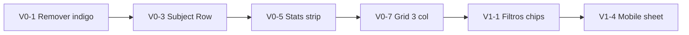

# Vitrine `/estudar` — auditoria e backlog (elite)

**Data:** 2026-06-11  
**Escopo:** hub principal do produto — desktop + mobile  
**Arquivos centrais:** `VitrineClient.tsx`, `VitrineCatalogStats.tsx`, `QuestaoFilterBar.tsx`, `SubtopicoCard` (inline), `DashboardShell` (header mobile)  
**Nota atual:** **6,4 / 10** · **Meta pós-P0+P1:** **8,8 / 10** · **Meta elite:** **9,2 / 10** (com P2)

---

## Veredito executivo

A vitrine é **tecnicamente madura** (SSR, SWR, prefetch, paginação, facets) mas **visualmente ainda híbrida**: restos Cyber (índigo no header, `NeonBadge`, seleção indigo) convivem com Editorial v2 (barra verde, stats, chips brand). O maior gap para “elite” não é performance — é **arquitetura de superfície**:

1. **Muito chrome antes do conteúdo** (header duplo + filtros grandes + stats gigantes).
2. **Card-dentro-de-card** que trunca títulos e consome altura no mobile.
3. **Hierarquia de títulos conflitante** (edital/cidade no sticky vs “Vitrine de questões” no main).
4. **Scanability fraca** no grid 4 colunas — progresso só visível expandido ou em barra de 1px.

Referências de elite edtech: QConcursos (densidade + filtros como chips), Gabarita (disciplina → tópico direto), Estudei (KPIs compactos + “o que fazer hoje”). O AVANT deve manter o **diferencial NeuroSlides/reverso**, mas com **descoberta mais rápida**.

---

## Mapa da página (estado atual)

```
┌─ STICKY (VitrineClient) ─────────────────────────────────────┐
│ [mobile] Logo shell + busca + Filtrar                         │
│ [desktop] Ícone INDIGO + título edital + busca larga        │  ← legado Cyber
│ [desktop] FILTROS + 2× MultiCheckbox (dashed + Adicionar)   │  ← ~180–220px
└───────────────────────────────────────────────────────────────┘
┌─ MAIN ──────────────────────────────────────────────────────┐
│ │ Estudo Reverso                                              │
│ │ Vitrine de questões          ← 2º H1                      │
│ │ Mostrando 1-12 de 41 assuntos                               │
│ ┌─────────────┐ ┌─────────────┐                               │
│ │ 5.180       │ │ 20.720      │  ← stats hero (2 colunas)    │
│ └─────────────┘ └─────────────┘                               │
│ ┌─ card outer ─────────────────────────────────────────────┐ │
│ │ ┌─ inner slate-50 button ──────────────────────────────┐ │ │  ← card-in-card
│ │ │ [icon] Verificação de Sinais…  654 · 2616 NS    [v] │ │ │
│ │ └─────────────────────────────────────────────────────┘ │ │
│ │ [expandido: ring 120px, badges, jump, lista questões]   │ │
│ │ ▓▓▓░░░░░░ 1px progress (só se em progresso)             │ │
│ └──────────────────────────────────────────────────────────┘ │
│ Paginação Anterior | Próxima                                 │
└───────────────────────────────────────────────────────────────┘
```

---

## Diagnóstico por zona

### Zona A — Sticky header desktop (nota: 5/10)

**Código:** `VitrineClient.tsx` L724–797

| Problema | Evidência | Impacto |
|----------|-----------|---------|
| Ícone indigo/violet | `from-indigo-50 to-violet-50`, `text-indigo-600` | Quebra marca editorial; sidebar já é verde |
| Título = `cidadeUrl` / edital | `h1` no sticky | Usuário vê “Estudo Reverso” na sidebar e outro título no topo |
| Busca duplicada conceitualmente | Sticky busca + seção “Vitrine” abaixo | OK funcional, mas ocupa ~80px antes de filtros |
| `selection:bg-indigo-100` | L617 | Detalhe que denuncia tema misto |

**Elite:** um único sticky compacto: busca + chips de filtro ativos + “Limpar”. Sem segundo ícone de “dashboard”.

---

### Zona B — Filtros (nota: 6/10)

**Código:** `QuestaoFilterBar.tsx` (variant vitrine), `MultiCheckboxFilter.tsx`

| Problema | Evidência | Impacto |
|----------|-----------|---------|
| Área “vazia” com dashed `+ Adicionar` | empty state = label + botão tracejado | Parece placeholder, não filtro ativo (nota dos prints) |
| Label “FILTROS” + 2 colunas largas | `grid-cols-2` no desktop | ~25% viewport 1440px antes dos assuntos |
| Mobile: “Filtrar” + expand + chips | 2 taps para banca/assunto | Aceitável, mas soma com header shell |

**Elite:** barra horizontal de **chips** (Banca · Assunto) sempre visíveis; picker em sheet/popover; filtros ativos como pills verdes (já existe no selected state).

---

### Zona C — Hero de stats (nota: 6,5/10)

**Código:** `VitrineCatalogStats.tsx`

| Problema | Evidência | Impacto |
|----------|-----------|---------|
| Números hero `text-5xl` | competem com grid | Bom para marketing; ruim para “quero estudar agora” |
| Duas cores de verde (`#3d6b0f` vs `emerald-700`) | stats lado a lado | Mesma tensão da sidebar multi-accent |
| Sem ação | cards não clicáveis | Ocupam espaço sem CTA |

**Elite:** **strip compacta** uma linha: `5.180 questões · 20.720 NeuroSlides` com tipografia 13px/semibold, ou KPI bar 64px altura; opcional link “Como funciona o reverso”.

---

### Zona D — Título da seção (nota: 7,5/10)

**Código:** L820–848

| Acerto | Problema |
|--------|----------|
| Barra verde `#8fe020`, label “Estudo Reverso”, `text-editorial-title` | Redundante com sticky header; `font-mono` 11px no contador é frio demais |

**Elite:** fundir com sticky — uma hierarquia: eyebrow → título → contador inline na mesma linha do título.

---

### Zona E — Cards de assunto (nota: 5,5/10) — **maior oportunidade**

**Código:** `SubtopicoCard` L966–1322

| Problema | Evidência print/código | Impacto |
|----------|------------------------|---------|
| Card-in-card | outer `border shadow` + inner `bg-slate-50 border` button | Dupla borda, truncamento, altura ~2× necessária |
| `line-clamp-2` em grid 4 col | “Vias de Administra…” | Títulos ilegíveis — falha grave de UX |
| NeuroSlides em `emerald-700` | compete com contagem de questões | Hierarquia invertida para job primário (estudar questão) |
| Progresso 1px no rodapé | `h-1` só se `mostrarBarraProgresso` | Quase invisível no print; collapsed não mostra % |
| Ícone default `Stethoscope` | `getTopicIcon` fallback | Urgências = Sinais Vitais visualmente |
| Expansão em 2 níveis | assunto → questões | Cognitive load alto no mobile |
| `NeonBadge` uppercase tracking-wider | legado naming “Neon” | OK visual editorial, nome confunde sistema de design |

**Elite — modelo “Subject Row” (wireframe):**

```
┌──────────────────────────────────────────────────┐
│ [icon]  Verificação de Sinais Vitais      72%   │
│         654 questões · 12 pendentes      [→]   │
│ ▓▓▓▓▓▓▓▓▓▓▓▓▓▓░░░░░  (barra 4px, sempre)      │
└──────────────────────────────────────────────────┘
  tap → sheet/bottom panel com lista de questões (mobile)
      → painel lateral ou expand inline (desktop)
```

---

### Zona F — Mobile chrome (nota: 6/10)

**Stack:** `DashboardShell` header (logo, busca, avatar) + `VitrineClient` sticky (filtrar) + título + stats + cards

| Problema | Impacto |
|----------|---------|
| ~3 faixas sticky antes do 1º card | Só 1–2 assuntos visíveis no 812px |
| Avatar abre drawer (conta), não filtros | OK, mas busca em 2 lugares (shell event + vitrine) |

**Elite:** consolidar header vitrine no shell OU vitrine full-bleed sem duplicar logo; stats em 1 linha; filtros em FAB ou barra única.

---

### Zona G — Paginação (nota: 7,5/10)

`VitrinePaginationBar` — funcional, 44px targets, `aria-label`. Falta: indicador de página mais compacto no mobile (dots ou 1/4 pill).

---

## Coerência com design system

| Token editorial | Vitrine hoje | Status |
|-----------------|--------------|--------|
| Brand `#8fe020` / `#3d6b0f` | barra título, chips filtro, hover cards | Parcial |
| Sem indigo/cyan | header desktop indigo, selection indigo | **Violação** |
| `card-elevated` | stats + cards | OK |
| Tipografia editorial | mono em contadores, Plus Jakarta no título | Misto |
| NeuroSlides = momento escuro | só no player; na vitrine é texto verde | OK conceitual |

---

## Benchmark posicionamento

| Critério | QConcursos / Gabarita | AVANT hoje | Gap |
|----------|----------------------|------------|-----|
| Time-to-first-assunto | Baixo (lista densa) | Alto (chrome + card padding) | **Alto** |
| Título legível sem expandir | Sim | Não (clamp + 4 col) | **Alto** |
| Progresso à primeira vista | Barra/% na linha | 1px ou só expandido | **Médio** |
| Filtros óbvios | Chips + dropdown | Dashed “adicionar” | **Médio** |
| Diferencial reverso | Comentários IA | Stats NeuroSlides | **Oportunidade** (destaque certo, lugar errado) |

---

## Backlog priorizado

### P0 — Fundação elite (4–6h)

| ID | Tarefa | Arquivo(s) |
|----|--------|------------|
| V0-1 | Remover header desktop indigo; ícone brand ou eliminar bloco (título já está no main) | `VitrineClient.tsx` |
| V0-2 | Unificar hierarquia de título: remover H1 duplicado no sticky; manter só bloco “Estudo Reverso / Vitrine” | `VitrineClient.tsx` |
| V0-3 | **Subject Row**: colapsar card-in-card — uma superfície clicável, título `line-clamp-3` mobile / `clamp` responsivo ou 2 linhas fixas com `min-h` | `SubtopicoCard` → extrair `VitrineSubjectCard.tsx` |
| V0-4 | Barra de progresso **4px** sempre visível quando `totalResolvidas > 0`; % no canto direito collapsed | `SubtopicoCard` |
| V0-5 | Stats → strip compacta (altura máx. 72px desktop, 56px mobile) | `VitrineCatalogStats.tsx` |
| V0-6 | `selection:` brand editorial; remover indigo | `VitrineClient.tsx` |
| V0-7 | Grid: `xl:grid-cols-3` em vez de 4 (títulos legíveis) OU lista 1 col mobile / 2 tablet / 3 desktop | `VitrineClient.tsx` |

### P1 — Polish e scanability (4–5h)

| ID | Tarefa | Arquivo(s) |
|----|--------|------------|
| V1-1 | Filtros vitrine: chips horizontais primários (reusar `QuestaoFilterChips` no desktop) | `QuestaoFilterBar.tsx` |
| V1-2 | NeuroSlides: `text-slate-500` no collapsed; destaque só no expand | `SubtopicoCard` |
| V1-3 | Mapa de ícones: urgência → `Siren`, sinais vitais → `Activity`, etc. | `getTopicIcon` |
| V1-4 | Mobile: expand assunto → **bottom sheet** lista questões (menos scroll no card) | novo `VitrineSubjectSheet.tsx` |
| V1-5 | CTA primário no row collapsed: “Continuar” / “Iniciar” → `firstSlug` pendente | `VitrineQuestaoLink` |
| V1-6 | Paginação mobile: pill `1 / 4` entre setas | `VitrinePaginationBar.tsx` |
| V1-7 | Sticky único: fundir busca desktop no topo da seção main (colapsar sticky atual) | `VitrineClient.tsx` |

### P2 — Diferenciação (backlog)

| ID | Tarefa |
|----|--------|
| V2-1 | “Continuar de onde parou” — 1 card hero com última questão (histórico) |
| V2-2 | Filtro rápido: Só pendentes / Só novos |
| V2-3 | Vista compacta (lista densa estilo Gabarita) toggle |
| V2-4 | Stats animadas só na 1ª visita (`localStorage`) |

---

## Wireframe alvo (desktop)

```
┌─ sidebar ─┬─ main max-w-6xl ─────────────────────────────────┐
│ AVANT     │ [🔍 Buscar assunto, banca, Q-…                    ] │
│ PRO       │ [Banca ▾] [Assunto ▾]  ··· chips ativos · Limpar   │
│           │ Estudo reverso · Vitrine · 1–12 de 41 assuntos     │
│ Vitrine ● │ 5.180 questões · 20.720 NeuroSlides               │
│           │ ┌────────────────────────────────────────────────┐ │
│           │ │ ◉ Sinais Vitais    654 q · 8 pend.      62% → │ │
│           │ │ ▓▓▓▓▓▓▓▓▓▓▓▓▓░░░░░░░░░░░░░░░░░░░░░░░░░░░░░░░ │ │
│           │ └────────────────────────────────────────────────┘ │
│           │ ... grid 3 col ...                                  │
│           │ ← Página 1 de 4 →                                   │
└───────────┴────────────────────────────────────────────────────┘
```

---

## Ordem de implementação



**PR sugerido 1:** V0-1, V0-2, V0-6, V0-5 (quick wins visuais)  
**PR sugerido 2:** V0-3, V0-4, V0-7 (refactor card — maior impacto)  
**PR sugerido 3:** P1

---

## Testes mínimos

- Jest: `VitrineSubjectCard` render título sem truncar em `xl` com 3 col (snapshot ou css class)
- e2e: `/estudar` — expandir assunto, abrir questão, paginação
- Visual: atualizar `T3-vitrine-*.png` em `screenshots/avant-editorial-v2/`
- A11y: uma única `h1` por viewport; `aria-expanded` mantido

---

## Decisões (defaults recomendados)

| # | Pergunta | Recomendação |
|---|----------|--------------|
| D1 | Grid 3 ou lista no mobile? | Mobile lista; desktop 3 col |
| D2 | Expand inline vs sheet mobile? | Sheet no mobile (P1-4) |
| D3 | Manter stats globais? | Sim, strip compacta |
| D4 | Remover header edital do sticky? | Sim — edital já no sidebar PRO/plano |

---

## Referências

- Prints usuário 2026-06-11 (desktop 1440, mobile 375)
- [`SIDEBAR-REBRAND-BACKLOG.md`](./SIDEBAR-REBRAND-BACKLOG.md) — coerência nav + vitrine
- [`D2-avant-editorial-v2.md`](./plataformas/D2-avant-editorial-v2.md) — telha T3
- [`tokens/AVANT-EDITORIAL-V2-DRAFT.md`](./tokens/AVANT-EDITORIAL-V2-DRAFT.md)
